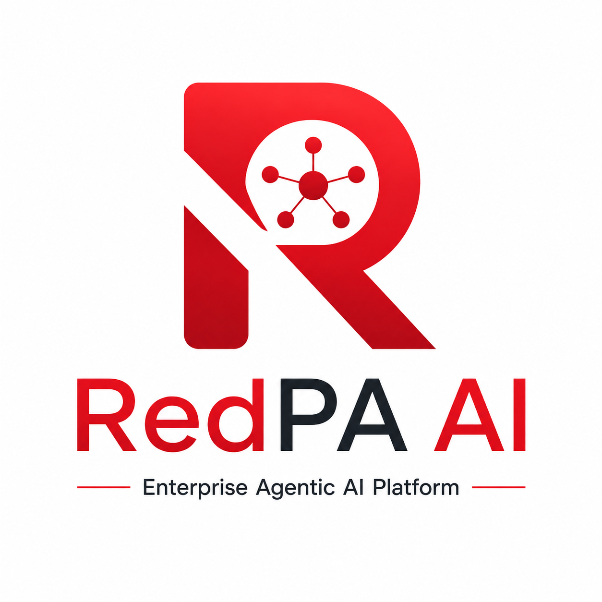
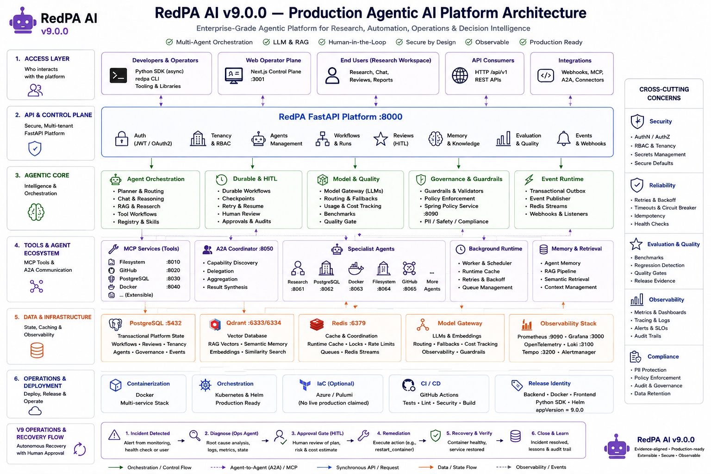
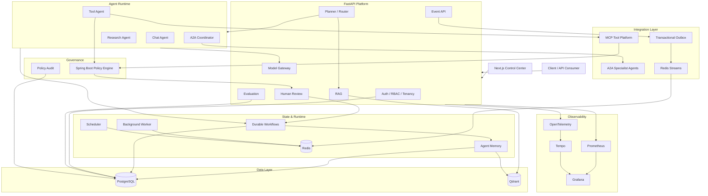

<p align="center">
  
</p>

<h1 align="center">RedPA AI</h1>

<p align="center">
  <strong>Enterprise Agentic AI Platform</strong>
</p>

<p align="center">
  Production-oriented multi-agent orchestration, MCP tool execution, A2A communication,
  durable workflows, semantic memory, policy enforcement, human approval, multi-tenancy,
  event-driven integration, and distributed observability.
</p>
```
```{=html}
<p align="center">
```

 


```{=html}
</p>
```

------------------------------------------------------------------------

> **A production-oriented Agentic AI platform for orchestrating
> autonomous agents, enforcing policy at tool boundaries, executing
> durable workflows, integrating enterprise systems, and operating AI
> workloads with security, observability, and human oversight.**

RedPA AI is a modular platform for building real-world Agentic AI
systems. It combines planner-based routing, Retrieval-Augmented
Generation (RAG), Model Context Protocol (MCP), Agent-to-Agent (A2A)
communication, Human-in-the-Loop approval, durable workflow execution,
semantic Agent Memory, model-provider abstraction, evaluation, policy
enforcement, RBAC, multi-tenancy, event-driven messaging, and production
observability in one extensible architecture.

The project is designed as an engineering platform rather than a single
LLM wrapper. APIs, orchestration, agents, tools, policy, workflows,
memory, messaging, observability, identity, and infrastructure are
separated so that each subsystem can evolve independently.

------------------------------------------------------------------------

## Table of Contents

-   [Overview](#overview)
-   [What v3 Adds](#what-v3-adds)
-   [Control Center](#control-center)
-   [Architecture](#architecture)
-   [Key Capabilities](#key-capabilities)
-   [Policy and Guardrails](#policy-and-guardrails)
-   [Evaluation and Model Gateway](#evaluation-and-model-gateway)
-   [Access Control and
    Multi-tenancy](#access-control-and-multi-tenancy)
-   [Event-driven Architecture](#event-driven-architecture)
-   [MCP Integration](#mcp-integration)
-   [A2A Multi-Agent System](#a2a-multi-agent-system)
-   [Durable Workflows](#durable-workflows)
-   [Human-in-the-Loop](#human-in-the-loop)
-   [Agent Memory](#agent-memory)
-   [Observability](#observability)
-   [Architecture Governance](#architecture-governance)
-   [Cloud and Infrastructure](#cloud-and-infrastructure)
-   [Security](#security)
-   [Technology Stack](#technology-stack)
-   [Repository Structure](#repository-structure)
-   [Quick Start](#quick-start)
-   [API Overview](#api-overview)
-   [Testing and Verification](#testing-and-verification)
-   [Release](#release)
-   [Roadmap](#roadmap)
-   [Engineering Highlights](#engineering-highlights)
-   [License](#license)

------------------------------------------------------------------------

## Overview

RedPA AI provides an end-to-end foundation for production-oriented
Agentic AI applications.

The platform can:

-   coordinate multiple agents;
-   route tasks through structured planning;
-   retrieve internal knowledge with RAG;
-   discover and execute MCP tools;
-   delegate work to remote A2A specialist agents;
-   pause risky actions for human approval;
-   persist and resume long-running workflows;
-   maintain semantic and structured agent memory;
-   evaluate model and workflow quality;
-   route requests through a model gateway;
-   enforce policy before internal-tool and MCP execution;
-   isolate tenants and enforce tenant roles;
-   publish domain events through a transactional outbox;
-   deliver events through Redis Streams;
-   expose metrics, logs, traces, health, and performance data;
-   deploy locally with Docker or target Azure through Pulumi.

------------------------------------------------------------------------

## What v3 Adds

RedPA AI v3 extends the v2 platform with an enterprise governance and
integration layer.

### Evaluation

-   evaluation datasets and runs;
-   reusable evaluation metrics;
-   persisted evaluation results;
-   evaluation APIs;
-   evaluation dashboard foundation.

### Model Gateway

-   centralized model access;
-   model-provider abstraction;
-   model configuration;
-   usage and cost visibility foundation;
-   gateway-level routing and observability.

### Policy Engine

-   dedicated Spring Boot policy service;
-   deterministic `ALLOW`, `REVIEW`, and `DENY` decisions;
-   risk classification;
-   matched policy rules;
-   Human Review bridge;
-   guarded internal-tool boundary;
-   guarded MCP boundary;
-   persistent policy audit events;
-   policy metrics;
-   Policy Control Center.

### Architecture Governance

-   Domain-Driven Design guidance;
-   bounded contexts;
-   Clean Architecture rules;
-   SOLID guidance;
-   Architecture Decision Records;
-   C4 documentation;
-   arc42 architecture documentation;
-   automated architecture contract tests.

### Cloud Architecture

-   Azure reference architecture;
-   Pulumi Python infrastructure;
-   Azure Container Apps design;
-   Azure Database for PostgreSQL design;
-   Azure Key Vault integration design;
-   Azure Container Registry;
-   cloud security guidance;
-   cost guidance;
-   Pulumi preview CI workflow.

### Identity and Tenancy

-   tenant/workspace model;
-   tenant memberships;
-   role-based access-control foundation;
-   tenant isolation foundation;
-   OAuth provider discovery;
-   OAuth PKCE foundation;
-   Access & Tenancy Control Center.

> OAuth token exchange and account linking remain intentionally disabled
> until real provider credentials and persistent state/verifier storage
> are configured.

### Event-driven Integration

-   transactional outbox;
-   persisted event state;
-   Redis Streams publication;
-   event publisher service;
-   Event Control Center;
-   event API;
-   event delivery verification.

### Production Hardening

-   production configuration guards;
-   secret scanning;
-   Kubernetes network policy;
-   security CI;
-   threat model;
-   production-hardening documentation;
-   release-gate automation.

------------------------------------------------------------------------

## Control Center

The operator-facing Next.js Control Center provides one interface for
inspecting and operating the platform.

Main areas include:

-   **Agent Control Center** --- agent registry and capability
    discovery;
-   **Durable Workflow Visualizer** --- workflows, subtasks, state, and
    results;
-   **Human Review Console** --- approve, reject, and resume gated
    workflows;
-   **Agent Memory Explorer** --- inspect and search stored memories;
-   **MCP & Tool Console** --- registry, catalog, and guarded execution;
-   **Evaluation Center** --- evaluation workflows and results;
-   **Model Gateway Dashboard** --- model access and gateway visibility;
-   **Policy Control Center** --- decisions, risk, matched rules,
    reviews, and audit history;
-   **Access & Tenancy Control Center** --- workspaces, memberships,
    roles, and OAuth providers;
-   **Event Control Center** --- transactional-outbox and event
    publication visibility;
-   **Observability & Operations** --- health, metrics, runtime, and
    performance.

Local Control Center:

``` text
http://localhost:3001
```

------------------------------------------------------------------------

## Architecture


<p align="center">
  
</p>

### Logical Architecture




The repository also contains C4 and arc42 documentation for architecture
views beyond this high-level diagram.

------------------------------------------------------------------------

## Key Capabilities

### Agentic AI

-   planner-based routing;
-   multi-agent orchestration;
-   structured agent state;
-   chat workflows;
-   research workflows;
-   RAG workflows;
-   tool workflows;
-   context-aware conversations;
-   distributed specialist delegation;
-   shared execution context.

### Workflow Reliability

-   durable workflow persistence;
-   workflow checkpoints;
-   workflow resume;
-   Human Review;
-   retry support;
-   failed-task recovery;
-   distributed subtask tracking;
-   idempotency;
-   background processing;
-   dead-letter handling.

### Agent Memory

-   long-term memory;
-   semantic memory;
-   private and shared memory;
-   memory search;
-   memory summarization;
-   deduplication;
-   retention policies;
-   PostgreSQL metadata;
-   Qdrant semantic retrieval.

### Runtime

-   Redis cache;
-   Redis Streams;
-   rate limiting;
-   idempotency middleware;
-   background worker;
-   scheduler;
-   delayed jobs;
-   retry queue;
-   dead-letter queue;
-   worker and scheduler heartbeats.

------------------------------------------------------------------------

## Policy and Guardrails

RedPA AI v3 introduces a dedicated policy boundary between agent intent
and sensitive execution.

The policy service evaluates:

-   action;
-   resource;
-   execution boundary;
-   arguments;
-   agent identity;
-   policy rules;
-   risk level.

Policy outcomes are:

``` text
ALLOW
REVIEW
DENY
```

Example behavior:

  Action              Decision   Risk       Policy
  ------------------- ---------- ---------- ----------------------------------
  `list_containers`   ALLOW      LOW        `READ_ONLY_ALLOW`
  `send_email`        REVIEW     HIGH       `EXTERNAL_SIDE_EFFECT_REVIEW`
  `drop_database`     DENY       CRITICAL   `DESTRUCTIVE_ACTION_DENY`
  unknown action      REVIEW     MEDIUM     `UNKNOWN_ACTION_REQUIRES_REVIEW`

`REVIEW` decisions can create Human Review records. `DENY` decisions
stop execution. Policy decisions are persisted to the audit trail with
their boundary, risk, matched rules, policy version, review link, and
enforcement outcome.

The same enforcement model protects both internal tools and MCP
execution boundaries.

------------------------------------------------------------------------

## Evaluation and Model Gateway

### Evaluation

The evaluation subsystem provides a foundation for measuring Agentic AI
behavior instead of relying only on manual inspection.

It includes:

-   evaluation persistence;
-   datasets;
-   evaluation runs;
-   metric execution;
-   result storage;
-   API contracts;
-   dashboard integration.

### Model Gateway

The Model Gateway separates application workflows from model-provider
details.

Its role is to centralize:

-   provider configuration;
-   model selection;
-   request routing;
-   model access;
-   observability;
-   usage and cost-analysis foundations.

This makes model infrastructure replaceable without coupling every agent
directly to one provider.

------------------------------------------------------------------------

## Access Control and Multi-tenancy

Phase 16 introduces tenant-aware platform boundaries.

### Tenancy

-   workspace/tenant records;
-   tenant membership;
-   owner membership on tenant creation;
-   tenant-scoped access foundation;
-   tenant listing and management APIs.

### RBAC

The access-control layer provides a foundation for role-aware
authorization inside a tenant.

### OAuth

OAuth provider discovery and PKCE foundations are implemented.

Production OAuth completion requires:

-   real provider credentials;
-   persistent OAuth state;
-   persistent PKCE verifier storage;
-   secure callback handling;
-   account linking.

These are intentionally not claimed as completed production OAuth login.

------------------------------------------------------------------------

## Event-driven Architecture

RedPA AI v3 adds a transactional event pipeline.

``` text
Application transaction
        |
        v
Transactional Outbox
        |
        v
Event Publisher
        |
        v
Redis Streams
        |
        v
Consumers / Integrations
```

The outbox pattern prevents application state changes and event
publication from becoming two unrelated operations.

Capabilities include:

-   persisted outbox events;
-   publication state;
-   Redis Streams delivery;
-   publisher service;
-   event APIs;
-   Event Control Center;
-   runtime verification that published events appear in the Redis
    stream.

This layer provides the foundation for future external integrations and
asynchronous domain-event consumers.

------------------------------------------------------------------------

## MCP Integration

RedPA AI uses MCP as a dedicated enterprise tool layer.

Validated MCP services include:

``` text
Filesystem MCP   : 8010
GitHub MCP       : 8020
PostgreSQL MCP   : 8030
Docker MCP       : 8040
```

Capabilities include:

-   server registration;
-   dynamic tool discovery;
-   unified tool catalog;
-   structured arguments;
-   permission-aware execution;
-   policy enforcement;
-   Human Review integration;
-   response normalization;
-   service isolation.

Security controls include filesystem sandboxing, PostgreSQL read-only
protections, Docker input validation, and policy evaluation before
guarded MCP actions.

------------------------------------------------------------------------

## A2A Multi-Agent System

RedPA AI supports distributed Agent-to-Agent execution.

The coordinator can:

1.  parse a complex request;
2.  create subtasks;
3.  discover suitable agents;
4.  select capabilities;
5.  delegate work;
6.  execute independent work in parallel;
7.  collect successful and failed results;
8.  aggregate the final response.

Specialist services include:

``` text
A2A Coordinator      : 8050
Research Agent       : 8061
PostgreSQL Agent     : 8062
Docker Agent         : 8063
Filesystem Agent     : 8064
GitHub Agent         : 8065
```

Remote services expose Agent Cards through:

``` text
/.well-known/agent-card.json
```

------------------------------------------------------------------------

## Durable Workflows

Durable workflows support tasks that cannot safely be treated as one
synchronous request.

Typical examples:

-   distributed research;
-   approval-gated actions;
-   multi-step tool workflows;
-   tasks that must survive restart;
-   retryable distributed subtasks.

Lifecycle:

``` text
Create
  |
Persist
  |
Execute
  |
Checkpoint
  |
Pause for review / retry if required
  |
Resume
  |
Aggregate
  |
Finalize
```

Persisted state can include workflow status, request data, metadata,
subtasks, remote-agent identifiers, results, errors, timing, approval
state, and retry state.

------------------------------------------------------------------------

## Human-in-the-Loop

Risky operations can be paused before execution.

Typical cases include:

-   sending email;
-   modifying external systems;
-   high-risk tool execution;
-   actions with irreversible side effects;
-   policy decisions returning `REVIEW`.

The Human Review flow supports:

-   review creation;
-   pending-review listing;
-   approval;
-   rejection;
-   edited responses;
-   workflow resume;
-   policy-to-review linking;
-   prevention of duplicate approval gates after resume.

------------------------------------------------------------------------

## Agent Memory

The memory subsystem combines relational persistence with vector
retrieval.

### Memory Types

-   private agent memory;
-   shared memory;
-   semantic memory;
-   long-term structured memory;
-   summarized memory.

### Operations

-   create;
-   retrieve;
-   search;
-   inject into context;
-   summarize;
-   deduplicate;
-   retain;
-   analyze.

PostgreSQL stores structured records and metadata. Qdrant supports
semantic similarity search.

------------------------------------------------------------------------

## Observability

RedPA AI includes metrics, logs, traces, health monitoring, and
policy/event visibility.

### Prometheus

The backend exposes Prometheus-compatible metrics.

``` text
GET /api/v1/metrics
```

### Distributed Tracing

OpenTelemetry instrumentation integrates application tracing with Tempo.

OTLP endpoints:

``` text
4317 gRPC
4318 HTTP
```

### Structured Logging

Logs can carry:

-   timestamp;
-   level;
-   logger;
-   request ID;
-   correlation ID;
-   trace ID;
-   span ID;
-   workflow ID;
-   job ID;
-   error code;
-   execution timing.

### Operational Dashboards

Grafana, the Control Center, policy audit views, and event views provide
complementary operational visibility.

------------------------------------------------------------------------

## Architecture Governance

Phase 14 formalizes architectural boundaries instead of leaving
architecture only as conventions in implementation code.

The repository includes:

-   Domain-Driven Design bounded-context documentation;
-   Clean Architecture dependency rules;
-   SOLID engineering guidance;
-   Architecture Decision Records;
-   C4 architecture documentation;
-   arc42 documentation;
-   automated architecture tests.

The goal is to make architectural decisions explicit, reviewable, and
testable.

------------------------------------------------------------------------

## Cloud and Infrastructure

### Local Runtime

The complete development platform can run through Docker Compose.

### Kubernetes and Helm

Deployment assets include:

-   Kubernetes manifests;
-   Helm chart;
-   health probes;
-   resource limits;
-   security context;
-   Horizontal Pod Autoscaling;
-   network-policy hardening.

### Azure Reference Architecture

Phase 15 adds an Azure deployment design implemented with Pulumi Python.

The reference architecture includes:

-   Azure Container Apps;
-   Azure Database for PostgreSQL;
-   Azure Key Vault;
-   Azure Container Registry;
-   managed cloud configuration;
-   security guidance;
-   cost guidance;
-   CI-based Pulumi preview.

> Local verification validates the IaC structure and Pulumi provider
> configuration. It does **not** claim that Azure resources have already
> been deployed.

Cloud deployment remains explicit through `pulumi preview` and
`pulumi up`.

------------------------------------------------------------------------

## Security

Security controls include:

-   JWT authentication;
-   tenant-aware access-control foundation;
-   RBAC foundation;
-   OAuth PKCE foundation;
-   security response headers;
-   CORS configuration;
-   rate limiting;
-   idempotency;
-   environment validation;
-   production configuration guards;
-   secret scanning;
-   policy enforcement;
-   Human Review;
-   policy audit logging;
-   guarded internal tools;
-   guarded MCP execution;
-   safe MCP input validation;
-   read-only tool policies;
-   Kubernetes non-root execution;
-   dropped Linux capabilities;
-   network-policy hardening;
-   threat-model documentation;
-   security CI workflows.

The project deliberately distinguishes implemented controls from
production configuration that still requires real credentials or cloud
deployment.

------------------------------------------------------------------------

## Technology Stack

  Area                  Technologies
  --------------------- ------------------------------------------------
  Backend               Python, FastAPI, Pydantic
  Policy Service        Java, Spring Boot
  Frontend              Next.js, TypeScript
  Database              PostgreSQL, SQLAlchemy, asyncpg
  Vector Database       Qdrant
  Cache / Messaging     Redis, Redis Streams
  Agent Orchestration   LangGraph-style stateful workflows
  LLM Runtime           Ollama and Model Gateway abstraction
  Agent Protocols       MCP, A2A
  Architecture          DDD, Clean Architecture, C4, arc42, ADR
  Containers            Docker, Docker Compose
  Metrics               Prometheus
  Dashboards            Grafana, RedPA Control Center
  Tracing               OpenTelemetry, Tempo
  Cloud IaC             Pulumi Python, Azure Native
  Cloud Target          Microsoft Azure
  Testing               pytest, Spring/JUnit/Cucumber, contract tests
  Deployment            Kubernetes, Helm, Azure reference architecture
  CI/CD                 GitHub Actions

------------------------------------------------------------------------

## Repository Structure

``` text
redpa-ai/
├── backend/
│   ├── alembic/
│   └── app/
│       ├── a2a_protocol/
│       ├── agent_memory/
│       ├── api/v1/
│       ├── background_jobs/
│       ├── database/
│       ├── distributed_durable/
│       ├── events/
│       ├── mcp/
│       ├── mcp_servers/
│       ├── middleware/
│       ├── model_gateway/
│       ├── monitoring/
│       ├── observability/
│       ├── security/
│       ├── security_hardening/
│       ├── services/
│       ├── specialist_agents/
│       └── main.py
├── frontend/
│   ├── app/
│   └── components/
├── policy-service/
├── infra/
│   └── azure/
├── config/
├── deploy/
│   ├── helm/
│   └── kubernetes/
├── docs/
│   ├── architecture/
│   ├── events/
│   ├── release/
│   └── security/
├── observability/
├── scripts/
│   ├── release/
│   └── security/
├── tests/
├── .github/
│   └── workflows/
├── docker-compose.yml
├── docker-compose.phase13.yml
├── BUILD_V3_RELEASE.ps1
├── RELEASE_MANIFEST_v3.0.0.json
└── README.md
```

The exact tree may evolve as bounded contexts and deployment assets are
refined.

------------------------------------------------------------------------

## Quick Start

### Requirements

Install:

-   Python 3.13+;
-   Docker Desktop;
-   Docker Compose;
-   Git;
-   Node.js when running the frontend outside Docker;
-   Java/Maven when building the policy service outside Docker;
-   Ollama when using the local model runtime outside Docker.

### Clone

``` bash
git clone https://github.com/saeidkh96/redpa-ai.git
cd redpa-ai
```

### Create a virtual environment

Windows PowerShell:

``` powershell
python -m venv .venv
.\.venv\Scripts\Activate.ps1
```

Linux/macOS:

``` bash
python -m venv .venv
source .venv/bin/activate
```

### Install Python dependencies

``` bash
python -m pip install --upgrade pip
python -m pip install -r requirements.txt
```

### Configure the environment

Windows:

``` powershell
Copy-Item .env.example .env
```

Linux/macOS:

``` bash
cp .env.example .env
```

Review `.env` before starting the platform. Do not commit local secret
files.

### Validate Docker configuration

``` powershell
docker compose `
  -f docker-compose.yml `
  -f docker-compose.phase13.yml `
  config
```

### Start the platform

``` powershell
docker compose `
  -f docker-compose.yml `
  -f docker-compose.phase13.yml `
  up -d --build
```

### Apply database migrations

``` powershell
docker compose `
  -f docker-compose.yml `
  -f docker-compose.phase13.yml `
  exec backend alembic upgrade head
```

### Check services

``` powershell
docker compose `
  -f docker-compose.yml `
  -f docker-compose.phase13.yml `
  ps
```

### Main local endpoints

``` text
Control Center:       http://localhost:3001
Backend Swagger:      http://localhost:8000/docs
Backend OpenAPI:      http://localhost:8000/openapi.json
Policy Service:       http://localhost:8090
Prometheus:           http://localhost:9090
Grafana:              http://localhost:3000
Tempo:                http://localhost:3200
Qdrant:               http://localhost:6333
```

------------------------------------------------------------------------

## API Overview

Main API areas are exposed under `/api/v1`.

  Area                   Purpose
  ---------------------- -----------------------------------
  `/auth`                Authentication
  `/users`               User management
  `/conversations`       Conversation lifecycle
  `/messages`            Conversation messages
  `/chat`                Agentic chat
  `/documents`           Document ingestion and RAG
  `/reviews`             Human Review
  `/tools`               Internal tools
  `/mcp`                 MCP operations
  `/unified-tools`       Unified tool catalog
  `/agents`              Agent management
  `/remote-agents`       Remote A2A agents
  `/multi-agents`        Multi-agent execution
  `/durable-workflows`   Durable workflow operations
  `/agent-memory`        Agent Memory
  `/evaluations`         Evaluation
  `/model-gateway`       Model Gateway
  `/policy`              Policy enforcement and audit
  `/tenants`             Tenant/workspace management
  `/oauth`               OAuth provider foundation
  `/events`              Event outbox and event operations
  `/jobs`                Background jobs
  `/platform`            Health
  `/performance`         Performance
  `/metrics`             Prometheus metrics

Use Swagger UI for the current request and response schemas.

------------------------------------------------------------------------

## Testing and Verification

RedPA AI uses layered verification rather than relying on a single
unit-test suite.

Coverage includes:

-   Python compilation;
-   pytest unit and contract tests;
-   API contract tests;
-   architecture tests;
-   security tests;
-   policy enforcement tests;
-   Spring Boot tests;
-   Cucumber/BDD policy scenarios;
-   database migration verification;
-   Docker Compose validation;
-   frontend production builds;
-   runtime authentication checks;
-   Human Review checks;
-   MCP policy enforcement;
-   policy audit persistence;
-   Redis Streams publication;
-   secret scanning;
-   release archive verification.

### Phase 17--19 final verification

``` powershell
powershell -ExecutionPolicy Bypass -File .\VERIFY_V3_PHASES_17_18_19_RUNTIME.ps1
```

The verified release pipeline covers:

-   transactional outbox enqueue;
-   Redis Streams publication;
-   persisted published state;
-   Event Control Center availability;
-   Spring Boot Policy Service health;
-   metrics endpoint;
-   production security gates;
-   release packaging.

### Build the v3 archive

``` powershell
powershell -ExecutionPolicy Bypass -File .\BUILD_V3_RELEASE.ps1
```

Release output:

``` text
dist/redpa-ai-v3.0.0.zip
dist/redpa-ai-v3.0.0.sha256
```

------------------------------------------------------------------------

## Release

### v3.0.0

RedPA AI v3 completes the current enterprise-platform roadmap.

Major v3 capabilities include:

-   evaluation framework;
-   Model Gateway;
-   Spring Boot Policy Engine;
-   deterministic guardrails;
-   policy audit and metrics;
-   Policy Control Center;
-   DDD bounded contexts;
-   Clean Architecture rules;
-   C4 and arc42 documentation;
-   ADRs;
-   Azure reference architecture;
-   Pulumi IaC;
-   RBAC foundation;
-   multi-tenancy;
-   tenant isolation foundation;
-   OAuth PKCE foundation;
-   transactional outbox;
-   Redis Streams;
-   Event Control Center;
-   production hardening;
-   threat model;
-   secret scanning;
-   security/release CI gates;
-   automated v3 release packaging.

Release manifest:

``` text
RELEASE_MANIFEST_v3.0.0.json
```

Final checklist:

``` text
docs/release/V3_FINAL_CHECKLIST.md
```

Release archive:

``` text
dist/redpa-ai-v3.0.0.zip
```

> The source tree and release automation can prepare the v3.0.0 artifact
> locally. A Git tag/repository release should only be created after the
> final release checklist and archive contents have been reviewed.

------------------------------------------------------------------------

## Roadmap

### v1 --- Agentic Foundation

-   [x] FastAPI platform
-   [x] PostgreSQL
-   [x] authentication
-   [x] conversations and messages
-   [x] planner and routing
-   [x] RAG
-   [x] tool execution
-   [x] Docker Compose

### v2 --- Distributed Agentic Runtime

-   [x] MCP server/client platform
-   [x] unified tool registry
-   [x] Human Review
-   [x] workflow resume
-   [x] A2A coordinator
-   [x] specialist agents
-   [x] distributed durable workflows
-   [x] Agent Memory
-   [x] Redis cache
-   [x] background worker
-   [x] scheduler
-   [x] retry and dead-letter queues
-   [x] rate limiting
-   [x] idempotency
-   [x] Prometheus
-   [x] Grafana
-   [x] OpenTelemetry
-   [x] Tempo
-   [x] structured logging
-   [x] Kubernetes
-   [x] Helm
-   [x] Web Control Center

### v3 --- Enterprise Governance, Cloud, and Integration

-   [x] evaluation framework
-   [x] Model Gateway
-   [x] Spring Boot Policy Engine
-   [x] Human Review policy bridge
-   [x] internal-tool enforcement
-   [x] MCP enforcement
-   [x] persistent policy audit
-   [x] policy metrics
-   [x] Policy Control Center
-   [x] DDD bounded contexts
-   [x] Clean Architecture rules
-   [x] SOLID guidance
-   [x] ADRs
-   [x] C4 documentation
-   [x] arc42 documentation
-   [x] Azure reference architecture
-   [x] Pulumi Python IaC
-   [x] cloud security and cost guidance
-   [x] RBAC foundation
-   [x] multi-tenancy
-   [x] tenant isolation foundation
-   [x] OAuth PKCE foundation
-   [x] Access & Tenancy Control Center
-   [x] transactional outbox
-   [x] Redis Streams
-   [x] Event Control Center
-   [x] production hardening
-   [x] threat model
-   [x] secret scanning
-   [x] security CI
-   [x] release automation

### Future Work

-   [ ] complete production OAuth token exchange and account linking
-   [ ] deploy and validate the Azure stack in a live Azure subscription
-   [ ] add external event consumers/connectors
-   [ ] expand tenant-level authorization policies
-   [ ] add more model providers to the Model Gateway
-   [ ] expand evaluation datasets and benchmark suites
-   [ ] add production SLO/SLA dashboards
-   [ ] perform larger-scale load and resilience testing

------------------------------------------------------------------------

## Engineering Highlights

RedPA AI demonstrates practical experience with:

-   Agentic AI architecture;
-   multi-agent orchestration;
-   Retrieval-Augmented Generation;
-   Model Context Protocol;
-   Agent-to-Agent communication;
-   durable workflow execution;
-   Human-in-the-Loop systems;
-   semantic memory;
-   model abstraction;
-   AI evaluation;
-   deterministic AI guardrails;
-   policy enforcement;
-   auditability;
-   event-driven architecture;
-   transactional outbox patterns;
-   Redis Streams;
-   RBAC and multi-tenancy;
-   OAuth PKCE architecture;
-   Domain-Driven Design;
-   Clean Architecture;
-   C4 and arc42;
-   Azure architecture;
-   Infrastructure as Code with Pulumi;
-   API security;
-   observability;
-   containerization;
-   Kubernetes and Helm;
-   CI/CD;
-   security and release engineering.

------------------------------------------------------------------------

## License

This project is licensed under the MIT License.

Copyright (c) 2026 Saeid Khalilian
