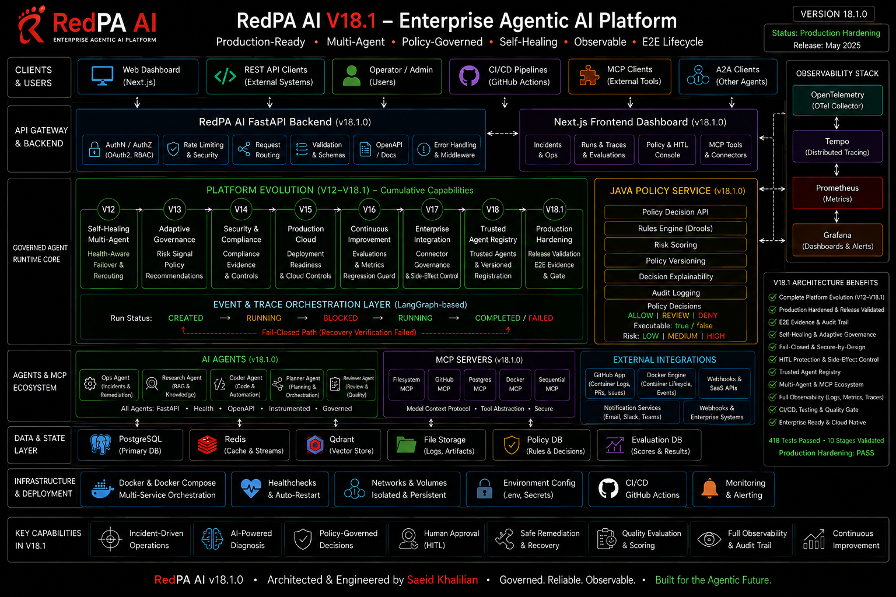
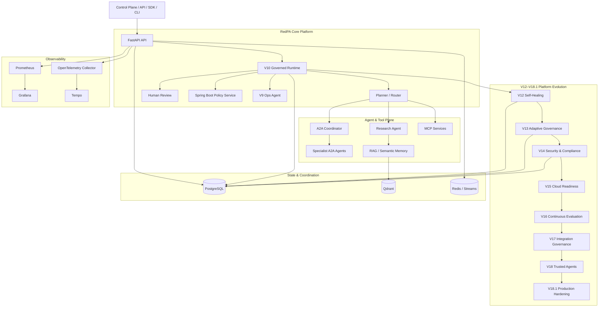

<p align="center">
  
</p>

<h1 align="center">RedPA AI</h1>

<p align="center">
  <strong>Enterprise Agentic AI Platform</strong>
</p>

<p align="center">
  Governed multi-agent execution, self-healing failover, adaptive governance,
  compliance evidence, continuous evaluation, enterprise integration controls,
  and trusted agent operations.
</p>

<p align="center">
  
  
  
  
  
  
  
  
</p>

---

> **A production-oriented platform for building and validating governed Agentic AI systems with explicit policy, human approval, reliability, audit, and observability boundaries.**

RedPA AI explores a central production question: **what should happen when autonomous agents are allowed to reason about—and potentially act on—real systems?**

The platform combines multi-agent orchestration, RAG, MCP tools, A2A delegation, durable workflows, Human-in-the-Loop controls, policy enforcement, operational recovery, self-healing failover, adaptive governance, compliance evidence, continuous evaluation, connector governance, trusted-agent routing, and release validation.

RedPA is intentionally **production-oriented**, not a claim of a live production deployment. Kubernetes/Helm and Azure/Pulumi assets are deployment/reference paths; the repository's strongest validated integration target is the Docker Compose environment and its automated release evidence.

## Current Release — v18.1.0

**V18.1 Production Hardening & Release Validation** closes the V12–V18 platform-evolution chain with an evidence-oriented release gate.

Validated release evidence:

```text
418 passed
0 failed

Alembic head: v270a1b2c3d4e
Production Hardening: PASS
```

The V18.1 hardening gate covers:

| Stage | Validation |
| --- | --- |
| 1 | V12–V18 cross-version integration |
| 2 | Migration-chain continuity through `v270a1b2c3d4e` |
| 3 | Authenticated API end-to-end flows |
| 4 | Persistence and restart behavior |
| 5 | Controlled failure injection and fail-closed behavior |
| 6 | Security and governance boundaries |
| 7 | Docker runtime health |
| 8 | Metrics, logs, and traces |
| 9 | Persisted/exportable release evidence |
| 10 | Final regression gate |

Machine-readable release evidence is stored at:

```text
artifacts/v181-production-hardening.json
```

## Platform Evolution

| Release | Capability | Core boundary |
| --- | --- | --- |
| **V12** | Self-Healing Multi-Agent Runtime | health-aware failover, checkpoint persistence, idempotent recovery, controlled rejoin |
| **V13** | Adaptive Governance | evidence-driven policy recommendations without silent auto-application |
| **V14** | Security & Compliance Evidence | versioned controls, evidence integrity/freshness, risk, approval, audit export |
| **V15** | Production Cloud Readiness | dependency, backup, secrets/IAM, capacity, observability and deployment gates |
| **V16** | Agent Evaluation & Continuous Improvement | baseline/candidate evaluation, safety/regression checks, shadow rollout and rollback |
| **V17** | Enterprise Integration Hub | connector registry, scopes, secret/network/write boundaries, risk and approval |
| **V18** | Trusted Agent Registry | identity, provenance, capabilities, health, governance and trust-aware routing |
| **V18.1** | Production Hardening | cross-version integration, restart/failure validation, observability and release evidence |

Earlier releases established the underlying platform primitives: Agentic foundation, distributed execution, enterprise governance, Control Plane, developer tooling, research workflows, enterprise operations, production operations, and the governed runtime.

## Architecture

<p align="center">
  
</p>



For the detailed component, data, governance, reliability, observability, and deployment views, see [`docs/architecture.md`](docs/architecture.md).

## Core Capabilities

| Area | Capabilities |
| --- | --- |
| Agentic Runtime | planner/router, research workflows, RAG, multi-agent orchestration |
| Governed Execution | persisted run lifecycle, policy decisions, audit events, approval-aware continuation |
| Human-in-the-Loop | explicit approval/rejection and blocked-run resume |
| Operations | incident persistence, diagnosis, remediation proposals, controlled execution, recovery verification |
| Self-Healing | health-aware replacement, context handoff, idempotency, restart checkpoints, controlled rejoin |
| MCP | filesystem, GitHub, PostgreSQL and Docker tool services |
| A2A | coordinator plus research, PostgreSQL, Docker, filesystem and GitHub specialist agents |
| Memory | PostgreSQL-backed state and Qdrant semantic retrieval |
| Governance | adaptive recommendations, versioned proposals, shadow evaluation, explicit apply/rollback |
| Compliance | control registry, evidence collection, SHA-256 integrity, freshness, risk and audit records |
| Evaluation | quality/safety/regression evaluation and rollout/rollback gates |
| Integration | connector scope, secrets, network and write-access boundaries |
| Trust | agent identity, provenance, capabilities, health and trust-aware routing |
| Observability | Prometheus, Grafana, OpenTelemetry, Tempo and structured logging |
| Developer Platform | Python SDK, CLI, examples and API-first integration |
| Deployment Assets | Docker Compose; Kubernetes/Helm and Azure/Pulumi reference assets |

## Runtime Topology

The main Docker Compose stack defines the backend, Control Plane, PostgreSQL, Qdrant, Redis, policy service, MCP services, A2A services, Ops Agent, background workers, event publisher, and observability stack.

Primary local endpoints:

| Service | Port |
| --- | ---: |
| FastAPI backend / Swagger | `8000` |
| Next.js Control Plane | `3001` |
| Spring Boot Policy Service | `8090` |
| Filesystem MCP | `8010` |
| GitHub MCP | `8020` |
| PostgreSQL MCP | `8030` |
| Docker MCP | `8040` |
| A2A Coordinator | `8050` |
| Research Agent | `8061` |
| PostgreSQL Agent | `8062` |
| Docker Agent | `8063` |
| Filesystem Agent | `8064` |
| GitHub Agent | `8065` |

## API Surface

Selected versioned APIs:

| API | Purpose |
| --- | --- |
| `/api/v1/governance/v10` | governed execution lifecycle |
| `/api/v1/operations/v9` | production operations and remediation flow |
| `/api/v1/platform/evolution` | persisted platform-evolution records |
| `/api/v1/adaptive-governance/v13` | governance signals and policy proposals |
| `/api/v1/security-compliance/v14` | compliance controls/evidence |
| `/api/v1/cloud-readiness/v15` | cloud-readiness assessment |
| `/api/v1/continuous-evaluation/v16` | evaluation and rollout decisions |
| `/api/v1/enterprise-integration/v17` | connector governance |
| `/api/v1/trusted-agents/v18` | trusted-agent assessment |
| `/api/v1/production-hardening/v18.1` | release-hardening evidence |

The platform also exposes APIs for authentication, conversations/messages, RAG/documents, Human Review, MCP, agents, memory, evaluations, events, policy enforcement, model gateway, analytics, connectors, and health/monitoring.

Swagger UI:

```text
http://localhost:8000/docs
```

## Quick Start

### Windows / PowerShell

```powershell
git clone https://github.com/saeidkh96/redpa-ai.git
cd redpa-ai

git checkout v18.1.0

python -m venv .venv
.\.venv\Scripts\Activate.ps1

python -m pip install --upgrade pip
python -m pip install -r requirements.txt

Copy-Item .env.example .env

docker compose config --quiet
docker compose up -d --build

docker exec redpa-backend alembic `
  -c /app/backend/alembic.ini upgrade head
```

Expected migration head for V18.1:

```text
v270a1b2c3d4e
```

Then open:

```text
API docs:      http://localhost:8000/docs
Control Plane: http://localhost:3001
```

## Validation

Run the full regression suite:

```powershell
python -m pytest tests -q
```

Validated V18.1 baseline:

```text
418 passed
```

Run the V18.1 production-hardening report using the repository evidence example:

```powershell
New-Item -ItemType Directory -Force .\artifacts | Out-Null

Copy-Item `
  .\docs\v181-evidence-example.json `
  .\artifacts\v181-production-hardening-input.json `
  -Force

python scripts/v181_production_hardening_validation.py
```

Expected result:

```text
PRODUCTION HARDENING: PASS
```

The example evidence file is a reproducible validation fixture. A real deployment should populate release evidence from its actual environment and operational checks.

## Engineering Principles

- **Autonomous reasoning does not imply autonomous permission.**
- High-risk or destructive operations remain policy- and approval-aware.
- Governance, operational state, and release evidence should be persisted and auditable.
- Recovery is not complete until post-action verification succeeds.
- Failover must preserve workflow context and remain idempotent across retries/restarts.
- Adaptive governance can recommend changes but must not silently apply them.
- Connector write access and agent trust are explicit runtime boundaries.
- Production readiness should be demonstrated with evidence, not inferred from architecture alone.

## Documentation

Useful entry points:

- [`docs/architecture.md`](docs/architecture.md) — detailed architecture
- [`docs/V12_SELF_HEALING_STAGE1_10.md`](docs/V12_SELF_HEALING_STAGE1_10.md) — self-healing lifecycle
- [`docs/V13_ADAPTIVE_GOVERNANCE_STAGE1_10.md`](docs/V13_ADAPTIVE_GOVERNANCE_STAGE1_10.md) — adaptive governance
- [`docs/V14_SECURITY_COMPLIANCE_STAGE1_10.md`](docs/V14_SECURITY_COMPLIANCE_STAGE1_10.md) — compliance evidence
- [`docs/V15_PRODUCTION_CLOUD_PLATFORM_STAGE1_10.md`](docs/V15_PRODUCTION_CLOUD_PLATFORM_STAGE1_10.md) — cloud readiness
- [`docs/V16_AGENT_EVALUATION_AND_CONTINUOUS_IMPROVEMENT_STAGE1_10.md`](docs/V16_AGENT_EVALUATION_AND_CONTINUOUS_IMPROVEMENT_STAGE1_10.md) — evaluation and rollout
- [`docs/V17_ENTERPRISE_INTEGRATION_HUB_STAGE1_10.md`](docs/V17_ENTERPRISE_INTEGRATION_HUB_STAGE1_10.md) — connector governance
- [`docs/V18_TRUSTED_AGENT_REGISTRY_STAGE1_10.md`](docs/V18_TRUSTED_AGENT_REGISTRY_STAGE1_10.md) — trusted agents
- [`docs/V18_1_PRODUCTION_HARDENING_STAGE1_10.md`](docs/V18_1_PRODUCTION_HARDENING_STAGE1_10.md) — release hardening
- [`docs/API_REFERENCE.md`](docs/API_REFERENCE.md) — API reference
- [`docs/TESTING.md`](docs/TESTING.md) — testing guidance

## Release Line

```text
V1–V4.2   Agentic foundation -> distributed runtime -> enterprise governance -> production-oriented agentic systems
V5–V8     Control Plane -> developer platform -> enterprise research -> enterprise operations
V9–V10    Production operations -> governed agent runtime
V11       Platform evolution foundation
V12–V18   Self-healing -> adaptive governance -> compliance -> cloud -> evaluation -> integrations -> trust
V18.1     Production hardening & release validation
```

## License

MIT License

Copyright (c) 2026 Saeid Khalilian
