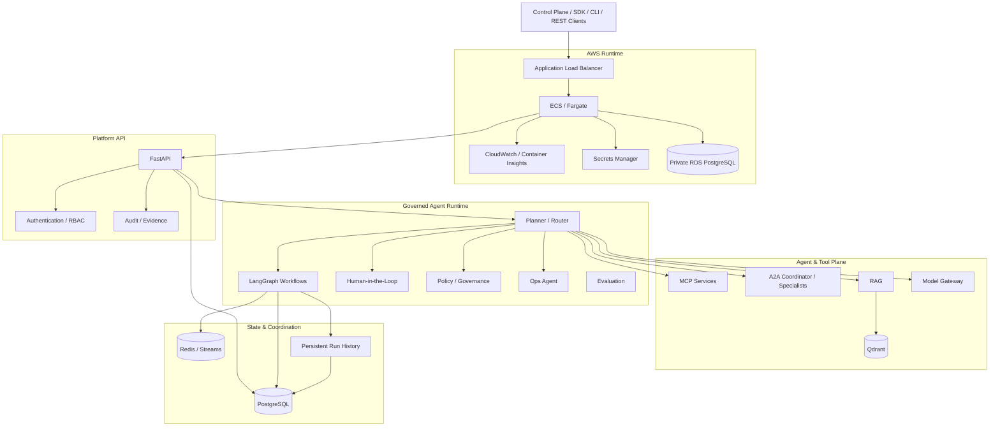

<p align="center">
  
</p>

<h1 align="center">RedPA AI</h1>

<p align="center">
  <strong>Enterprise Agentic AI Platform</strong>
</p>

<p align="center">
  Governed multi-agent execution, RAG, MCP, A2A, Human-in-the-Loop,
  policy enforcement, self-healing recovery, continuous evaluation,
  enterprise analytics, and production-validated AWS infrastructure.
</p>

<p align="center">
  
  
  
  
  
  
  
  
  
</p>

---

> **A production-oriented platform for building and validating governed Agentic AI systems with explicit policy, approval, reliability, recovery, audit, and observability boundaries.**

RedPA AI explores a central production question:

> **What should happen when autonomous agents are allowed to reason about — and potentially act on — real systems?**

The platform separates **reasoning from permission**. Agents may plan, retrieve, delegate, evaluate, diagnose, and recommend actions, while high-risk or destructive operations remain behind explicit governance, policy, Human-in-the-Loop approval, verification, and audit boundaries.

RedPA AI is not only an LLM/RAG demo. It combines a governed Agentic AI runtime, durable state, multi-agent interoperability, operational recovery, enterprise integration contracts, analytics, observability, cloud infrastructure, and release validation.

## Current Release — v20.0.0

RedPA AI v20.0.0 promotes the validated AWS foundation into a dedicated **production Pulumi stack** while preserving the existing development stack without drift.

V20 adds production-specific resource identities, runtime configuration, a validated release image, two-task steady-state ECS capacity, target-tracking autoscaling, SNS-backed CloudWatch alarm routing, and production startup hardening.

### Validated production evidence

```text
Full regression suite:          437 passed
Release tag:                    v20.0.0
Live AWS runtime version:       20.0.0
Runtime environment:            production
ECS desired / running:          2 / 2
ECS pending:                    0
ECS rollout:                    COMPLETED
ECS failed tasks:               0
ECS autoscaling range:          2–4 tasks
ALB liveness:                   healthy
RDS status:                     available
RDS storage encrypted:          true
RDS public access:              false
RDS deletion protection:        true
RDS Multi-AZ:                   false
RDS backup retention:           1 day
SNS production alert topic:     deployed
CloudWatch alarm routing:       SNS-backed
Pulumi production preview:      39 unchanged
Development stack drift:        preserved / clean
```

### Production runtime boundary

```text
Internet
   |
   v
Application Load Balancer :80
   |
   | security-group controlled ingress
   v
ECS / Fargate service
   |
   +-- minimum / desired: 2 tasks
   +-- target-tracking scale-out: up to 4 tasks
   +-- RedPA backend :8000
   +-- Redis sidecar
   |
   v
Private Amazon RDS PostgreSQL
```

The ALB remains the public application entry point; direct public access to backend port `8000` is not part of the production boundary.

### Production autoscaling

V20 registers the ECS service with AWS Application Auto Scaling:

```text
minimum capacity:        2
maximum capacity:        4
CPU target:              60%
memory target:           70%
scale-out cooldown:      60 seconds
scale-in cooldown:       300 seconds
```

This provides service-level capacity elasticity while preserving a two-task steady-state production floor. It is not a claim of regional or multi-region HA.

### Production alert routing

Seven CloudWatch alarms cover ECS, ALB, and RDS signals and route alarm actions to the V20 production SNS topic. An email subscription is optional and configuration-driven; the committed production configuration does **not** claim an active email subscriber.

### Production startup hardening

V20 also validates the container startup contract for production:

- production-specific `SECRET_KEY` / `JWT_SECRET_KEY`
- URL-safe construction of the RDS connection string
- explicit production `ALLOWED_HOSTS` sourced from the ALB DNS name
- production liveness endpoint bypass for Redis-backed rate limiting
- validated `20.0.0` container startup and `/api/v1/platform/live`
- validated ECR release promotion from the tested RC image to `v20.0.0`

### Current database boundary

The production RDS instance is private, encrypted, deletion-protected, and backup-enabled. `Multi-AZ=false` and one-day backup retention remain explicit current boundaries. V20 therefore does not claim multi-AZ database HA, regional failover, or disaster-recovery objectives that have not been validated.

---

## What RedPA AI Includes

### Agentic Runtime

- Planner / router
- LangGraph workflows
- research workflows
- retrieval-augmented generation
- specialist-agent orchestration
- durable execution
- approval-aware continuation
- persistent execution state
- recovery-aware workflow handling

### Retrieval and Memory

- RAG pipelines
- Qdrant vector retrieval
- semantic memory
- PostgreSQL-backed durable state
- contextual retrieval for agents and workflows

### MCP Tool Plane

RedPA uses MCP as a structured tool-execution boundary.

Implemented MCP services include:

- filesystem
- GitHub
- PostgreSQL
- Docker

The MCP plane focuses on capability discovery, typed arguments, controlled invocation, and tool execution.

### A2A Agent Plane

A2A is treated separately from MCP.

The A2A layer supports:

- agent discovery
- capability-based specialist selection
- delegation
- distributed / parallel work
- fallback execution
- result aggregation
- governed agent routing

Specialist services include research, PostgreSQL, Docker, filesystem, and GitHub agents.

### Human-in-the-Loop

The Human Review flow supports:

- approval
- rejection
- persisted review state
- blocked execution
- explicit resume
- audit evidence
- safe continuation after approval

### Governed Runtime

Governance is part of runtime state rather than a detached pre-request check.

Core boundaries include:

- policy evaluation
- ALLOW / REVIEW / DENY outcomes
- explicit approval gates
- fail-closed execution
- persisted audit evidence
- approval-aware resume
- post-action verification

### Production Operations

The operations path covers:

```text
Incident
  -> persistence
  -> diagnosis
  -> remediation proposal
  -> policy decision
  -> approval boundary
  -> controlled execution
  -> recovery verification
  -> close / fail closed
```

A dedicated Ops Agent supports incident diagnosis and remediation planning while potentially destructive side effects remain governed.

### Self-Healing Runtime

RedPA includes self-healing behavior for agent/runtime failures:

- failure recording
- capability discovery
- health-aware replacement
- approval-aware failover
- context handoff
- replacement execution
- verification
- persisted checkpoints
- controlled rejoin
- idempotent failover behavior

### Adaptive Governance

Adaptive governance converts runtime signals into auditable recommendations.

It can:

- aggregate historical signals
- generate policy recommendations
- calculate risk/confidence
- create versioned proposals
- perform shadow evaluation
- require explicit review/apply
- support rollback

Recommendations are not silently auto-applied.

### Security and Compliance Evidence

The compliance lifecycle includes:

- versioned controls
- evidence collection
- completeness checks
- SHA-256 integrity
- freshness / expiry
- risk assessment
- approval boundaries
- persisted audit records
- export / validation gates

### Continuous Evaluation

The evaluation layer supports:

- baseline vs candidate evaluation
- quality evaluation
- safety evaluation
- regression analysis
- shadow evaluation
- rollout decisions
- rollback capability
- validation gates

### Trusted Agent Registry

Trusted-agent routing considers:

- agent identity
- signed manifests
- provenance
- declared capabilities
- health
- governance compatibility
- policy profile
- trust score/state
- routing eligibility

### Enterprise Integration Hub

RedPA treats external integrations as governed capabilities.

Connector controls cover:

- authentication scope
- secret handling
- network access
- write access
- rate limits
- audit
- risk assessment
- approval requirements
- validation gates

### Microsoft Enterprise Integration Readiness

The repository includes contract/readiness support for:

- Power Automate approval flows
- `requires_approval=true` semantics
- Copilot Studio REST actions
- platform summary actions
- agent status actions
- incident summary actions

This is integration readiness and contract support. It does **not** claim a live Power Automate, Copilot Studio, Microsoft 365, Teams, Outlook, or tenant connection.

### Persistent Run History

RedPA persists execution history in PostgreSQL:

- run records
- trace IDs
- primary/fallback agent data
- fallback/recovery evidence
- latency
- evaluation scores
- execution summaries
- Control Plane run-history visibility

### Enterprise Analytics

Analytics are derived from persisted execution history and expose:

- operational KPI summaries
- success / fallback / recovery metrics
- latency
- evaluation scores
- policy-denial visibility
- agent reliability signals
- Power BI-friendly JSON
- Excel-compatible CSV

### Model Gateway

The Model Gateway provides an abstraction boundary between platform logic and model providers.

It supports:

- provider abstraction
- routing
- model status
- provider-specific adapters
- economics / usage considerations
- controlled model-facing integration

### Observability

Application-level observability includes:

- Prometheus
- Grafana
- OpenTelemetry
- Tempo
- structured logs
- request metrics
- operational metrics
- evaluation metrics
- governance metrics

AWS infrastructure observability is documented separately and uses CloudWatch and Container Insights.

### Developer Platform

- FastAPI REST API
- Python SDK
- CLI
- examples
- Docker Compose
- Helm chart
- Kubernetes deployment path
- Pulumi AWS infrastructure
- Pulumi Azure infrastructure path

---

## Architecture

<p align="center">
  
</p>


The canonical architecture is documented in [`docs/architecture.md`](docs/architecture.md).



---

## Platform Evolution

| Release | Capability | Core boundary |
|---|---|---|
| V1–V4.2 | Agentic foundation | orchestration, RAG, platform foundations |
| V5–V8 | Control Plane & developer platform | operator UI, SDK, enterprise workflows |
| V9 | Production operations | incident diagnosis, remediation, verification |
| V10 | Governed agent runtime | policy-aware execution and approval |
| V11 | Platform evolution | cross-version evolution foundation |
| V12 | Self-healing runtime | failure, replacement, verification, rejoin |
| V13 | Adaptive governance | recommendation-first policy evolution |
| V14 | Security & compliance | evidence, risk, approval, audit |
| V15 | Cloud readiness | explicit production/cloud readiness gates |
| V16 | Continuous evaluation | baseline/candidate evaluation and rollout |
| V17 | Enterprise integration hub | governed connector boundaries |
| V18 | Trusted agents | identity, provenance, health, trust-aware routing |
| V18.1 | Production hardening | release evidence and production gates |
| V18.2 | Production E2E | controlled failure, A2A fallback, recovery |
| V18.3 | Persistent run history | PostgreSQL execution evidence |
| V18.4 | Microsoft readiness | Power Automate / Copilot Studio contracts |
| V18.5 | Enterprise analytics | KPIs, Power BI JSON, Excel/CSV |
| V19.0–V19.3 | AWS runtime/data foundation | VPC, ECS/Fargate, ECR, RDS, Secrets |
| V19.4 | Controlled ingress | ALB and backend exposure boundary |
| V19.5 | Resilience | ECS rollback/rebalancing and RDS hardening |
| V19.6 | AWS observability | CloudWatch alarms and infrastructure telemetry |
| V19.7 | Production-readiness validation | failure recovery, backup readiness, validated AWS runtime |
| **V20.0** | **Enterprise production deployment** | **dedicated prod stack, 2–4 ECS autoscaling, SNS alert routing, production runtime hardening** |

---

## Runtime Topology

The main Docker Compose integration stack includes:

- FastAPI backend
- Next.js Control Plane
- PostgreSQL
- Qdrant
- Redis
- Spring Boot Policy Service
- MCP services
- A2A coordinator
- specialist agents
- Ops Agent
- background workers
- scheduler
- outbox/event publisher
- Prometheus
- Grafana
- OpenTelemetry Collector
- Tempo

### Primary local endpoints

| Service | Port |
|---|---:|
| FastAPI backend / Swagger | `8000` |
| Next.js Control Plane | `3001` |
| Spring Boot Policy Service | `8090` |
| Filesystem MCP | `8010` |
| GitHub MCP | `8020` |
| PostgreSQL MCP | `8030` |
| Docker MCP | `8040` |
| A2A Coordinator | `8050` |
| Research Agent | `8061` |
| PostgreSQL Agent | `8062` |
| Docker Agent | `8063` |
| Filesystem Agent | `8064` |
| GitHub Agent | `8065` |

---

## API Surface

Selected APIs include:

| API | Purpose |
|---|---|
| `/api/v1/governance/v10` | Governed execution lifecycle |
| `/api/v1/operations/v9` | Production operations and remediation |
| `/api/v1/platform/evolution` | Platform evolution records |
| `/api/v1/adaptive-governance/v13` | Policy recommendations |
| `/api/v1/security-compliance/v14` | Compliance controls/evidence |
| `/api/v1/cloud-readiness/v15` | Cloud readiness |
| `/api/v1/continuous-evaluation/v16` | Evaluation and rollout decisions |
| `/api/v1/enterprise-integration/v17` | Connector governance |
| `/api/v1/trusted-agents/v18` | Trusted agent assessment |
| `/api/v1/production-hardening/v18.1` | Release-hardening evidence |
| `/api/v1/production-demo/v18.2` | Production E2E demonstration |
| `/api/v1/control-plane/v18.3/runs` | Persistent run history |
| `/api/v1/analytics/v18.5/power-bi` | Power BI-friendly analytics |
| `/api/v1/analytics/v18.5/excel.csv` | Excel-compatible export |

The platform also exposes authentication, conversations/messages, RAG/documents, Human Review, MCP, agents, memory, evaluations, events, policy, model-gateway, analytics, connector, and health endpoints.

Swagger UI:

```text
http://localhost:8000/docs
```

---

## Quick Start

### Windows / PowerShell

```powershell
git clone https://github.com/saeidkh96/redpa-ai.git
cd redpa-ai

git checkout v20.0.0

python -m venv .venv
.\.venv\Scripts\Activate.ps1

python -m pip install --upgrade pip
python -m pip install -r requirements.txt

Copy-Item .env.example .env

docker compose config --quiet
docker compose up -d --build

docker exec redpa-backend alembic `
  -c /app/backend/alembic.ini upgrade head
```

Current validated Alembic head:

```text
v280a1b2c3d4e
```

Open:

```text
API docs:      http://localhost:8000/docs
Control Plane: http://localhost:3001
```

---

## Validation

Run the regression suite:

```powershell
python -m pytest tests -q
```

Validated V20.0 result:

```text
437 passed
```

Run the secret scan:

```powershell
python scripts/security/secret_scan.py
```

Expected result:

```text
[PASS] No obvious committed secrets detected.
```

Validate AWS IaC syntax:

```powershell
python -m py_compile infra/aws/__main__.py
```

Validate Pulumi state:

```powershell
cd infra/aws
pulumi preview
```

Current validated result:

```text
Resources:
    39 unchanged
```

---

## Deployment Boundaries

### Docker Compose

The strongest integrated local runtime target.

### AWS / Pulumi

V20.0.0 is deployed and validated in AWS using a dedicated `prod` Pulumi stack in `eu-central-1`, alongside the preserved `dev` stack. The production runtime uses ECS/Fargate, ECR, ALB, private encrypted RDS PostgreSQL, Secrets Manager, CloudWatch, SNS, Application Auto Scaling, and Pulumi.

Validated claims include:

- live ECS/Fargate runtime
- ALB controlled ingress
- direct public backend access closed
- healthy target routing
- ECS task self-recovery
- deployment circuit breaker
- automatic rollback
- AZ rebalancing
- RDS encryption
- RDS private access
- deletion protection
- automated backup metadata
- restore window
- encrypted automated snapshots
- CloudWatch alarms
- Container Insights
- clean Pulumi drift state

Not currently claimed:

- HTTPS/custom-domain ingress
- AWS WAF
- Route53 production DNS
- ACM certificate integration
- NAT Gateway private egress architecture
- Multi-AZ RDS
- regional failover
- multi-region HA
- SLA/SLO-backed production traffic

### Kubernetes / Helm

The repository contains Kubernetes and Helm deployment assets. They represent a deployment path, not proof of a currently running production cluster.

### Azure / Pulumi

Azure infrastructure modules remain part of the multi-cloud deployment foundation. They should be treated as infrastructure/reference assets unless separately validated against a live Azure target.

---

## Engineering Principles

- **Autonomous reasoning does not imply autonomous permission.**
- High-risk operations remain policy- and approval-aware.
- Governance state and release evidence should be persisted and auditable.
- Recovery is incomplete until post-action verification succeeds.
- Failover must preserve context and remain idempotent.
- Adaptive governance can recommend changes but must not silently apply them.
- Connector write access and agent trust are explicit runtime boundaries.
- Evaluation precedes rollout.
- Deployment readiness must be demonstrated with evidence.
- Integration readiness must not be represented as a live integration.
- Infrastructure preview must not be represented as deployment.
- Cloud deployment must not be represented as HA beyond what is actually validated.

---

## Documentation

Key entry points:

- [`docs/architecture.md`](docs/architecture.md) — detailed architecture
- [`docs/V12_SELF_HEALING_STAGE1_10.md`](docs/V12_SELF_HEALING_STAGE1_10.md)
- [`docs/V13_ADAPTIVE_GOVERNANCE_STAGE1_10.md`](docs/V13_ADAPTIVE_GOVERNANCE_STAGE1_10.md)
- [`docs/V14_SECURITY_COMPLIANCE_STAGE1_10.md`](docs/V14_SECURITY_COMPLIANCE_STAGE1_10.md)
- [`docs/V15_PRODUCTION_CLOUD_PLATFORM_STAGE1_10.md`](docs/V15_PRODUCTION_CLOUD_PLATFORM_STAGE1_10.md)
- [`docs/V16_AGENT_EVALUATION_AND_CONTINUOUS_IMPROVEMENT_STAGE1_10.md`](docs/V16_AGENT_EVALUATION_AND_CONTINUOUS_IMPROVEMENT_STAGE1_10.md)
- [`docs/V17_ENTERPRISE_INTEGRATION_HUB_STAGE1_10.md`](docs/V17_ENTERPRISE_INTEGRATION_HUB_STAGE1_10.md)
- [`docs/V18_TRUSTED_AGENT_REGISTRY_STAGE1_10.md`](docs/V18_TRUSTED_AGENT_REGISTRY_STAGE1_10.md)
- [`docs/V18_1_PRODUCTION_HARDENING_STAGE1_10.md`](docs/V18_1_PRODUCTION_HARDENING_STAGE1_10.md)
- [`docs/V18_2_PRODUCTION_E2E_DEMO_STAGE1_10.md`](docs/V18_2_PRODUCTION_E2E_DEMO_STAGE1_10.md)
- [`docs/V18_3_CONTROL_PLANE_RUN_HISTORY.md`](docs/V18_3_CONTROL_PLANE_RUN_HISTORY.md)
- [`docs/V18_4_MICROSOFT_ENTERPRISE_INTEGRATION.md`](docs/V18_4_MICROSOFT_ENTERPRISE_INTEGRATION.md)
- [`docs/V18_5_ENTERPRISE_ANALYTICS.md`](docs/V18_5_ENTERPRISE_ANALYTICS.md)
- [`docs/V19_CLOUD_DEPLOYMENT_FOUNDATION.md`](docs/V19_CLOUD_DEPLOYMENT_FOUNDATION.md)
- [`docs/releases/V19.7.0.md`](docs/releases/V19.7.0.md)
- [`docs/releases/V20.0.0.md`](docs/releases/V20.0.0.md)
- [`docs/V20_ENTERPRISE_PRODUCTION.md`](docs/V20_ENTERPRISE_PRODUCTION.md)
- [`docs/API_REFERENCE.md`](docs/API_REFERENCE.md)
- [`docs/TESTING.md`](docs/TESTING.md)

---

## Release Line

```text
V1–V4.2     Agentic foundation → distributed runtime → governance
V5–V8       Control Plane → developer platform → research → enterprise operations
V9–V10      Production operations → governed agent runtime
V11         Platform evolution foundation
V12–V18     Self-healing → adaptive governance → compliance → cloud readiness
            → continuous evaluation → integration governance → trusted agents
V18.1       Production hardening
V18.2       Production E2E demonstration
V18.3       Persistent run history
V18.4       Microsoft integration readiness
V18.5       Enterprise analytics
V19.0–19.3  AWS runtime and managed data foundation
V19.4       Controlled ALB ingress
V19.5       ECS/RDS resilience hardening
V19.6       AWS observability
V19.7       Failure recovery + production-readiness validation
V20.0       Enterprise production stack + autoscaling + alert routing + runtime hardening
```

## License

MIT License

Copyright (c) 2026 Saeid Khalilian
