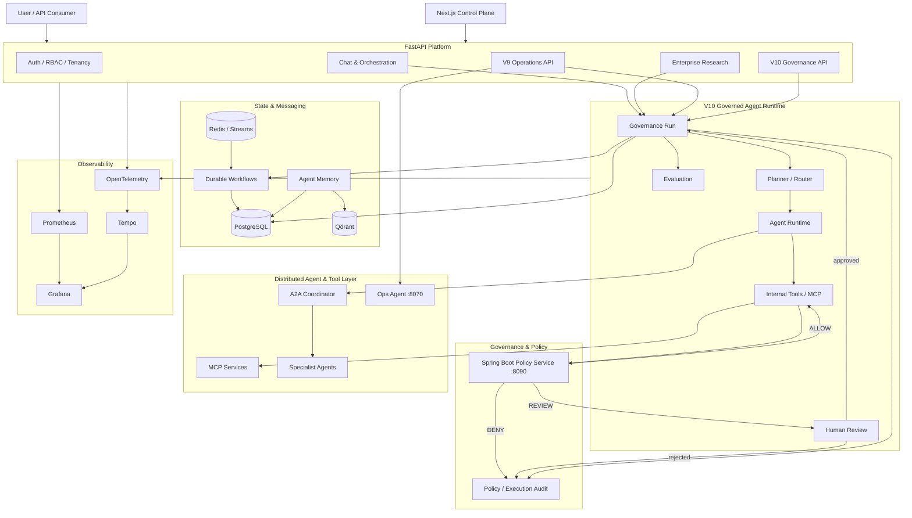

<p align="center">
  
</p>

<h1 align="center">RedPA AI</h1>

<p align="center">
  <strong>Enterprise Agentic AI Platform</strong>
</p>

<p align="center">
  Governed multi-agent execution with MCP, A2A, durable workflows, Human-in-the-Loop approval,
  semantic memory, policy enforcement, evaluation, autonomous operations, and distributed observability.
</p>

<p align="center">
  
  
  
  
  
  
  
  
  
  
</p>

------------------------------------------------------------------------

> **A production-oriented Agentic AI platform for orchestrating
> autonomous agents, enforcing policy at tool boundaries, executing
> durable workflows, integrating enterprise systems, and operating AI
> workloads with security, observability, and human oversight.**

RedPA AI is a modular platform for building real-world Agentic AI
systems. It combines planner-based routing, Retrieval-Augmented
Generation (RAG), Model Context Protocol (MCP), Agent-to-Agent (A2A)
communication, Human-in-the-Loop approval, durable workflow execution,
semantic Agent Memory, model-provider abstraction, evaluation, policy
enforcement, RBAC, multi-tenancy, event-driven messaging, and production
observability in one extensible architecture.

The project is designed as an engineering platform rather than a single
LLM wrapper. APIs, orchestration, agents, tools, policy, workflows,
memory, messaging, observability, identity, and infrastructure are
separated so that each subsystem can evolve independently.

------------------------------------------------------------------------

## Table of Contents

-   [Overview](#overview)
-   [V10.0 Governed Agent Runtime](#v100-governed-agent-runtime)
-   [V9.0 Production Cloud & Autonomous Operations](#v90-production-cloud--autonomous-operations)
-   [V8.0 Enterprise Operations](#v80-enterprise-operations)
-   [V7.0 Enterprise Research](#v70-enterprise-research)
-   [V6.0 Developer Platform](#v60-developer-platform)
-   [V5.5 Evaluation & Reliability](#v55-evaluation--reliability)
-   [V5.0 Control Plane](#v50-control-plane)
-   [V4.2 Production Agentic Systems Readiness](#v42-production-agentic-systems-readiness)
-   [Control Center](#control-center)
-   [Architecture](#architecture)
-   [Key Capabilities](#key-capabilities)
-   [Policy and Guardrails](#policy-and-guardrails)
-   [Evaluation and Model Gateway](#evaluation-and-model-gateway)
-   [Access Control and
    Multi-tenancy](#access-control-and-multi-tenancy)
-   [Event-driven Architecture](#event-driven-architecture)
-   [MCP Integration](#mcp-integration)
-   [A2A Multi-Agent System](#a2a-multi-agent-system)
-   [Durable Workflows](#durable-workflows)
-   [Human-in-the-Loop](#human-in-the-loop)
-   [Agent Memory](#agent-memory)
-   [Observability](#observability)
-   [Architecture Governance](#architecture-governance)
-   [Cloud and Infrastructure](#cloud-and-infrastructure)
-   [Security](#security)
-   [Technology Stack](#technology-stack)
-   [Repository Structure](#repository-structure)
-   [Quick Start](#quick-start)
-   [API Overview](#api-overview)
-   [Testing and Verification](#testing-and-verification)
-   [Release](#release)
-   [Roadmap](#roadmap)
-   [Engineering Highlights](#engineering-highlights)
-   [License](#license)

------------------------------------------------------------------------

## Overview

RedPA AI provides an end-to-end foundation for production-oriented
Agentic AI applications.

The platform can:

-   coordinate multiple agents;
-   route tasks through structured planning;
-   retrieve internal knowledge with RAG;
-   discover and execute MCP tools;
-   delegate work to remote A2A specialist agents;
-   pause risky actions for human approval;
-   persist and resume long-running workflows;
-   maintain semantic and structured agent memory;
-   evaluate model and workflow quality;
-   route requests through a model gateway;
-   enforce policy before internal-tool and MCP execution;
-   isolate tenants and enforce tenant roles;
-   publish domain events through a transactional outbox;
-   deliver events through Redis Streams;
-   expose metrics, logs, traces, health, and performance data;
-   deploy locally with Docker Compose and provide Kubernetes/Helm and Azure/Pulumi deployment/reference assets.

------------------------------------------------------------------------


## V10.0 Governed Agent Runtime

V10 turns governance from a tool-boundary check into a persisted runtime control layer for agent execution. Agent runs now carry lifecycle state, trace events, policy decisions, evaluation linkage, and explicit Human-in-the-Loop recovery semantics.

### V10 governed lifecycle

```text
Agent request
    |
    v
Governance Run
    |
    +--> policy / risk decision
    |        |
    |        +--> executable --------------------+
    |        |                                    |
    |        +--> review required                 |
    |                 |                           |
    |                 v                           |
    |              BLOCKED                        |
    |                 |                           |
    |           human approval                    |
    |                 |                           |
    |                 v                           |
    +-------------> RUNNING <---------------------+
                       |
                       v
                 agent / tool work
                       |
                       v
                recovery / result
                       |
                       v
                   COMPLETED
                       |
                       v
                  evaluation
```

Implemented V10 capabilities include:

- persisted governance runs with lifecycle states and immutable-style execution events;
- governance trace correlation across agent, workflow, policy, operations, and evaluation stages;
- explicit `BLOCKED -> RUNNING` resume semantics after valid human approval;
- policy decisions recorded with risk, decision, matched rules, policy version, and executability;
- governed integration in planner, research, tool, Human Review, and chat/orchestration paths;
- governed autonomous-operations recovery with diagnosis, denial, approval, remediation, recovery verification, and evaluation;
- a dedicated Spring Boot Policy Service on port `8090`, promoted to the primary Docker Compose stack;
- evaluation linkage on completed runs, including aggregate score and evaluation-run identity;
- CI governance gates covering V10 governance, runtime integration, Ops governance, lifecycle recovery, release hardening, regression tests, and secret scanning;
- release-hardening across Docker Compose, OpenTelemetry/Tempo startup behavior, SDK, frontend, Helm, CI, and application version contracts.

### Verified V10 recovery path

The release candidate was exercised end-to-end against a deliberately stopped `redpa-research-agent` container:

```text
RUNNING
 -> policy REVIEW / executable=false
 -> BLOCKED
 -> human approval
 -> policy REVIEW / executable=true
 -> RUNNING
 -> ops.remediation_started
 -> ops.recovery_verified
 -> COMPLETED
 -> evaluation.completed
```

The verified run restored the container to `running`, completed the governance run, and produced an evaluation score of `1.0`.

### V10 service surfaces

| Surface | Purpose |
| --- | --- |
| `/api/v1/governance/v10` | Governed run lifecycle, events, policy/evaluation-linked execution records |
| `/api/v1/operations/v9` | Operations domain, now integrated with V10 governance lifecycle |
| `redpa-ops-agent:8070` | Docker-backed diagnosis and approval-aware remediation |
| `policy-service:8090` | Dedicated Spring Boot policy decision service |
| OpenTelemetry + Tempo | Distributed trace export and trace storage |
| Prometheus + Grafana | Metrics and operational dashboards |

See [`docs/V10_GOVERNED_AGENT_RUNTIME.md`](docs/V10_GOVERNED_AGENT_RUNTIME.md) and [`docs/releases/V10.0.0.md`](docs/releases/V10.0.0.md).

------------------------------------------------------------------------

------------------------------------------------------------------------

## Architecture

<p align="center">
  
</p>

RedPA V10 is organized around a **governed agent runtime** rather than a collection of isolated LLM calls. Agent execution, policy decisions, Human-in-the-Loop approval, operational recovery, evaluation, persistence, and observability are connected through one auditable lifecycle.



Architecture documentation also includes C4, arc42, DDD, Clean Architecture rules, and ADRs under [`docs/architecture/`](docs/architecture/).

------------------------------------------------------------------------

## Core Capabilities

| Area | Capabilities |
| --- | --- |
| **Governed Agent Runtime** | persisted runs, lifecycle states, trace events, policy decisions, approval-aware resume, evaluation linkage |
| **Agentic AI** | planner routing, chat, research, RAG, tool agents, structured state, multi-agent orchestration |
| **MCP** | tool discovery, qualified execution, isolated services, guarded tool boundaries |
| **A2A** | coordinator, specialist discovery, delegation, parallel execution, result aggregation |
| **Human-in-the-Loop** | approval/rejection, blocked-run recovery, workflow resume, policy-to-review linkage |
| **Durable Workflows** | persistence, checkpoints, retries, resume, distributed subtasks |
| **Agent Memory** | PostgreSQL metadata, Qdrant semantic retrieval, private/shared memory, summarization |
| **Evaluation** | persisted evaluations, benchmarks, regression checks, quality gates, run linkage |
| **Model Gateway** | provider abstraction, routing, fallback, reliability, usage and cost controls |
| **Operations** | incident persistence, diagnosis, governed remediation, recovery verification, release readiness |
| **Enterprise Platform** | tenancy/RBAC foundations, event outbox, Redis Streams, analytics/KPIs, connectors |
| **Observability** | Prometheus, Grafana, OpenTelemetry, Tempo, structured logs and trace correlation |
| **Infrastructure** | Docker Compose, Kubernetes, Helm, Azure/Pulumi reference architecture, CI/CD |

------------------------------------------------------------------------

## V10 Governance Lifecycle

Every governed execution can be correlated through a persisted run and event history.

```text
CREATED
   |
   v
RUNNING
   |
   +--> policy ALLOW --------------------------+
   |                                           |
   +--> policy REVIEW --> BLOCKED              |
   |                       |                   |
   |                  human approval           |
   |                       |                   |
   |                       v                   |
   +-------------------- RUNNING <-------------+
   |                       |
   +--> policy DENY         v
   |                     execution
   v                       |
FAILED / BLOCKED           v
                        recovery/result
                           |
                           v
                       COMPLETED
                           |
                           v
                       EVALUATED
```

The V10 operational recovery path was validated end-to-end by stopping the Research Agent, diagnosing the failure, denying an unapproved restart, resuming after explicit approval, restarting the container, verifying recovery, completing the governed run, and linking evaluation evidence.

------------------------------------------------------------------------

## Policy and Human Approval

The dedicated Spring Boot Policy Service is the execution-policy authority for guarded actions.

Policy outcomes:

```text
ALLOW   -> action may execute
REVIEW  -> action requires Human-in-the-Loop approval
DENY    -> action is blocked
```

Policy records can include risk, matched rules, policy version, reason, executability, and review linkage. V10 persists these decisions into the governed execution trace so operational actions are auditable rather than hidden side effects.

The policy service runs locally at:

```text
http://localhost:8090
```

------------------------------------------------------------------------

## MCP and A2A

### MCP services

```text
Filesystem MCP   : 8010
GitHub MCP       : 8020
PostgreSQL MCP   : 8030
Docker MCP       : 8040
```

MCP execution supports service isolation, dynamic discovery, structured arguments, policy enforcement, and Human Review for guarded actions.

### A2A runtime

```text
A2A Coordinator      : 8050
Research Agent       : 8061
PostgreSQL Agent     : 8062
Docker Agent         : 8063
Filesystem Agent     : 8064
GitHub Agent         : 8065
```

Specialist services expose Agent Cards through `/.well-known/agent-card.json` and can be selected by capability for distributed execution.

------------------------------------------------------------------------

## Data, Memory, Workflows, and Events

**PostgreSQL** stores relational platform state including users, workflows, governance records, evaluations, incidents, policy/audit data, and other persisted application state.

**Qdrant** provides vector retrieval for RAG and semantic Agent Memory.

**Redis** supports caching, background execution, and Redis Streams-based messaging.

Durable workflows provide persisted state, checkpoints, retries, Human Review pauses, and resume semantics. The transactional outbox separates application transactions from asynchronous event publication.

------------------------------------------------------------------------

## Observability

RedPA combines:

- **Prometheus** for metrics;
- **Grafana** for dashboards;
- **OpenTelemetry** for distributed instrumentation;
- **Tempo** for trace storage;
- structured logging with request, correlation, trace, workflow, and execution identifiers.

V10 extends this model with governance-run and execution-event correlation across agent, policy, operations, Human Review, recovery, and evaluation stages.

------------------------------------------------------------------------

## Security and Platform Controls

Implemented security and governance foundations include:

- JWT authentication;
- tenant-aware access foundations and RBAC;
- policy enforcement at guarded execution boundaries;
- Human-in-the-Loop approval;
- persistent policy and governance audit records;
- rate limiting and idempotency;
- CORS and security headers;
- environment/configuration validation;
- secret scanning;
- guarded MCP execution and input validation;
- read-only protections where applicable;
- Kubernetes security contexts and network-policy hardening;
- CI governance and release gates.

Production OAuth completion and live cloud deployment require real provider/cloud credentials and are not represented as already deployed production infrastructure.

------------------------------------------------------------------------

## Technology Stack

| Area | Technologies |
| --- | --- |
| Backend | Python 3.13, FastAPI, Pydantic, SQLAlchemy, asyncpg |
| Governance | V10 governed runtime, Spring Boot Policy Service |
| Frontend | Next.js, TypeScript |
| Agentic AI | planner routing, RAG, stateful agent workflows |
| Protocols | MCP, A2A |
| Data | PostgreSQL 17, Qdrant |
| Messaging / Runtime | Redis, Redis Streams |
| Evaluation | persisted evaluation, benchmarks, regression and quality gates |
| Observability | Prometheus, Grafana, OpenTelemetry, Tempo |
| Containers | Docker, Docker Compose |
| Deployment | Kubernetes, Helm |
| Cloud IaC | Pulumi Python, Azure Native |
| Architecture | DDD, Clean Architecture, C4, arc42, ADR |
| Testing | pytest, JUnit/Spring tests, contract and architecture tests |
| CI/CD | GitHub Actions |

------------------------------------------------------------------------

## Repository Structure

```text
redpa-ai/
├── backend/
│   ├── alembic/
│   └── app/
│       ├── agents/
│       ├── api/v1/
│       ├── governance_v10/
│       ├── ops_v9/
│       ├── evaluation/
│       ├── model_gateway/
│       ├── agent_memory/
│       ├── distributed_durable/
│       ├── events/
│       ├── mcp_servers/
│       ├── specialist_agents/
│       └── main.py
├── policy-service/
├── frontend/
├── sdk/python/
├── infra/azure/
├── deploy/
│   ├── helm/
│   └── kubernetes/
├── monitoring/
├── observability/
├── docs/
├── scripts/
├── tests/
├── .github/workflows/
├── docker-compose.yml
└── README.md
```

------------------------------------------------------------------------

## Quick Start

### Requirements

- Python 3.13+
- Docker Desktop / Docker Compose
- Git
- Node.js when running the frontend outside Docker
- Java/Maven when building the policy service outside Docker
- Ollama when using a local model runtime outside Docker

### Clone and configure

```powershell
git clone https://github.com/saeidkh96/redpa-ai.git
cd redpa-ai

python -m venv .venv
.\.venv\Scripts\Activate.ps1

python -m pip install --upgrade pip
python -m pip install -r requirements.txt

Copy-Item .env.example .env
docker compose config
```

Review `.env` before startup and never commit local secrets.

### Start the platform

```powershell
docker compose up -d --build
docker compose exec backend python -m alembic -c alembic.ini upgrade head
docker compose ps
```

### Local services

| Service | URL |
| --- | --- |
| Control Plane | `http://localhost:3001` |
| Backend / Swagger | `http://localhost:8000/docs` |
| Policy Service | `http://localhost:8090` |
| Ops Agent | `http://localhost:8070` |
| Prometheus | `http://localhost:9090` |
| Grafana | `http://localhost:3000` |
| Tempo | `http://localhost:3200` |
| Qdrant | `http://localhost:6333` |

------------------------------------------------------------------------

## API Overview

Main API areas are exposed under `/api/v1`.

| API | Purpose |
| --- | --- |
| `/auth`, `/users` | authentication and identity |
| `/conversations`, `/chat` | conversation and governed agent orchestration |
| `/documents` | document ingestion and RAG |
| `/reviews` | Human Review |
| `/governance/v10` | V10 governed run lifecycle, events and execution records |
| `/operations/v9` | incidents, diagnosis, governed remediation, cost and readiness |
| `/tools`, `/mcp` | internal and MCP tool discovery/execution |
| `/agents` | agent registry and distributed agent operations |
| `/memory` | Agent Memory |
| `/evaluations` | evaluation, benchmarks, regression and quality gates |
| `/model-gateway` | model routing and provider operations |
| `/guardrails`, `/policy` | policy and guardrail surfaces |
| `/tenants`, `/oauth` | tenancy and OAuth foundations |
| `/events` | transactional outbox and event operations |
| `/research/runs` | Enterprise Research |
| `/analytics` | KPI and analytics operations |
| `/connectors` | enterprise automation connectors |
| `/health`, `/platform`, `/performance` | platform health and operational state |

Use Swagger at `http://localhost:8000/docs` for authoritative request and response schemas.

------------------------------------------------------------------------

## Testing and Verification

V10 release validation includes dedicated governance, runtime-integration, operations-governance, lifecycle-recovery, regression, CI, and secret-scanning gates.

Latest full local regression:

```text
344 passed
```

The V10 governed operations lifecycle was also validated against a deliberately stopped Research Agent:

```text
RUNNING
 -> policy REVIEW / executable=false
 -> BLOCKED
 -> human approval
 -> policy REVIEW / executable=true
 -> RUNNING
 -> ops.remediation_started
 -> ops.recovery_verified
 -> COMPLETED
 -> evaluation.completed
```

Observed validation evidence included:

```text
container state      : running
governance run       : completed
evaluation score     : 1.0
```

This validates the critical V10 behavior: policy does not merely describe what should happen; it participates in an executable, persisted, approval-aware lifecycle.

------------------------------------------------------------------------

## Release

### v10.0.0 — Governed Agent Runtime

V10 promotes governance into the runtime lifecycle of RedPA AI.

Release highlights:

- persisted governance runs and execution events;
- trace correlation across agent, workflow, policy, operations, and evaluation;
- explicit `BLOCKED -> RUNNING` Human-in-the-Loop resume semantics;
- persisted policy decision evidence;
- governed planner, research, tool, Human Review, and orchestration paths;
- governed autonomous-operations recovery;
- dedicated Spring Boot Policy Service in the primary runtime;
- recovery verification and evaluation linkage;
- OpenTelemetry/Tempo integration and release hardening;
- V10 governance and release CI gates.

See [`docs/V10_GOVERNED_AGENT_RUNTIME.md`](docs/V10_GOVERNED_AGENT_RUNTIME.md) and [`docs/releases/V10.0.0.md`](docs/releases/V10.0.0.md).

------------------------------------------------------------------------

## Release History

| Version | Milestone |
| --- | --- |
| **V10** | Governed Agent Runtime |
| **V9** | Production Cloud & Autonomous Operations |
| **V8** | Enterprise Operations & Automation |
| **V7** | Enterprise Research |
| **V6** | Developer Platform |
| **V5.5** | Evaluation & Reliability |
| **V5** | Control Plane |
| **V4.2** | Production Agentic Systems Readiness |
| **V3** | Enterprise Governance & Integration |
| **V2** | Distributed Agentic Runtime |
| **V1** | Agentic Foundation |

Historical implementation and release documentation remains under `docs/`.

------------------------------------------------------------------------

## Roadmap

### Completed

**V1 → V10** establish the current RedPA platform foundation: agent orchestration, RAG, MCP, A2A, durable execution, Human Review, semantic memory, enterprise governance, model/evaluation infrastructure, Control Plane, SDK/CLI, enterprise research, automation/analytics, autonomous operations, and the V10 governed execution lifecycle.

### Next

- validate the Azure/Pulumi production stack against a live subscription;
- complete production OAuth token exchange and account linking;
- deepen tenant-level authorization and policy isolation;
- expand evaluation datasets and benchmark coverage;
- add larger-scale load, chaos, and resilience validation;
- extend production SLO/SLA operational dashboards;
- expand enterprise connectors and event consumers;
- continue hardening governed autonomous execution.

------------------------------------------------------------------------

## Engineering Focus

RedPA AI demonstrates practical engineering across:

**Agentic AI · Multi-Agent Systems · RAG · MCP · A2A · Governed Agent Runtime · Human-in-the-Loop · Durable Workflows · Semantic Memory · Model Routing · AI Evaluation · Policy Enforcement · Autonomous Operations · Event-Driven Architecture · PostgreSQL · Qdrant · Redis Streams · FastAPI · Spring Boot · Next.js · Docker · Kubernetes · Helm · OpenTelemetry · Prometheus · Grafana · Azure · Pulumi · CI/CD**

------------------------------------------------------------------------

## License

This project is licensed under the MIT License.

Copyright (c) 2026 Saeid Khalilian
