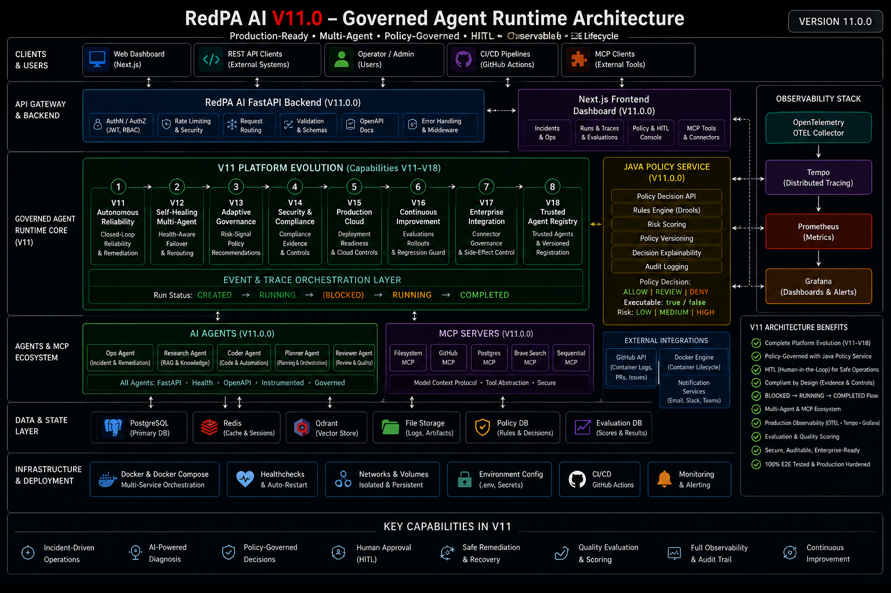
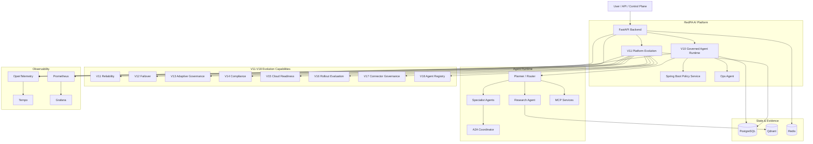

<p align="center">
  
</p>

<h1 align="center">RedPA AI</h1>

<p align="center">
  <strong>Enterprise Agentic AI Platform</strong>
</p>

<p align="center">
  Governed multi-agent execution, autonomous reliability, adaptive policy recommendations,
  enterprise integration controls, continuous evaluation, and trusted agent operations.
</p>

<p align="center">
  
  
  
  
  
  
  
  
  
</p>

---

> **A production-oriented Agentic AI platform for governed execution, multi-agent orchestration, durable workflows, policy enforcement, Human-in-the-Loop control, operational recovery, evaluation, and enterprise-grade observability.**

RedPA AI is an engineering platform for exploring how autonomous agents can operate inside explicit runtime, policy, reliability, and audit boundaries.

The current **v11.0.0** release builds on the V10 Governed Agent Runtime and adds a broader **Platform Evolution layer** covering reliability, failover, adaptive governance, compliance evidence, cloud readiness, rollout evaluation, connector risk, and trusted agent registration.

---

## Current Release — v11.0.0

### V11 Platform Evolution

The v11.0.0 release bundles a sequence of platform capabilities introduced as internal milestones V11–V18:

| Milestone | Capability |
| --- | --- |
| **V11** | Autonomous Reliability |
| **V12** | Self-Healing Multi-Agent |
| **V13** | Adaptive Governance |
| **V14** | Security & Compliance Evidence |
| **V15** | Production Cloud Readiness |
| **V16** | Continuous Evaluation & Rollout Gate |
| **V17** | Enterprise Connector Governance |
| **V18** | Trusted Agent Registry |

These capabilities share a persisted evidence model and are exposed through the V11 Platform Evolution API and Control Plane.

### Verified release evidence

The current release baseline has been validated with:

```text
359 passed
```

Additional live validation covered:

```text
V11  closed_loop_reliability  -> action_required
V12  agent_failover           -> routable
V13  policy_recommendation    -> recommendation
V14  compliance_evidence      -> incomplete (intentional missing-evidence test)
V15  cloud_readiness          -> ready
V16  continuous_evaluation    -> promote
V17  connector_assessment     -> review
V18  agent_registry           -> trusted
```

Eight persisted evolution records were verified in the Control Plane.

---

## Architecture

<p align="center">
  
</p>



Full architecture notes: [`docs/V11_PLATFORM_EVOLUTION.md`](docs/V11_PLATFORM_EVOLUTION.md)

---

## Governed Runtime

V10 established governance as persisted runtime state rather than a detached middleware check.

```text
CREATED
  -> RUNNING
      -> policy ALLOW
      -> policy REVIEW -> BLOCKED -> human approval -> RUNNING
      -> policy DENY
  -> execution
  -> recovery / result
  -> COMPLETED
  -> evaluation
```

A real V10.3 E2E flow was automated and validated:

```text
run.created
-> run.running
-> ops.diagnosis_started
-> ops.diagnosis_completed
-> policy.decision
-> ops.remediation_blocked
-> policy.decision
-> run.running
-> ops.remediation_started
-> ops.recovery_verified
-> run.completed
-> evaluation.completed
```

The test restored a deliberately stopped Research Agent and ended with:

```text
status            : completed
evaluation_score  : 1.0
container         : running
```

---

## Policy Management

RedPA provides two policy layers:

1. the dedicated Spring Boot Policy Service;
2. persisted user-scoped policy overrides in the FastAPI platform.

Supported outcomes:

```text
ALLOW
REVIEW
DENY
```

A live policy override was validated for `restart_container` at the `ops_remediation` boundary with `REVIEW / HIGH`, source `redpa-policy-override`, and `executable=false`.

The V13 Adaptive Governance capability recommends policy changes but deliberately does **not** auto-apply them.

---

## V11–V18 Platform Evolution

### V11 — Autonomous Reliability
Operational signals are evaluated into `observe`, `investigate`, or `governed_remediation`, with persisted evidence.

### V12 — Self-Healing Multi-Agent
Health-aware routing excludes unhealthy agents and selects a fallback candidate.

### V13 — Adaptive Governance
Produces policy recommendations from incident count, failure rate, and destructive-action context while preserving `auto_applied=false`.

### V14 — Security & Compliance Evidence
Checks structured evidence against required fields and records missing evidence.

### V15 — Production Cloud Readiness
Scores readiness across health checks, backups, secrets management, autoscaling, and telemetry.

### V16 — Continuous Evaluation
Compares candidate and baseline scores plus error-rate delta to return `PROMOTE` or `HOLD`.

### V17 — Enterprise Connector Governance
Assesses connector risk from write access, external network access, secret handling, and approval requirements.

### V18 — Trusted Agent Registry
Registers versioned agents with trust signals for signed manifests, health endpoints, and governance compatibility.

---

## Control Plane

Main Control Plane pages:

```text
/control-plane/governance
/control-plane/policy
/control-plane/evolution
```

The evolution dashboard exposes milestone counts and persisted evidence records.

---

## Core Platform Capabilities

| Area | Capabilities |
| --- | --- |
| Agentic Runtime | planner routing, research, RAG, multi-agent orchestration |
| Governance | persisted runs, lifecycle events, approval-aware resume, policy tracing |
| Policy | Spring Boot Policy Service, persisted overrides, ALLOW/REVIEW/DENY |
| HITL | approval/rejection, blocked-run recovery |
| Operations | incident persistence, diagnosis, governed remediation, recovery verification |
| MCP | filesystem, GitHub, PostgreSQL, Docker tools |
| A2A | coordinator, specialist discovery and delegation |
| Memory | PostgreSQL + Qdrant semantic memory |
| Evaluation | persisted evaluation, release and quality gates |
| Platform Evolution | reliability, failover, compliance, rollout, connectors, agent trust |
| Observability | Prometheus, Grafana, OpenTelemetry, Tempo |
| Infrastructure | Docker Compose, Kubernetes, Helm, Azure/Pulumi reference architecture |

---

## API Overview

| API | Purpose |
| --- | --- |
| `/api/v1/governance/v10` | governed run lifecycle and execution evidence |
| `/api/v1/policy` | enforcement and persisted policy overrides |
| `/api/v1/operations/v9` | incident diagnosis and governed remediation |
| `/api/v1/platform/evolution` | V11–V18 platform evolution capabilities |
| `/api/v1/reviews` | Human-in-the-Loop |
| `/api/v1/evaluations` | evaluation and quality |
| `/api/v1/mcp` | MCP execution |
| `/api/v1/agents` | agent operations |
| `/api/v1/memory` | semantic Agent Memory |
| `/api/v1/events` | event/outbox operations |
| `/api/v1/model-gateway` | provider routing |
| `/api/v1/health` | platform health |

Swagger:

```text
http://localhost:8000/docs
```

---

## Quick Start

```powershell
git clone https://github.com/saeidkh96/redpa-ai.git
cd redpa-ai

python -m venv .venv
.\.venv\Scripts\Activate.ps1

python -m pip install --upgrade pip
python -m pip install -r requirements.txt

Copy-Item .env.example .env

docker compose config --quiet
docker compose up -d --build

docker compose exec backend `
  python -m alembic -c alembic.ini upgrade head
```

Expected migration head:

```text
v180a1b2c3d4e
```

---

## Testing

```powershell
python -m pytest tests -q
```

Current validated baseline:

```text
359 passed
```

Additional release checks:

```powershell
python scripts/security/secret_scan.py
docker compose config --quiet

cd frontend
npm.cmd run build
cd ..
```

---

## Release History

| Release | Focus |
| --- | --- |
| **v11.0.0** | Platform Evolution: reliability, failover, adaptive governance, compliance, cloud readiness, rollout evaluation, integration governance, trusted agents |
| **v10.0.0** | Governed Agent Runtime |
| **v9.0.0** | Production Cloud & Autonomous Operations |
| V8 | Enterprise Operations & Automation |
| V7 | Enterprise Research |
| V6 | Developer Platform |
| V5.5 | Evaluation & Reliability |
| V5 | Control Plane |
| V4.2 | Production Agentic Systems Readiness |
| V3 | Enterprise Governance & Integration |
| V2 | Distributed Agentic Runtime |
| V1 | Agentic Foundation |

---

## Engineering Principles

- autonomous reasoning does not imply autonomous permission;
- destructive or high-risk actions remain policy- and approval-aware;
- governance state should be persisted and auditable;
- recovery is not complete until it is verified;
- adaptive governance may recommend policy changes without silently applying them;
- production readiness must be demonstrated with evidence rather than inferred from architecture diagrams alone.

---

## License

MIT License

Copyright (c) 2026 Saeid Khalilian
