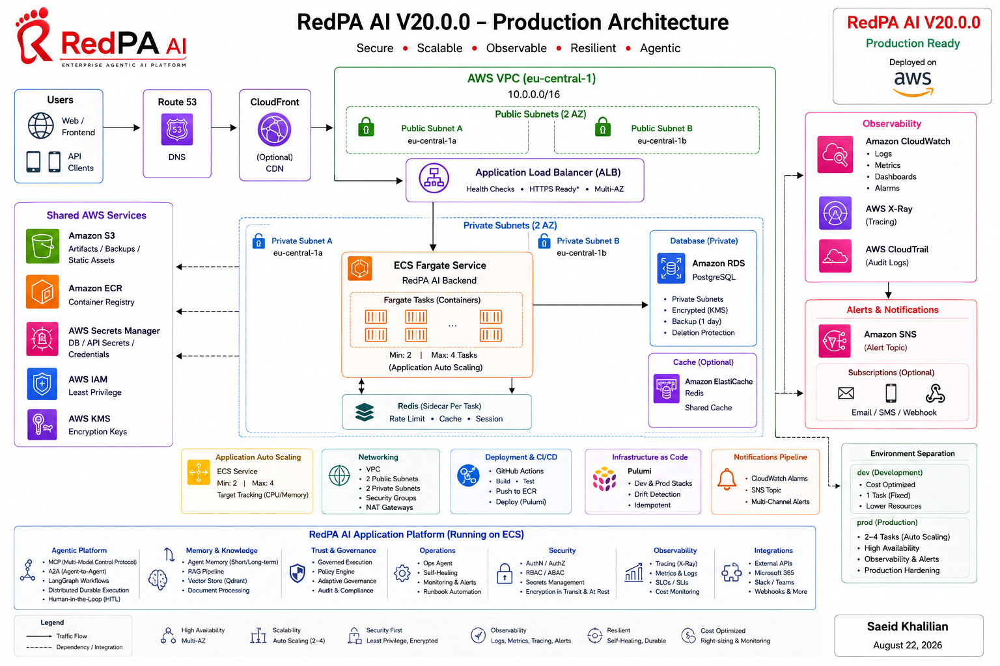
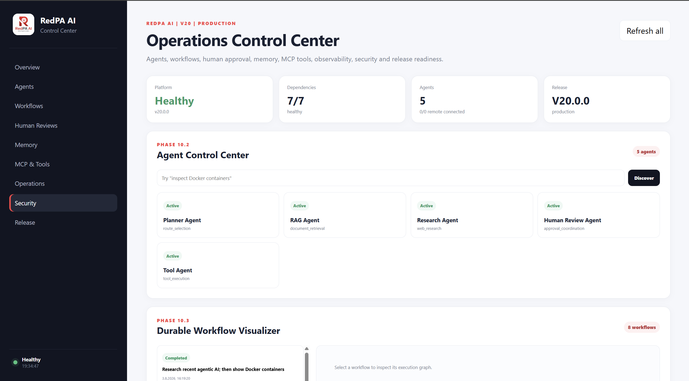
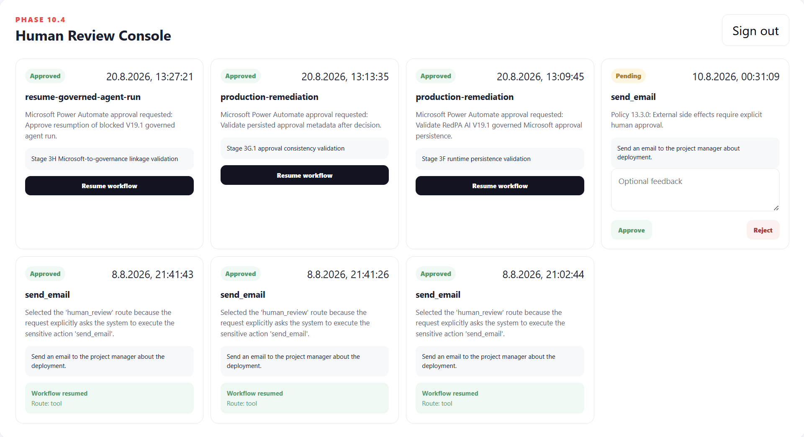
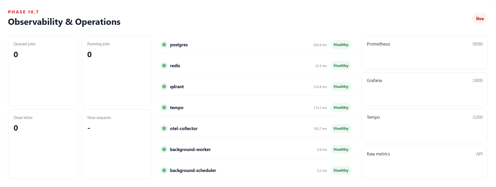
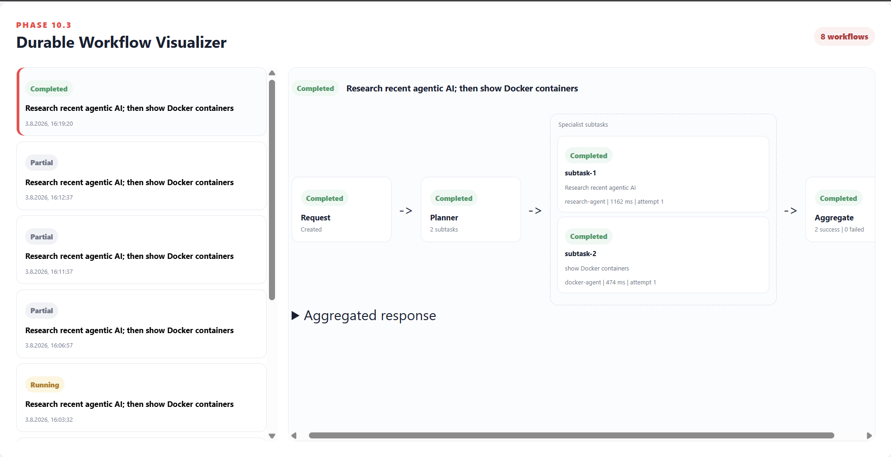
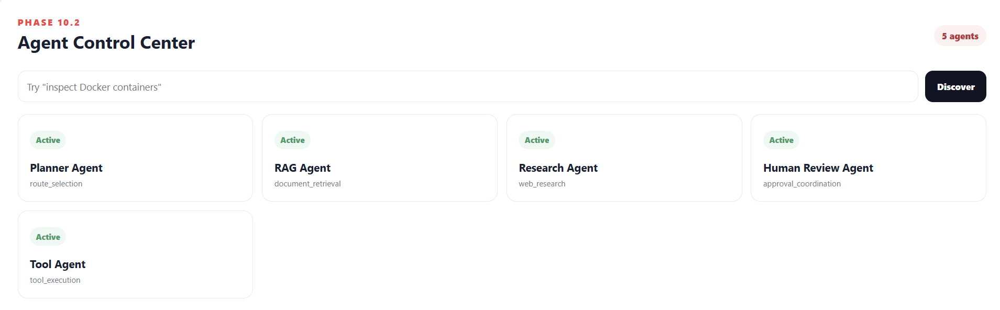
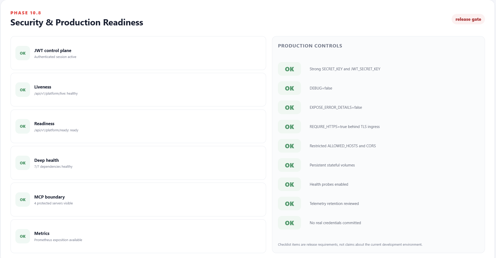

<p align="center">
  
</p>

<h1 align="center">RedPA AI</h1>

<p align="center">
  <strong>Enterprise Agentic AI Platform</strong>
</p>

<p align="center">
  Governed multi-agent execution, RAG, MCP, A2A, Human-in-the-Loop,
  durable workflows, self-healing operations, continuous evaluation,
  enterprise analytics, and validated AWS production infrastructure.
</p>

<p align="center">
  
  
  
  
  
  
  
  
  
</p>

---

> **A production-oriented platform for building and validating governed Agentic AI systems with explicit policy, approval, reliability, recovery, audit, and observability boundaries.**

RedPA AI explores a practical production question:

> **What should happen when autonomous agents are allowed to reason about — and potentially act on — real systems?**

The platform separates **reasoning from permission**. Agents can plan, retrieve, delegate, evaluate, diagnose, and recommend actions, while high-risk operations remain behind explicit policy, Human-in-the-Loop approval, verification, and audit boundaries.

RedPA AI is more than an LLM or RAG demo. It combines an agent runtime, interoperability, durable state, governance, operational recovery, enterprise integration contracts, analytics, observability, and a validated AWS production deployment.

## Architecture

<p align="center">
  
</p>

The diagram above is the high-level V20 architecture. See [`docs/architecture.md`](docs/architecture.md) for the detailed system architecture and [`docs/V20_ENTERPRISE_PRODUCTION.md`](docs/V20_ENTERPRISE_PRODUCTION.md) for the production deployment boundary.

## Why RedPA AI?

Most agent demos stop after a model chooses a tool or generates an answer. RedPA AI focuses on what comes next when agentic behavior is introduced into systems where actions have operational consequences.

The platform is designed around five ideas:

- **Governed autonomy** — reasoning and permission are separate concerns.
- **Durable execution** — workflow state, approvals, recovery, and execution evidence survive beyond a single request.
- **Interoperability** — MCP provides a structured tool plane while A2A supports specialist-agent discovery and delegation.
- **Operational safety** — diagnosis, remediation, failover, and self-healing remain policy-aware and verifiable.
- **Production evidence** — deployment readiness is demonstrated through tests, health checks, runtime validation, infrastructure state, and auditable boundaries.

## V20.0.0 — Enterprise Production

V20 promotes the validated AWS foundation into a dedicated **production Pulumi stack** while preserving the development stack without drift.

### Production highlights

| Area | V20 capability |
|---|---|
| Runtime | Amazon ECS Fargate production service |
| Capacity | 2-task steady state, autoscaling up to 4 |
| Ingress | Application Load Balancer with controlled backend access |
| Data | Private encrypted Amazon RDS PostgreSQL |
| Images | Amazon ECR production image delivery |
| Secrets | AWS Secrets Manager |
| Scaling | CPU and memory target-tracking policies |
| Observability | CloudWatch, Container Insights, production alarms |
| Alerting | SNS-backed CloudWatch alarm routing |
| IaC | Isolated Pulumi `dev` and `prod` stacks |
| Runtime hardening | Production secrets, host validation, liveness contract |

### Validated production evidence

```text
Regression suite:             437 passed
Release:                      v20.0.0
Live runtime version:         20.0.0
Runtime environment:          production
ECS desired / running:        2 / 2
ECS pending:                  0
ECS rollout:                  COMPLETED
ECS failed tasks:             0
Autoscaling range:            2–4 tasks
ALB liveness:                 healthy
RDS:                          private / encrypted / deletion-protected
SNS production topic:         deployed
CloudWatch alarm routing:     SNS-backed
Pulumi production preview:    39 unchanged
Development stack drift:      clean
```

Production traffic follows:

```text
Client
  |
  v
Application Load Balancer
  |
  v
ECS / Fargate Service
  |-- RedPA AI backend
  |-- Redis runtime sidecar
  |-- 2-task production floor
  |-- target-tracking scale-out to 4
  |
  v
Private Amazon RDS PostgreSQL
```

V20 does **not** claim infrastructure that has not been validated. Current boundaries include no custom-domain/HTTPS ingress, WAF, Multi-AZ RDS, regional failover, multi-region HA, or SLA/SLO-backed production traffic.

## Platform Capabilities

### 1. Agentic Runtime & Knowledge

- Planner/router and LangGraph workflows
- specialist-agent orchestration
- Retrieval-Augmented Generation
- Qdrant vector retrieval
- semantic agent memory
- durable and persistent execution state
- approval-aware continuation
- Model Gateway abstraction and routing

### 2. MCP & A2A Interoperability

**MCP tool plane**

- filesystem
- GitHub
- PostgreSQL
- Docker
- typed capability discovery and controlled invocation

**A2A agent plane**

- agent discovery
- capability-based specialist selection
- delegation and parallel work
- fallback execution
- result aggregation
- governed routing

Specialist services include research, PostgreSQL, Docker, filesystem, and GitHub agents.

### 3. Governance, Trust & Human Approval

- ALLOW / REVIEW / DENY policy outcomes
- explicit Human-in-the-Loop approval
- fail-closed execution
- persisted review and audit evidence
- approval-aware resume
- adaptive governance recommendations
- shadow evaluation before policy changes
- signed/trusted agent manifests and provenance
- governance-compatible agent routing
- security and compliance evidence lifecycle

A core design principle is:

> **Autonomous reasoning does not imply autonomous permission.**

### 4. Operations, Recovery & Self-Healing

The governed operations path is:

```text
Incident
  -> persistence
  -> diagnosis
  -> remediation proposal
  -> policy decision
  -> approval boundary
  -> controlled execution
  -> recovery verification
  -> close / fail closed
```

The runtime also supports failure recording, health-aware replacement, approval-aware failover, context handoff, persisted recovery checkpoints, verification, controlled rejoin, and idempotent failover behavior.

### 5. Evaluation, Analytics & Enterprise Integration

- baseline vs candidate evaluation
- quality, safety, and regression evaluation
- shadow evaluation and rollout decisions
- persistent run history and trace IDs
- fallback/recovery evidence
- latency and evaluation KPIs
- agent reliability signals
- Power BI-friendly JSON
- Excel-compatible CSV
- governed connector contracts
- Power Automate approval-flow readiness
- Copilot Studio REST-action readiness

Microsoft integration support represents **contract/readiness support**, not a claim of a live Microsoft 365, Teams, Outlook, Power Automate, or Copilot Studio tenant connection.

### 6. Observability & Developer Platform

**Observability**

- Prometheus
- Grafana
- OpenTelemetry
- Tempo
- structured logging
- request, operational, evaluation, and governance metrics
- AWS CloudWatch and Container Insights

**Developer platform**

- FastAPI REST API
- Next.js Control Plane
- Python SDK
- CLI and examples
- Docker Compose
- Kubernetes and Helm deployment assets
- Pulumi AWS infrastructure
- Pulumi Azure infrastructure path

## Technology Stack

| Layer | Technologies |
|---|---|
| Agentic AI | LangGraph, LangChain, RAG, MCP, A2A |
| Backend | Python, FastAPI, Pydantic |
| Frontend | Next.js, TypeScript |
| Data | PostgreSQL, Qdrant, Redis |
| AI runtime | Model Gateway, provider adapters, embeddings |
| Observability | Prometheus, Grafana, OpenTelemetry, Tempo, CloudWatch |
| Cloud | AWS ECS/Fargate, ALB, RDS, ECR, Secrets Manager, SNS |
| Infrastructure | Pulumi, Docker, Docker Compose, Kubernetes, Helm |
| Delivery | Git, GitHub Actions, CI/CD |

## Product Showcase

V20 exposes the platform through a unified Control Plane designed to make agent execution, governance, reliability, and operational evidence visible rather than hidden behind API calls.

### 1. Operations Control Center

<p align="center">
  
</p>

The main Control Center provides a consolidated view of platform health, active agents, Human Review, memory, MCP tooling, observability, and release state.

### 2. Governed Human-in-the-Loop Execution

<p align="center">
  
</p>

Sensitive side effects can be blocked behind explicit Human-in-the-Loop approval. Review state is persisted, operators can approve or reject actions, and approved workflows can resume from the governed boundary.

### 3. Observability & Operations

<p align="center">
  
</p>

Operational visibility includes live dependency health and latency for PostgreSQL, Redis, Qdrant, Tempo, OpenTelemetry, background workers, and scheduler components, alongside Prometheus/Grafana-oriented monitoring.

### 4. Durable Multi-Agent Orchestration

<p align="center">
  
</p>

The workflow visualizer shows planner-driven decomposition, specialist-agent execution, attempt and latency evidence, and result aggregation across durable multi-agent runs.

### 5. Agent Control Center

<p align="center">
  
</p>

The agent layer exposes specialized capabilities for planning, retrieval, research, Human Review, and tool execution through a unified discovery and control surface.

### 6. Security & Production Readiness

<p align="center">
  
</p>

The release-gate view surfaces authentication, liveness/readiness, deep dependency health, MCP boundaries, metrics, and production-control requirements such as secrets, HTTPS, CORS, persistence, health probes, and telemetry review.

Together, these views demonstrate the platform lifecycle:

```text
Request
  -> Planning / Routing
  -> RAG / Memory / Tools / Specialist Agents
  -> Policy & Governance
  -> Human Approval when required
  -> Controlled Execution
  -> Evaluation / Verification
  -> Persistent Evidence
  -> Observability & Operations
```

## Runtime Topology

The main Docker Compose integration stack includes FastAPI, the Next.js Control Plane, PostgreSQL, Qdrant, Redis, the Spring Boot Policy Service, MCP services, the A2A coordinator and specialist agents, Ops Agent, background workers, scheduler/outbox components, Prometheus, Grafana, OpenTelemetry Collector, and Tempo.

### Primary local endpoints

| Service | Port |
|---|---:|
| FastAPI / Swagger | `8000` |
| Next.js Control Plane | `3001` |
| Spring Boot Policy Service | `8090` |
| Filesystem MCP | `8010` |
| GitHub MCP | `8020` |
| PostgreSQL MCP | `8030` |
| Docker MCP | `8040` |
| A2A Coordinator | `8050` |
| Research Agent | `8061` |
| PostgreSQL Agent | `8062` |
| Docker Agent | `8063` |
| Filesystem Agent | `8064` |
| GitHub Agent | `8065` |

## Selected API Surface

| API | Purpose |
|---|---|
| `/api/v1/governance/v10` | Governed execution lifecycle |
| `/api/v1/operations/v9` | Production operations and remediation |
| `/api/v1/adaptive-governance/v13` | Policy recommendations |
| `/api/v1/security-compliance/v14` | Compliance controls and evidence |
| `/api/v1/continuous-evaluation/v16` | Evaluation and rollout decisions |
| `/api/v1/enterprise-integration/v17` | Connector governance |
| `/api/v1/trusted-agents/v18` | Trusted-agent assessment |
| `/api/v1/production-demo/v18.2` | Production E2E demonstration |
| `/api/v1/control-plane/v18.3/runs` | Persistent run history |
| `/api/v1/analytics/v18.5/power-bi` | Power BI-friendly analytics |
| `/api/v1/analytics/v18.5/excel.csv` | Excel-compatible export |

The platform additionally exposes authentication, conversations/messages, documents/RAG, Human Review, MCP, agents, memory, model-gateway, events, policy, analytics, connector, and health endpoints.

## Quick Start

### Windows / PowerShell

```powershell
git clone https://github.com/saeidkh96/redpa-ai.git
cd redpa-ai

git checkout v20.0.0

python -m venv .venv
.\.venv\Scripts\Activate.ps1

python -m pip install --upgrade pip
python -m pip install -r requirements.txt

Copy-Item .env.example .env

docker compose config --quiet
docker compose up -d --build

docker exec redpa-backend alembic `
  -c /app/backend/alembic.ini upgrade head
```

Open:

```text
API docs:      http://localhost:8000/docs
Control Plane: http://localhost:3001
```

## Validation

Run the regression suite:

```powershell
python -m pytest tests -q
```

Validated V20 result:

```text
437 passed
```

Run the committed-secret scanner:

```powershell
python scripts/security/secret_scan.py
```

Expected result:

```text
[PASS] No obvious committed secrets detected.
```

Validate AWS IaC syntax:

```powershell
python -m py_compile infra/aws/__main__.py
```

For the production Pulumi stack, the final release validation reported:

```text
Resources:
    39 unchanged
```

Infrastructure preview is evidence of IaC state only; it should not be represented as deployment unless the runtime has also been validated. V20 includes both deployed-runtime and drift-validation evidence.

## Deployment Boundaries

### Docker Compose

The strongest integrated local runtime target, combining the platform API, Control Plane, state services, agent/tool services, policy service, and observability stack.

### AWS / Pulumi

V20.0.0 is deployed and validated in AWS using a dedicated `prod` Pulumi stack in `eu-central-1`, alongside the preserved `dev` stack.

Validated production characteristics include:

- ECS/Fargate runtime and ALB-controlled ingress
- healthy target routing
- direct public backend access closed
- ECS recovery, deployment circuit breaker, rollback, and AZ rebalancing
- private encrypted RDS with deletion protection
- automated backup metadata and restore window
- CloudWatch alarms and Container Insights
- SNS-backed alarm actions
- ECS Application Auto Scaling
- clean Pulumi drift state

The current deployment does not claim HTTPS/custom-domain ingress, WAF, Route 53 production DNS, ACM integration, NAT Gateway private-egress architecture, Multi-AZ RDS, regional failover, multi-region HA, or SLA/SLO-backed traffic.

### Kubernetes / Helm

The repository contains Kubernetes and Helm deployment assets. They represent a deployment path, not proof of a currently running production Kubernetes cluster.

### Azure / Pulumi

Azure infrastructure modules remain part of the multi-cloud foundation and should be treated as infrastructure/reference assets unless separately validated against a live Azure target.

## Release Evolution

| Release | Main milestone |
|---|---|
| V1–V4.2 | Agentic foundation, RAG, orchestration, platform foundations |
| V5–V8 | Control Plane, developer platform, research and enterprise workflows |
| V9 | Production operations |
| V10 | Governed agent runtime |
| V11 | Platform evolution foundation |
| V12 | Self-healing runtime |
| V13 | Adaptive governance |
| V14 | Security and compliance |
| V15 | Cloud readiness |
| V16 | Continuous evaluation |
| V17 | Enterprise integration hub |
| V18 | Trusted agents |
| V18.1–V18.5 | Production hardening, E2E recovery, run history, Microsoft readiness, analytics |
| V19.0–V19.3 | AWS runtime and managed-data foundation |
| V19.4 | Controlled ALB ingress |
| V19.5 | ECS/RDS resilience hardening |
| V19.6 | AWS observability |
| V19.7 | Failure recovery and production-readiness validation |
| **V20.0** | **Enterprise production stack, autoscaling, alert routing, runtime hardening** |

## Engineering Principles

- **Autonomous reasoning does not imply autonomous permission.**
- High-risk operations remain policy- and approval-aware.
- Governance state and release evidence should be persisted and auditable.
- Recovery is incomplete until post-action verification succeeds.
- Failover should preserve context and remain idempotent.
- Adaptive governance may recommend changes but must not silently apply them.
- Connector write access and agent trust are explicit runtime boundaries.
- Evaluation precedes rollout.
- Deployment readiness must be demonstrated with evidence.
- Integration readiness must not be represented as a live integration.
- Infrastructure preview must not be represented as deployment.
- Cloud deployment must not be represented as HA beyond what has actually been validated.

## Documentation

| Document | Purpose |
|---|---|
| [`docs/architecture.md`](docs/architecture.md) | Detailed platform architecture |
| [`docs/V20_ENTERPRISE_PRODUCTION.md`](docs/V20_ENTERPRISE_PRODUCTION.md) | V20 AWS production deployment |
| [`docs/releases/V20.0.0.md`](docs/releases/V20.0.0.md) | V20 release notes |
| [`docs/roadmap.md`](docs/roadmap.md) | Platform roadmap |
| [`docs/API_REFERENCE.md`](docs/API_REFERENCE.md) | API reference |
| [`docs/TESTING.md`](docs/TESTING.md) | Testing and validation |
| [`infra/aws/README.md`](infra/aws/README.md) | AWS/Pulumi infrastructure |
| [`docs/V19_CLOUD_DEPLOYMENT_FOUNDATION.md`](docs/V19_CLOUD_DEPLOYMENT_FOUNDATION.md) | Historical V19 cloud foundation |

Detailed milestone documentation for V12–V18.5 remains under [`docs/`](docs/).

## Repository Structure

```text
redpa-ai/
├── backend/              FastAPI platform and agent runtime
├── frontend/             Next.js Control Plane
├── infra/
│   ├── aws/              Pulumi AWS infrastructure
│   └── azure/            Azure infrastructure path
├── docs/                 Architecture, releases and milestone documentation
├── tests/                Regression and platform validation
├── scripts/              Security, operations and validation tooling
├── sdk/                  Developer SDK
├── helm/                 Helm deployment assets
├── .github/              CI/CD workflows
└── docker-compose.yml    Integrated local runtime
```

## Author

**Saeid Khalilian**

RedPA AI is an engineering portfolio project focused on Agentic AI architecture, production-oriented backend systems, governance, reliability, observability, and cloud infrastructure.

## License

MIT License

Copyright (c) 2026 Saeid Khalilian
