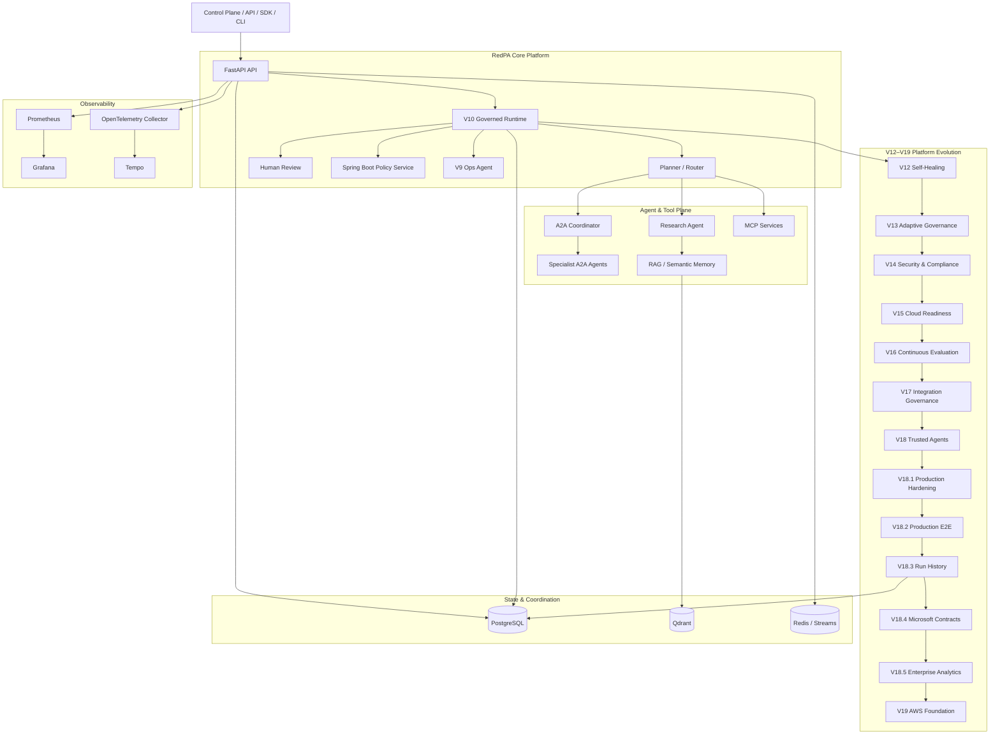

```{=html}
<p align="center">
```
``{=html}
```{=html}
</p>
```
```{=html}
<h1 align="center">
```
RedPA AI
```{=html}
</h1>
```
```{=html}
<p align="center">
```
`<strong>`{=html}Enterprise Agentic AI Platform`</strong>`{=html}
```{=html}
</p>
```
```{=html}
<p align="center">
```
Governed multi-agent execution, self-healing failover, adaptive
governance, compliance evidence, continuous evaluation, enterprise
integration controls, and trusted agent operations.
```{=html}
</p>
```
```{=html}
<p align="center">
```
``{=html}
``{=html}
``{=html}
``{=html}
``{=html}
``{=html}
``{=html}
``{=html}
```{=html}
</p>
```

------------------------------------------------------------------------

> **A production-oriented platform for building and validating governed
> Agentic AI systems with explicit policy, human approval, reliability,
> audit, and observability boundaries.**

RedPA AI explores a central production question: **what should happen
when autonomous agents are allowed to reason about---and potentially act
on---real systems?**

The platform combines multi-agent orchestration, RAG, MCP tools, A2A
delegation, durable workflows, Human-in-the-Loop controls, policy
enforcement, operational recovery, self-healing failover, adaptive
governance, compliance evidence, continuous evaluation, connector
governance, trusted-agent routing, persistent execution history,
enterprise analytics, and release validation.

RedPA is intentionally **production-oriented**, not a claim of a live
production deployment. Docker Compose is the strongest validated local
integration target. Kubernetes/Helm, Azure/Pulumi, and AWS/Pulumi are
deployment or infrastructure foundations unless explicitly validated
otherwise.

## Current Release --- v19.0.0

**V19 Enterprise Extension & AWS Cloud Deployment Foundation** extends
the V18.2 production E2E baseline with persistent Control Plane run
history, Microsoft enterprise integration contracts, enterprise
analytics, and an AWS infrastructure foundation.

### Validated release evidence

``` text
425 passed
0 failed

Alembic head: v280a1b2c3d4e
V18.3 runtime persistence: PASS
V18.4 Microsoft integration contracts: PASS
V18.5 enterprise analytics E2E: PASS
V19 AWS Pulumi preview: PASS
```

### V18.3 --- Control Plane & Persistent Run History

-   PostgreSQL-backed agent execution history
-   Persistent run records and summary aggregation
-   Trace IDs and execution evidence
-   Primary and fallback agent tracking
-   Fallback/recovery run persistence
-   Execution latency and evaluation scores
-   Control Plane Run History view

### V18.4 --- Microsoft Enterprise Integration Readiness

-   Power Automate approval contract
-   Explicit `requires_approval=true` human approval boundary
-   Copilot Studio REST action contracts
-   Platform summary action
-   Agent status action
-   Incident summary action
-   Credential-free integration contracts

> **Important:** V18.4 provides Microsoft integration contracts and
> readiness. It does **not** claim a live Power Automate, Copilot
> Studio, Microsoft 365, Teams, Outlook, or Microsoft tenant
> integration.

### V18.5 --- Enterprise Analytics

-   Operational KPI endpoint
-   Power BI-friendly JSON dataset
-   Excel-compatible CSV export
-   Analytics backed by persisted V18.3 execution history
-   Recovery-rate and fallback visibility
-   Average latency and evaluation evidence

Validated analytics example:

``` text
total_runs=1
successful_runs=1
fallback_runs=1
recovery_rate=100%
average_latency_ms=842.5
evaluation_score=0.94
```

### V19 --- AWS Cloud Deployment Foundation

-   Pulumi-based AWS infrastructure definition
-   Region: `eu-central-1`
-   VPC
-   ECS cluster
-   ECR repository
-   CloudWatch log group
-   Pulumi stack configuration
-   `pulumi preview` successfully validated

> **Important:** `pulumi preview` has passed, but **`pulumi up` has not
> been run and no AWS resources have been deployed**. V19 is an AWS
> deployment foundation, not a claim of a live AWS environment.

## Platform Evolution

  ------------------------------------------------------------------------------
  Release     Capability          Core boundary
  ----------- ------------------- ----------------------------------------------
  **V12**     Self-Healing        Health-aware failover, checkpoint persistence,
              Multi-Agent Runtime idempotent recovery, controlled rejoin

  **V13**     Adaptive Governance Evidence-driven policy recommendations without
                                  silent auto-application

  **V14**     Security &          Versioned controls, evidence
              Compliance Evidence integrity/freshness, risk, approval, audit
                                  export

  **V15**     Production Cloud    Dependency, backup, secrets/IAM, capacity,
              Readiness           observability and deployment gates

  **V16**     Agent Evaluation &  Baseline/candidate evaluation,
              Continuous          safety/regression checks, shadow rollout and
              Improvement         rollback

  **V17**     Enterprise          Connector registry, scopes,
              Integration Hub     secret/network/write boundaries, risk and
                                  approval

  **V18**     Trusted Agent       Identity, provenance, capabilities, health,
              Registry            governance and trust-aware routing

  **V18.1**   Production          Cross-version integration, restart/failure
              Hardening           validation, observability and release evidence

  **V18.2**   Production E2E      Real A2A fallback, self-healing recovery,
              Demonstration       governance/trust boundaries, evaluation and
                                  audit evidence

  **V18.3**   Persistent Run      PostgreSQL execution history,
              History             fallback/recovery evidence and Control Plane
                                  visibility

  **V18.4**   Microsoft           Power Automate approval and Copilot Studio
              Integration         REST contracts
              Readiness           

  **V18.5**   Enterprise          Operational KPIs, Power BI dataset and
              Analytics           Excel/CSV export

  **V19**     AWS Deployment      Pulumi-defined VPC, ECS, ECR and CloudWatch
              Foundation          with preview validation
  ------------------------------------------------------------------------------

Earlier releases established the underlying platform primitives: Agentic
foundation, distributed execution, enterprise governance, Control Plane,
developer tooling, research workflows, enterprise operations, production
operations, and the governed runtime.

## Architecture

```{=html}
<p align="center">
```
``{=html}
```{=html}
</p>
```


For the complete V19 component, runtime, data, governance, reliability,
observability, enterprise-integration, analytics, and deployment views,
see [`docs/architecture.md`](docs/architecture.md).

## Core Capabilities

  --------------------------------------------------------------------------------
  Area                    Capabilities
  ----------------------- --------------------------------------------------------
  **Agentic Runtime**     Planner/router, research workflows, RAG, multi-agent
                          orchestration

  **Governed Execution**  Persisted run lifecycle, policy decisions, audit events,
                          approval-aware continuation

  **Human-in-the-Loop**   Explicit approval/rejection and blocked-run resume

  **Operations**          Incident persistence, diagnosis, remediation proposals,
                          controlled execution, recovery verification

  **Self-Healing**        Health-aware replacement, context handoff, idempotency,
                          restart checkpoints, controlled rejoin

  **MCP**                 Filesystem, GitHub, PostgreSQL and Docker tool services

  **A2A**                 Coordinator plus research, PostgreSQL, Docker,
                          filesystem and GitHub specialist agents

  **Memory**              PostgreSQL-backed state and Qdrant semantic retrieval

  **Governance**          Adaptive recommendations, versioned proposals, shadow
                          evaluation, explicit apply/rollback

  **Compliance**          Control registry, evidence collection, SHA-256
                          integrity, freshness, risk and audit records

  **Evaluation**          Quality/safety/regression evaluation and
                          rollout/rollback gates

  **Integration**         Connector scope, secrets, network and write-access
                          boundaries

  **Trust**               Agent identity, provenance, capabilities, health and
                          trust-aware routing

  **Run History**         Persisted execution history, traces, fallback/recovery
                          evidence and summaries

  **Enterprise            KPIs, Power BI-friendly JSON and Excel-compatible CSV
  Analytics**             

  **Observability**       Prometheus, Grafana, OpenTelemetry, Tempo and structured
                          logging

  **Developer Platform**  Python SDK, CLI, examples and API-first integration

  **Deployment Assets**   Docker Compose; Kubernetes/Helm, Azure/Pulumi and
                          AWS/Pulumi foundations
  --------------------------------------------------------------------------------

## Runtime Topology

The main Docker Compose stack defines the backend, Control Plane,
PostgreSQL, Qdrant, Redis, policy service, MCP services, A2A services,
Ops Agent, background workers, event publisher, and observability stack.

Primary local endpoints:

  Service                          Port
  ---------------------------- --------
  FastAPI backend / Swagger      `8000`
  Next.js Control Plane          `3001`
  Spring Boot Policy Service     `8090`
  Filesystem MCP                 `8010`
  GitHub MCP                     `8020`
  PostgreSQL MCP                 `8030`
  Docker MCP                     `8040`
  A2A Coordinator                `8050`
  Research Agent                 `8061`
  PostgreSQL Agent               `8062`
  Docker Agent                   `8063`
  Filesystem Agent               `8064`
  GitHub Agent                   `8065`

## API Surface

Selected versioned APIs:

  ------------------------------------------------------------------------------
  API                                    Purpose
  -------------------------------------- ---------------------------------------
  `/api/v1/governance/v10`               Governed execution lifecycle

  `/api/v1/operations/v9`                Production operations and remediation
                                         flow

  `/api/v1/platform/evolution`           Persisted platform-evolution records

  `/api/v1/adaptive-governance/v13`      Governance signals and policy proposals

  `/api/v1/security-compliance/v14`      Compliance controls/evidence

  `/api/v1/cloud-readiness/v15`          Cloud-readiness assessment

  `/api/v1/continuous-evaluation/v16`    Evaluation and rollout decisions

  `/api/v1/enterprise-integration/v17`   Connector governance

  `/api/v1/trusted-agents/v18`           Trusted-agent assessment

  `/api/v1/production-hardening/v18.1`   Release-hardening evidence

  `/api/v1/production-demo/v18.2`        Production E2E demonstration and audit
                                         evidence

  `/api/v1/control-plane/v18.3/runs`     Persistent execution run history

  `/api/v1/analytics/v18.5/power-bi`     Power BI-friendly analytics dataset

  `/api/v1/analytics/v18.5/excel.csv`    Excel-compatible analytics export
  ------------------------------------------------------------------------------

The platform also exposes APIs for authentication,
conversations/messages, RAG/documents, Human Review, MCP, agents,
memory, evaluations, events, policy enforcement, model gateway,
analytics, connectors, and health/monitoring.

Swagger UI:

``` text
http://localhost:8000/docs
```

## Quick Start

### Windows / PowerShell

``` powershell
git clone https://github.com/saeidkh96/redpa-ai.git
cd redpa-ai

git checkout v19.0.0

python -m venv .venv
.\.venv\Scripts\Activate.ps1

python -m pip install --upgrade pip
python -m pip install -r requirements.txt

Copy-Item .env.example .env

docker compose config --quiet
docker compose up -d --build

docker exec redpa-backend alembic `
  -c /app/backend/alembic.ini upgrade head
```

Expected migration head for V19:

``` text
v280a1b2c3d4e
```

Then open:

``` text
API docs:      http://localhost:8000/docs
Control Plane: http://localhost:3001
```

## Validation

Run the full regression suite:

``` powershell
python -m pytest tests -q
```

Validated V19 baseline:

``` text
425 passed
```

V18.2 remains the production E2E demonstration baseline:

``` powershell
python scripts/v182_production_e2e_demo.py
```

Expected result:

``` text
E2E DEMO: PASS
```

The V18.2 demo validates controlled failure injection, self-healing
fallback, real A2A execution, recovery/rejoin, continuous evaluation,
and machine-readable audit evidence.

For the underlying V18.1 production-hardening gate:

``` powershell
New-Item -ItemType Directory -Force .\artifacts | Out-Null

Copy-Item `
  .\docs\v181-evidence-example.json `
  .\artifacts\v181-production-hardening-input.json `
  -Force

python scripts/v181_production_hardening_validation.py
```

Expected result:

``` text
PRODUCTION HARDENING: PASS
```

The V18.1 example evidence file is a reproducible validation fixture. A
real deployment should populate release evidence from its actual
environment and operational checks.

## Engineering Principles

-   **Autonomous reasoning does not imply autonomous permission.**
-   High-risk or destructive operations remain policy- and
    approval-aware.
-   Governance, operational state, and release evidence should be
    persisted and auditable.
-   Recovery is not complete until post-action verification succeeds.
-   Failover must preserve workflow context and remain idempotent across
    retries/restarts.
-   Adaptive governance can recommend changes but must not silently
    apply them.
-   Connector write access and agent trust are explicit runtime
    boundaries.
-   Production readiness should be demonstrated with evidence, not
    inferred from architecture alone.
-   Integration readiness must not be represented as a live external
    integration.
-   Infrastructure preview must not be represented as deployed
    infrastructure.

## Documentation

Useful entry points:

-   [`docs/architecture.md`](docs/architecture.md) --- detailed
    architecture
-   [`docs/V12_SELF_HEALING_STAGE1_10.md`](docs/V12_SELF_HEALING_STAGE1_10.md)
    --- self-healing lifecycle
-   [`docs/V13_ADAPTIVE_GOVERNANCE_STAGE1_10.md`](docs/V13_ADAPTIVE_GOVERNANCE_STAGE1_10.md)
    --- adaptive governance
-   [`docs/V14_SECURITY_COMPLIANCE_STAGE1_10.md`](docs/V14_SECURITY_COMPLIANCE_STAGE1_10.md)
    --- compliance evidence
-   [`docs/V15_PRODUCTION_CLOUD_PLATFORM_STAGE1_10.md`](docs/V15_PRODUCTION_CLOUD_PLATFORM_STAGE1_10.md)
    --- cloud readiness
-   [`docs/V16_AGENT_EVALUATION_AND_CONTINUOUS_IMPROVEMENT_STAGE1_10.md`](docs/V16_AGENT_EVALUATION_AND_CONTINUOUS_IMPROVEMENT_STAGE1_10.md)
    --- evaluation and rollout
-   [`docs/V17_ENTERPRISE_INTEGRATION_HUB_STAGE1_10.md`](docs/V17_ENTERPRISE_INTEGRATION_HUB_STAGE1_10.md)
    --- connector governance
-   [`docs/V18_TRUSTED_AGENT_REGISTRY_STAGE1_10.md`](docs/V18_TRUSTED_AGENT_REGISTRY_STAGE1_10.md)
    --- trusted agents
-   [`docs/V18_1_PRODUCTION_HARDENING_STAGE1_10.md`](docs/V18_1_PRODUCTION_HARDENING_STAGE1_10.md)
    --- release hardening
-   [`docs/V18_2_PRODUCTION_E2E_DEMO_STAGE1_10.md`](docs/V18_2_PRODUCTION_E2E_DEMO_STAGE1_10.md)
    --- production E2E demonstration
-   [`docs/V18_3_CONTROL_PLANE_RUN_HISTORY.md`](docs/V18_3_CONTROL_PLANE_RUN_HISTORY.md)
    --- persistent run history
-   [`docs/V18_4_MICROSOFT_ENTERPRISE_INTEGRATION.md`](docs/V18_4_MICROSOFT_ENTERPRISE_INTEGRATION.md)
    --- Microsoft integration contracts
-   [`docs/V18_5_ENTERPRISE_ANALYTICS.md`](docs/V18_5_ENTERPRISE_ANALYTICS.md)
    --- enterprise analytics
-   [`docs/V19_CLOUD_DEPLOYMENT_FOUNDATION.md`](docs/V19_CLOUD_DEPLOYMENT_FOUNDATION.md)
    --- AWS deployment foundation
-   [`docs/API_REFERENCE.md`](docs/API_REFERENCE.md) --- API reference
-   [`docs/TESTING.md`](docs/TESTING.md) --- testing guidance

## Release Line

``` text
V1–V4.2    Agentic foundation → distributed runtime → enterprise governance → production-oriented agentic systems
V5–V8      Control Plane → developer platform → enterprise research → enterprise operations
V9–V10     Production operations → governed agent runtime
V11        Platform evolution foundation
V12–V18    Self-healing → adaptive governance → compliance → cloud readiness → continuous evaluation → integrations → trusted agents
V18.1      Production hardening → release validation
V18.2      Production E2E demonstration → controlled failure → real A2A fallback → recovery → evaluation → audit evidence
V18.3      Persistent Control Plane → PostgreSQL run history → fallback/recovery evidence
V18.4      Microsoft enterprise integration contracts → Power Automate approvals → Copilot Studio REST actions
V18.5      Enterprise analytics → operational KPIs → Power BI dataset → Excel/CSV export
V19        AWS deployment foundation → Pulumi → VPC → ECS → ECR → CloudWatch → preview validated
```

## License

MIT License

Copyright (c) 2026 Saeid Khalilian
