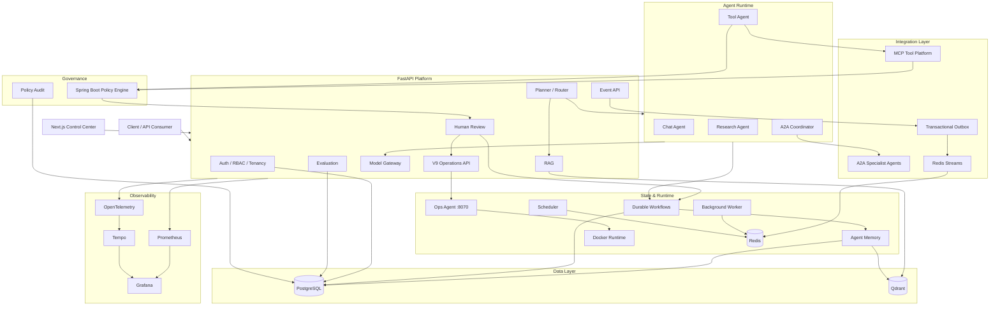

<p align="center">
  
</p>

<h1 align="center">RedPA AI</h1>

<p align="center">
  <strong>Enterprise Agentic AI Platform</strong>
</p>

<p align="center">
  Production-oriented multi-agent orchestration, MCP tool execution, A2A communication,
  durable workflows, semantic memory, policy enforcement, human approval, multi-tenancy,
  event-driven integration, autonomous operations, and distributed observability.
</p>

<p align="center">
  
  
  
  
  
  
  
  
  
  
</p>

------------------------------------------------------------------------

> **A production-oriented Agentic AI platform for orchestrating
> autonomous agents, enforcing policy at tool boundaries, executing
> durable workflows, integrating enterprise systems, and operating AI
> workloads with security, observability, and human oversight.**

RedPA AI is a modular platform for building real-world Agentic AI
systems. It combines planner-based routing, Retrieval-Augmented
Generation (RAG), Model Context Protocol (MCP), Agent-to-Agent (A2A)
communication, Human-in-the-Loop approval, durable workflow execution,
semantic Agent Memory, model-provider abstraction, evaluation, policy
enforcement, RBAC, multi-tenancy, event-driven messaging, and production
observability in one extensible architecture.

The project is designed as an engineering platform rather than a single
LLM wrapper. APIs, orchestration, agents, tools, policy, workflows,
memory, messaging, observability, identity, and infrastructure are
separated so that each subsystem can evolve independently.

------------------------------------------------------------------------

## Table of Contents

-   [Overview](#overview)
-   [V9.0 Production Cloud & Autonomous Operations](#v90-production-cloud--autonomous-operations)
-   [V8.0 Enterprise Operations](#v80-enterprise-operations)
-   [V7.0 Enterprise Research](#v70-enterprise-research)
-   [V6.0 Developer Platform](#v60-developer-platform)
-   [V5.5 Evaluation & Reliability](#v55-evaluation--reliability)
-   [V5.0 Control Plane](#v50-control-plane)
-   [V4.2 Production Agentic Systems Readiness](#v42-production-agentic-systems-readiness)
-   [Control Center](#control-center)
-   [Architecture](#architecture)
-   [Key Capabilities](#key-capabilities)
-   [Policy and Guardrails](#policy-and-guardrails)
-   [Evaluation and Model Gateway](#evaluation-and-model-gateway)
-   [Access Control and
    Multi-tenancy](#access-control-and-multi-tenancy)
-   [Event-driven Architecture](#event-driven-architecture)
-   [MCP Integration](#mcp-integration)
-   [A2A Multi-Agent System](#a2a-multi-agent-system)
-   [Durable Workflows](#durable-workflows)
-   [Human-in-the-Loop](#human-in-the-loop)
-   [Agent Memory](#agent-memory)
-   [Observability](#observability)
-   [Architecture Governance](#architecture-governance)
-   [Cloud and Infrastructure](#cloud-and-infrastructure)
-   [Security](#security)
-   [Technology Stack](#technology-stack)
-   [Repository Structure](#repository-structure)
-   [Quick Start](#quick-start)
-   [API Overview](#api-overview)
-   [Testing and Verification](#testing-and-verification)
-   [Release](#release)
-   [Roadmap](#roadmap)
-   [Engineering Highlights](#engineering-highlights)
-   [License](#license)

------------------------------------------------------------------------

## Overview

RedPA AI provides an end-to-end foundation for production-oriented
Agentic AI applications.

The platform can:

-   coordinate multiple agents;
-   route tasks through structured planning;
-   retrieve internal knowledge with RAG;
-   discover and execute MCP tools;
-   delegate work to remote A2A specialist agents;
-   pause risky actions for human approval;
-   persist and resume long-running workflows;
-   maintain semantic and structured agent memory;
-   evaluate model and workflow quality;
-   route requests through a model gateway;
-   enforce policy before internal-tool and MCP execution;
-   isolate tenants and enforce tenant roles;
-   publish domain events through a transactional outbox;
-   deliver events through Redis Streams;
-   expose metrics, logs, traces, health, and performance data;
-   deploy locally with Docker Compose and provide Kubernetes/Helm and Azure/Pulumi deployment/reference assets.

------------------------------------------------------------------------


## V9.0 Production Cloud & Autonomous Operations

V9 adds a production-operations layer on top of V8: persisted incidents, Docker-backed diagnosis, explicit Human-in-the-Loop remediation for allowlisted services, release-readiness gates, cloud cost estimation, backup/restore tooling, and dedicated Control Plane views.

### V9 operational flow

```text
Incident -> Persist -> Diagnose -> Recommend -> Human approval -> Allowlisted remediation -> Verify recovery
```

The dedicated **RedPA Ops Agent** runs on port `8070` and provides container diagnosis plus approval-aware restart execution. The backend exposes the governed operations API under `/api/v1/operations/v9`. Unapproved side effects are denied, while explicitly approved and allowlisted remediation can be executed and recorded.

Key V9 API operations include:

- `POST /api/v1/operations/v9/incidents` — create an incident;
- `GET /api/v1/operations/v9/incidents` — list persisted incidents;
- `POST /api/v1/operations/v9/incidents/{incident_id}/diagnose` — collect runtime diagnosis;
- `POST /api/v1/operations/v9/incidents/{incident_id}/remediate` — execute approval-gated remediation;
- `POST /api/v1/operations/v9/cost/estimate` — estimate cloud/runtime cost;
- `POST /api/v1/operations/v9/release/readiness` — evaluate production release readiness.

Operator-facing V9 routes include:

- `/control-plane/incidents`;
- `/control-plane/cloud`;
- `/control-plane/cost`;
- `/control-plane/operations`.

The local Ops Agent intentionally protects stateful infrastructure from unsafe automatic remediation. Live Azure deployment is not claimed until the Pulumi production stack is executed and validated against a real Azure subscription.

See [`docs/operations/V9_PRODUCTION_OPERATIONS.md`](docs/operations/V9_PRODUCTION_OPERATIONS.md).

------------------------------------------------------------------------

## V8.0 Enterprise Operations

V8.0 combines analytics/KPIs, enterprise automation connectors, and cloud reliability evidence into one operator/developer milestone.

Implemented V8 surfaces include:

- generic analytics fact ingestion with JSON dimensions and metric catalog discovery;
- KPI queries with sum, average, weighted-average, count, min and max aggregations;
- Control Plane KPI explorer at `/control-plane/analytics`;
- persisted Webhook, Slack Webhook, GitHub Dispatch and n8n connector registry;
- dry-run, explicit approval for live side effects, bounded retry/backoff and delivery audit state;
- Control Plane connector workspace at `/control-plane/connectors`;
- deterministic SLO evaluation for availability and p50/p95/p99 latency;
- reusable HTTP load-smoke evidence generator;
- Control Plane SLO workspace at `/control-plane/operations`;
- production Azure Pulumi profile/runbook and manually-triggered deployment workflow;
- manually-triggered GitHub Actions reliability smoke with uploaded JSON evidence;
- Python SDK/async SDK and CLI access to V8 operational APIs.

See [`docs/V8_ENTERPRISE_OPERATIONS.md`](docs/V8_ENTERPRISE_OPERATIONS.md).

------------------------------------------------------------------------

## V7.0 Enterprise Research

V7.0 adds the first complete real-world application workflow on top of the RedPA platform: a persisted, evidence-first Enterprise Research Workspace.

Implemented V7 surfaces include:

- persisted enterprise research runs and execution timeline events;
- background research execution using the existing Research Agent and ranked DDGS evidence;
- explicit planning, web-research, synthesis, quality-gate and completion stages;
- deterministic research-quality scoring based on evidence coverage and source diversity;
- evidence-first Markdown reports with source URLs, snippets and retrieval scores;
- live Control Plane polling for stage, progress, evidence, quality and final report;
- Python SDK and async SDK research operations;
- `redpa research start`, `redpa research list` and `redpa research get` CLI commands;
- Alembic persistence for research runs and timeline events;
- V7 API routes under `/api/v1/research/runs`.

Local Control Plane:

```text
http://localhost:3001/control-plane/research
```

The V7 research report deliberately preserves evidence provenance instead of presenting unsupported synthesis as fact.

See [`docs/V7_ENTERPRISE_RESEARCH.md`](docs/V7_ENTERPRISE_RESEARCH.md).

------------------------------------------------------------------------

## V6.0 Developer Platform

V6.0 completes the current developer-platform milestone for RedPA.

**V6.0 complete developer surface:**

- sync and async Python SDK clients;
- packaged `redpa` CLI;
- agent discovery and registry inspection;
- durable workflow create/list/get/resume;
- human-review list/get/approve/reject/resume;
- MCP server, health, tool discovery and qualified-tool execution;
- provider/reliability and release-quality operations;
- benchmark-suite and reliability-history access;
- actionable connection and authentication diagnostics;
- SDK examples, package build configuration and dedicated Python 3.11–3.13 CI.

Install from the repository:

```bash
pip install -e sdk/python
```

See [`docs/V6_DEVELOPER_PLATFORM.md`](docs/V6_DEVELOPER_PLATFORM.md).

------------------------------------------------------------------------

## V5.5 Evaluation & Reliability

V5.5 extends RedPA's existing evaluation and reliability foundations with release-oriented quality controls.

**Batch 4 implemented:**

- persisted benchmark suite registry with reusable evaluation cases;
- persisted execution of benchmark suites;
- reliability snapshot history;
- release candidate evidence reports combining evaluation, quality gate, benchmark, and provider reliability.

**Batch 3 implemented:**

- persisted release promotion quality gates and decision history;
- CI-friendly gate endpoint returning HTTP `409` for blocked candidates;
- benchmark quality trends from persisted benchmark history;
- release-gate history and trend inspection in the Control Plane;
- standalone CI release-gate CLI with pass/fail/error exit codes.

**Batch 2 implemented:**

- persisted benchmark history with case-level results;
- agent/model benchmark filtering and comparison pool;
- provider reliability scorecards using live health and circuit-breaker state;
- deterministic retry/fallback failure validation.

**Batch 1 implemented:**

- persisted baseline vs candidate evaluation comparison;
- aggregate and per-metric regression detection;
- missing-metric regression detection;
- configurable regression tolerances;
- minimum candidate score checks;
- explicit quality-gate `PASS` / `FAIL` decisions;
- a Control Plane surface for regression analysis.

API endpoints:

```text
POST /api/v1/evaluations/regression/compare
POST /api/v1/evaluations/quality-gates/evaluate
```

Control Plane:

```text
http://localhost:3001/control-plane/reliability
```

See [`docs/V5_5_EVALUATION_RELIABILITY.md`](docs/V5_5_EVALUATION_RELIABILITY.md).

------------------------------------------------------------------------

## V5.0 Control Plane

RedPA V5.0 adds a unified operator-facing Control Plane over the platform APIs already implemented in the repository.

Implemented V5 surfaces include:

- **Overview** — platform health, agent health, model-provider state and direct navigation to operational surfaces;
- **Agents** — registry, health and capability discovery;
- **Models** — providers, model discovery, health and circuit-breaker state;
- **Tools & MCP** — unified tool catalog, MCP server health and catalog refresh;
- **Workflows** — persisted distributed durable workflows, subtask state and resume/retry;
- **Executions** — persisted distributed execution history with subtask attempts, routing and timing;
- **Memory** — Agent Memory analytics and semantic search;
- **Usage & Cost** — tenant model budgets and persisted model-usage accounting;
- **Human Reviews** — review queue, approve/reject decisions and supported workflow resume;
- **Governance** — policy enforcement preview and persisted policy audit events;
- **Access & Tenancy** — tenant workspaces and configured OAuth-provider discovery.

V5.0 is intentionally API-backed: the Control Plane surfaces implemented backend behavior and does not present roadmap-only functionality as complete.

Local entry point:

```text
http://localhost:3001/control-plane
```

See [`docs/V5_CONTROL_PLANE.md`](docs/V5_CONTROL_PLANE.md) and [`docs/release/V5_0_CONTROL_PLANE.md`](docs/release/V5_0_CONTROL_PLANE.md).

------------------------------------------------------------------------

## V4.2 Production Agentic Systems Readiness

RedPA V4.2 adds the production-agentic capabilities needed to operate agents as real product infrastructure rather than isolated prototypes:

- multi-provider model access for Ollama, OpenAI/OpenAI-compatible, Anthropic Claude, and Google Gemini;
- capability-aware, fallback-aware and cost-aware routing;
- a unified agent runtime combining LLMs, guarded internal/MCP tools, data context, and business rules;
- deterministic input/output guardrails layered with the existing policy service and HITL path;
- runtime evaluation gates with pass, retry, human-review, and block outcomes;
- AI-specific Prometheus telemetry for outcomes, latency, cost, guardrails, and tool calls;
- concurrency, idempotency, retry-budget and existing circuit-breaker/durable-workflow reliability controls;
- tenant provider allow-lists, token/cost budgets, persisted usage, and provider economics for cost-efficient routing.

See [`docs/V4_2_PRODUCTION_AGENTIC_READINESS.md`](docs/V4_2_PRODUCTION_AGENTIC_READINESS.md).

------------------------------------------------------------------------

## V3 Foundation

The V3 foundation, retained in V9.0, extends the v2 platform with an enterprise governance and
integration layer.

### Evaluation

-   evaluation datasets and runs;
-   reusable evaluation metrics;
-   persisted evaluation results;
-   evaluation APIs;
-   evaluation dashboard foundation.

### Model Gateway

-   centralized model access;
-   model-provider abstraction;
-   model configuration;
-   usage and cost visibility foundation;
-   gateway-level routing and observability.

### Policy Engine

-   dedicated Spring Boot policy service;
-   deterministic `ALLOW`, `REVIEW`, and `DENY` decisions;
-   risk classification;
-   matched policy rules;
-   Human Review bridge;
-   guarded internal-tool boundary;
-   guarded MCP boundary;
-   persistent policy audit events;
-   policy metrics;
-   Policy Control Center.

------------------------------------------------------------------------
## Control Center

The Next.js V5 Control Plane provides one operator-facing interface for
inspecting and operating implemented RedPA platform capabilities.

Main areas include:

-   **Agent Control Center** --- agent registry and capability
    discovery;
-   **Durable Workflow Visualizer** --- workflows, subtasks, state, and
    results;
-   **Human Review Console** --- approve, reject, and resume gated
    workflows;
-   **Agent Memory Explorer** --- inspect and search stored memories;
-   **MCP & Tool Console** --- registry, catalog, and guarded execution;
-   **Evaluation Center** --- evaluation workflows and results;
-   **Model Gateway Dashboard** --- model access and gateway visibility;
-   **Policy Control Center** --- decisions, risk, matched rules,
    reviews, and audit history;
-   **Access & Tenancy Control Center** --- workspaces, memberships,
    roles, and OAuth providers;
-   **Event Control Center** --- transactional-outbox and event
    publication visibility;
-   **Observability & Operations** --- health, metrics, runtime, and
    performance.

Local Control Center:

```text
http://localhost:3001
```

------------------------------------------------------------------------

## Architecture


<p align="center">
  
</p>

### Logical Architecture




The repository also contains C4, arc42, DDD, and ADR architecture views under [`docs/architecture/`](docs/architecture/). The V5 Control Plane design history remains documented in [`docs/V5_CONTROL_PLANE.md`](docs/V5_CONTROL_PLANE.md).

------------------------------------------------------------------------

## Key Capabilities

### Agentic AI

-   planner-based routing;
-   multi-agent orchestration;
-   structured agent state;
-   chat workflows;
-   research workflows;
-   RAG workflows;
-   tool workflows;
-   context-aware conversations;
-   distributed specialist delegation;
-   shared execution context.

### Workflow Reliability

-   durable workflow persistence;
-   workflow checkpoints;
-   workflow resume;
-   Human Review;
-   retry support;
-   failed-task recovery;
-   distributed subtask tracking;
-   idempotency;
-   background processing;
-   dead-letter handling.

### Agent Memory

-   long-term memory;
-   semantic memory;
-   private and shared memory;
-   memory search;
-   memory summarization;
-   deduplication;
-   retention policies;
-   PostgreSQL metadata;
-   Qdrant semantic retrieval.

### Runtime

-   Redis cache;
-   Redis Streams;
-   rate limiting;
-   idempotency middleware;
-   background worker;
-   scheduler;
-   delayed jobs;
-   retry queue;
-   dead-letter queue;
-   worker and scheduler heartbeats.

------------------------------------------------------------------------

## Policy and Guardrails

RedPA AI includes a dedicated policy boundary between agent intent
and sensitive execution.

The policy service evaluates:

-   action;
-   resource;
-   execution boundary;
-   arguments;
-   agent identity;
-   policy rules;
-   risk level.

Policy outcomes are:

```text
ALLOW
REVIEW
DENY
```

Example behavior:

  Action              Decision   Risk       Policy
  ------------------- ---------- ---------- ----------------------------------
  `list_containers`   ALLOW      LOW        `READ_ONLY_ALLOW`
  `send_email`        REVIEW     HIGH       `EXTERNAL_SIDE_EFFECT_REVIEW`
  `drop_database`     DENY       CRITICAL   `DESTRUCTIVE_ACTION_DENY`
  unknown action      REVIEW     MEDIUM     `UNKNOWN_ACTION_REQUIRES_REVIEW`

`REVIEW` decisions can create Human Review records. `DENY` decisions
stop execution. Policy decisions are persisted to the audit trail with
their boundary, risk, matched rules, policy version, review link, and
enforcement outcome.

The same enforcement model protects both internal tools and MCP
execution boundaries.

------------------------------------------------------------------------

## Evaluation and Model Gateway

### Evaluation

The evaluation subsystem provides a foundation for measuring Agentic AI
behavior instead of relying only on manual inspection.

It includes:

-   evaluation persistence;
-   datasets;
-   evaluation runs;
-   metric execution;
-   result storage;
-   API contracts;
-   dashboard integration.

### Model Gateway

The Model Gateway separates application workflows from model-provider
details.

Its role is to centralize:

-   provider configuration;
-   model selection;
-   request routing;
-   model access;
-   observability;
-   usage and cost-analysis foundations.

This makes model infrastructure replaceable without coupling every agent
directly to one provider.

------------------------------------------------------------------------

## Access Control and Multi-tenancy

Phase 16 introduces tenant-aware platform boundaries.

### Tenancy

-   workspace/tenant records;
-   tenant membership;
-   owner membership on tenant creation;
-   tenant-scoped access foundation;
-   tenant listing and management APIs.

### RBAC

The access-control layer provides a foundation for role-aware
authorization inside a tenant.

### OAuth

OAuth provider discovery and PKCE foundations are implemented.

Production OAuth completion requires:

-   real provider credentials;
-   persistent OAuth state;
-   persistent PKCE verifier storage;
-   secure callback handling;
-   account linking.

These are intentionally not claimed as completed production OAuth login.

------------------------------------------------------------------------

## Event-driven Architecture

RedPA AI includes a transactional event pipeline.

```text
Application transaction
        |
        v
Transactional Outbox
        |
        v
Event Publisher
        |
        v
Redis Streams
        |
        v
Consumers / Integrations
```

The outbox pattern prevents application state changes and event
publication from becoming two unrelated operations.

Capabilities include:

-   persisted outbox events;
-   publication state;
-   Redis Streams delivery;
-   publisher service;
-   event APIs;
-   Event Control Center;
-   runtime verification that published events appear in the Redis
    stream.

This layer provides the foundation for future external integrations and
asynchronous domain-event consumers.

------------------------------------------------------------------------

## MCP Integration

RedPA AI uses MCP as a dedicated enterprise tool layer.

Validated MCP services include:

```text
Filesystem MCP   : 8010
GitHub MCP       : 8020
PostgreSQL MCP   : 8030
Docker MCP       : 8040
```

Capabilities include:

-   server registration;
-   dynamic tool discovery;
-   unified tool catalog;
-   structured arguments;
-   permission-aware execution;
-   policy enforcement;
-   Human Review integration;
-   response normalization;
-   service isolation.

Security controls include filesystem sandboxing, PostgreSQL read-only
protections, Docker input validation, and policy evaluation before
guarded MCP actions.

------------------------------------------------------------------------

## A2A Multi-Agent System

RedPA AI supports distributed Agent-to-Agent execution.

The coordinator can:

1.  parse a complex request;
2.  create subtasks;
3.  discover suitable agents;
4.  select capabilities;
5.  delegate work;
6.  execute independent work in parallel;
7.  collect successful and failed results;
8.  aggregate the final response.

Specialist services include:

```text
A2A Coordinator      : 8050
Research Agent       : 8061
PostgreSQL Agent     : 8062
Docker Agent         : 8063
Filesystem Agent     : 8064
GitHub Agent         : 8065
```

Remote services expose Agent Cards through:

```text
/.well-known/agent-card.json
```

------------------------------------------------------------------------

## Durable Workflows

Durable workflows support tasks that cannot safely be treated as one
synchronous request.

Typical examples:

-   distributed research;
-   approval-gated actions;
-   multi-step tool workflows;
-   tasks that must survive restart;
-   retryable distributed subtasks.

Lifecycle:

```text
Create
  |
Persist
  |
Execute
  |
Checkpoint
  |
Pause for review / retry if required
  |
Resume
  |
Aggregate
  |
Finalize
```

Persisted state can include workflow status, request data, metadata,
subtasks, remote-agent identifiers, results, errors, timing, approval
state, and retry state.

------------------------------------------------------------------------

## Human-in-the-Loop

Risky operations can be paused before execution.

Typical cases include:

-   sending email;
-   modifying external systems;
-   high-risk tool execution;
-   actions with irreversible side effects;
-   policy decisions returning `REVIEW`.

The Human Review flow supports:

-   review creation;
-   pending-review listing;
-   approval;
-   rejection;
-   edited responses;
-   workflow resume;
-   policy-to-review linking;
-   prevention of duplicate approval gates after resume.

------------------------------------------------------------------------

## Agent Memory

The memory subsystem combines relational persistence with vector
retrieval.

### Memory Types

-   private agent memory;
-   shared memory;
-   semantic memory;
-   long-term structured memory;
-   summarized memory.

### Operations

-   create;
-   retrieve;
-   search;
-   inject into context;
-   summarize;
-   deduplicate;
-   retain;
-   analyze.

PostgreSQL stores structured records and metadata. Qdrant supports
semantic similarity search.

------------------------------------------------------------------------

## Observability

RedPA AI includes metrics, logs, traces, health monitoring, and
policy/event visibility.

### Prometheus

The backend exposes Prometheus-compatible metrics.

```text
GET /api/v1/metrics
```

### Distributed Tracing

OpenTelemetry instrumentation integrates application tracing with Tempo.

OTLP endpoints:

```text
4317 gRPC
4318 HTTP
```

### Structured Logging

Logs can carry:

-   timestamp;
-   level;
-   logger;
-   request ID;
-   correlation ID;
-   trace ID;
-   span ID;
-   workflow ID;
-   job ID;
-   error code;
-   execution timing.

### Operational Dashboards

Grafana, the Control Center, policy audit views, and event views provide
complementary operational visibility.

------------------------------------------------------------------------

## Architecture Governance

Phase 14 formalizes architectural boundaries instead of leaving
architecture only as conventions in implementation code.

The repository includes:

-   Domain-Driven Design bounded-context documentation;
-   Clean Architecture dependency rules;
-   SOLID engineering guidance;
-   Architecture Decision Records;
-   C4 architecture documentation;
-   arc42 documentation;
-   automated architecture tests.

The goal is to make architectural decisions explicit, reviewable, and
testable.

------------------------------------------------------------------------

## Cloud and Infrastructure

### Local Runtime

The complete development platform can run through Docker Compose.

### Kubernetes and Helm

Deployment assets include:

-   Kubernetes manifests;
-   Helm chart;
-   health probes;
-   resource limits;
-   security context;
-   Horizontal Pod Autoscaling;
-   network-policy hardening.

### Azure Reference Architecture

Phase 15 adds an Azure deployment design implemented with Pulumi Python.

The reference architecture includes:

-   Azure Container Apps;
-   Azure Database for PostgreSQL;
-   Azure Key Vault;
-   Azure Container Registry;
-   managed cloud configuration;
-   security guidance;
-   cost guidance;
-   CI-based Pulumi preview.

> Local verification validates the IaC structure and Pulumi provider
> configuration. It does **not** claim that Azure resources have already
> been deployed.

Cloud deployment remains explicit through `pulumi preview` and
`pulumi up`.

------------------------------------------------------------------------

## Security

Security controls include:

-   JWT authentication;
-   tenant-aware access-control foundation;
-   RBAC foundation;
-   OAuth PKCE foundation;
-   security response headers;
-   CORS configuration;
-   rate limiting;
-   idempotency;
-   environment validation;
-   production configuration guards;
-   secret scanning;
-   policy enforcement;
-   Human Review;
-   policy audit logging;
-   guarded internal tools;
-   guarded MCP execution;
-   safe MCP input validation;
-   read-only tool policies;
-   Kubernetes non-root execution;
-   dropped Linux capabilities;
-   network-policy hardening;
-   threat-model documentation;
-   security CI workflows.

The project deliberately distinguishes implemented controls from
production configuration that still requires real credentials or cloud
deployment.

------------------------------------------------------------------------

## Technology Stack

  Area                  Technologies
  --------------------- ------------------------------------------------
  Backend               Python, FastAPI, Pydantic
  Policy Service        Java, Spring Boot
  Frontend              Next.js, TypeScript
  Database              PostgreSQL, SQLAlchemy, asyncpg
  Vector Database       Qdrant
  Cache / Messaging     Redis, Redis Streams
  Agent Orchestration   LangGraph-style stateful workflows
  LLM Runtime           Ollama and Model Gateway abstraction
  Agent Protocols       MCP, A2A
  Architecture          DDD, Clean Architecture, C4, arc42, ADR
  Containers            Docker, Docker Compose
  Metrics               Prometheus
  Dashboards            Grafana, RedPA Control Center
  Tracing               OpenTelemetry, Tempo
  Cloud IaC             Pulumi Python, Azure Native
  Cloud Target          Microsoft Azure
  Testing               pytest, Spring/JUnit/Cucumber, contract tests
  Deployment            Kubernetes, Helm, Azure reference architecture
  CI/CD                 GitHub Actions

------------------------------------------------------------------------

## Repository Structure

```text
redpa-ai/
├── backend/
│   ├── alembic/
│   └── app/
│       ├── a2a*/
│       ├── agent_memory/
│       ├── api/v1/
│       ├── background_jobs/
│       ├── distributed_durable/
│       ├── evaluation/
│       ├── events/
│       ├── mcp*/
│       ├── model_gateway/
│       ├── production_ai/
│       ├── repositories/
│       ├── specialist_agents/
│       └── main.py
├── frontend/
│   ├── app/
│   └── components/
├── sdk/python/
├── policy-service/
├── infra/azure/
├── deploy/
│   ├── helm/
│   └── kubernetes/
├── config/
├── docs/
│   ├── architecture/
│   ├── archive/
│   ├── release/
│   └── security/
├── monitoring/
├── observability/
├── scripts/
├── tests/
├── .github/workflows/
├── docker-compose.yml
├── docker-compose.phase13.yml
└── README.md
```

Historical release automation and manifests remain in the repository for release history and regression/source-verification compatibility; they are not the current V9 release path.

------------------------------------------------------------------------

## Quick Start

### Requirements

Install:

-   Python 3.13+;
-   Docker Desktop;
-   Docker Compose;
-   Git;
-   Node.js when running the frontend outside Docker;
-   Java/Maven when building the policy service outside Docker;
-   Ollama when using the local model runtime outside Docker.

### Clone

``` bash
git clone https://github.com/saeidkh96/redpa-ai.git
cd redpa-ai
```

### Create a virtual environment

Windows PowerShell:

```powershell
python -m venv .venv
.\.venv\Scripts\Activate.ps1
```

Linux/macOS:

``` bash
python -m venv .venv
source .venv/bin/activate
```

### Install Python dependencies

``` bash
python -m pip install --upgrade pip
python -m pip install -r requirements.txt
```

### Configure the environment

Windows:

```powershell
Copy-Item .env.example .env
```

Linux/macOS:

``` bash
cp .env.example .env
```

Review `.env` before starting the platform. Do not commit local secret
files.

### Validate Docker configuration

```powershell
docker compose config
```

### Start the platform

```powershell
docker compose up -d --build
```

### Apply database migrations

```powershell
docker compose exec backend python -m alembic upgrade head
```

### Check services

```powershell
docker compose ps
```

### Main local endpoints

```text
Control Center:       http://localhost:3001
Backend Swagger:      http://localhost:8000/docs
Backend OpenAPI:      http://localhost:8000/openapi.json
Ops Agent:            http://localhost:8070
Prometheus:           http://localhost:9090
Grafana:              http://localhost:3000
Tempo:                http://localhost:3200
Qdrant:               http://localhost:6333
```

------------------------------------------------------------------------

## API Overview

Main API areas are exposed under `/api/v1`. The table below follows the V9 OpenAPI surface rather than historical shorthand names.

| Area | Purpose |
| --- | --- |
| `/auth`, `/users` | Authentication and user identity |
| `/conversations`, `/chat` | Conversation lifecycle and agentic chat |
| `/documents` | Document ingestion and RAG |
| `/reviews` | Human Review approval/rejection/resume |
| `/tools`, `/tools/catalog` | Internal tools and unified tool catalog |
| `/mcp` | MCP server discovery, health, tools, and execution |
| `/agents` | Agent registry, health, and capability discovery |
| `/agents/remotes` | Remote A2A agent registration and delegation |
| `/agents/multi` | Multi-agent delegation |
| `/agents/distributed` | Distributed and durable specialist workflows |
| `/memory` | Agent Memory, shared context, search, and administration |
| `/evaluations` | Evaluation, benchmarks, regression, and release quality gates |
| `/model-gateway` | Provider routing, invocation, circuits, and reliability |
| `/guardrails`, `/policy` | Guardrails, policy enforcement, and policy audit |
| `/tenants`, `/oauth` | Tenancy, memberships, and OAuth foundations |
| `/events` | Transactional outbox and event operations |
| `/jobs` | Background jobs |
| `/platform`, `/health`, `/performance` | Health, readiness, and performance |
| `/research/runs` | Enterprise research runs |
| `/analytics` | KPI, metric, dimensional, and analytics operations |
| `/connectors` | Enterprise connector operations |
| `/operations/v9` | Incidents, diagnosis, remediation, cost, and release readiness |

Use Swagger UI at `http://localhost:8000/docs` for the authoritative current request/response schemas.

------------------------------------------------------------------------

## Testing and Verification

RedPA AI uses layered verification across backend, contracts, security, runtime, frontend, SDK, migrations, and release metadata.

The latest V9 local regression validation reported:

```text
323 passed
[PASS] No obvious committed secrets detected.
```

The V9 frontend production build completed successfully with Next.js 16.3.0. Runtime verification reported the backend and dedicated Ops Agent healthy:

```json
{
  "status": "healthy",
  "service": "RedPA AI",
  "version": "9.0.0",
  "environment": "development",
  "database": {"status": "healthy"}
}
```

```json
{
  "status": "healthy",
  "service": "RedPA Ops Agent",
  "version": "9.0.0"
}
```

V9 end-to-end operations validation also confirmed persisted incident creation, Docker-backed diagnosis, denial of unapproved side effects, approved `restart_container` remediation, and post-remediation service health. The Python SDK package identity is `redpa-ai-sdk 9.0.0`.

------------------------------------------------------------------------

## Release

### v9.0.0 — Production Cloud & Autonomous Operations

V9.0.0 is the current source milestone. It extends the V8 enterprise-operations platform with persisted incident response, Docker-backed diagnosis, approval-gated remediation, release-readiness gates, cloud cost estimation, backup/restore tooling, and dedicated operator views.

Validated V9 behavior includes:

- persisted incident creation and listing;
- container-backed incident diagnosis through the RedPA Ops Agent;
- Human-in-the-Loop denial when remediation approval is absent;
- allowlisted, explicitly approved container restart remediation;
- recovery verification after remediation;
- production-operation APIs under `/api/v1/operations/v9`;
- Control Plane views for incidents, cloud, cost, and operations;
- V9-aligned backend, frontend, Python SDK, Docker, Helm, and release metadata.

Important scope note: live Azure deployment is not claimed until the Pulumi production stack is executed and validated against a real Azure subscription.

See [`docs/operations/V9_PRODUCTION_OPERATIONS.md`](docs/operations/V9_PRODUCTION_OPERATIONS.md).

Historical V1–V8 release material is retained as project history and regression/source-verification context.

------------------------------------------------------------------------

## Roadmap

### Completed milestones

- **V1 — Agentic Foundation:** FastAPI, persistence, authentication, conversations, planner/routing, RAG, tools, Docker.
- **V2 — Distributed Agentic Runtime:** MCP, A2A specialists, durable workflows, Human Review, Agent Memory, background execution, Redis, observability, deployment assets.
- **V3 — Enterprise Governance & Integration:** evaluation, Model Gateway, Spring policy service, architecture governance, tenancy/RBAC foundations, OAuth PKCE foundations, transactional outbox/Redis Streams, production hardening.
- **V4 / V4.2 — Platform & Production Agentic Readiness:** provider routing, unified agent runtime, guardrails, economics/usage controls, runtime reliability.
- **V5 — Control Plane:** API-backed operational surfaces for agents, models, tools, workflows, executions, memory, usage, reviews, governance, access, and reliability.
- **V5.5 — Evaluation & Reliability:** persisted benchmarks, benchmark suites, regression comparison, reliability snapshots, release quality gates and candidate reports.
- **V6 — Developer Platform:** Python SDK, async client, CLI, developer diagnostics, workflow/review/MCP operations, packaging, examples, and SDK CI.
- **V7 — Enterprise Research:** persisted evidence-first research runs, live execution timeline, quality scoring, reports, Control Plane workspace, SDK and CLI operations.
- **V8 — Enterprise Operations & Automation:** analytics/KPI engine, dimensional queries, enterprise connectors, approval-aware automation, SLO/load evidence, and Azure production deployment workflow.
- **V9 — Production Cloud & Autonomous Operations:** persisted incidents, Docker-backed diagnosis, Human-approved remediation, recovery verification, release-readiness gates, cloud cost estimation, backup/restore tooling, and dedicated operations views.

### Future work

- complete production OAuth token exchange and account linking;
- validate Azure/Pulumi deployment against a live subscription;
- add external event consumers/connectors;
- expand tenant-level authorization policies;
- expand evaluation datasets and benchmark suites;
- add production SLO/SLA dashboards;
- perform larger-scale load, chaos, and resilience testing;
- consider additional SDK languages and hosted deployment options.

------------------------------------------------------------------------

## Engineering Highlights

RedPA AI demonstrates practical experience with:

-   Agentic AI architecture;
-   multi-agent orchestration;
-   Retrieval-Augmented Generation;
-   Model Context Protocol;
-   Agent-to-Agent communication;
-   durable workflow execution;
-   Human-in-the-Loop systems;
-   semantic memory;
-   model abstraction;
-   AI evaluation;
-   deterministic AI guardrails;
-   policy enforcement;
-   auditability;
-   event-driven architecture;
-   transactional outbox patterns;
-   Redis Streams;
-   RBAC and multi-tenancy;
-   OAuth PKCE architecture;
-   Domain-Driven Design;
-   Clean Architecture;
-   C4 and arc42;
-   Azure architecture;
-   Infrastructure as Code with Pulumi;
-   API security;
-   observability;
-   containerization;
-   Kubernetes and Helm;
-   CI/CD;
-   security and release engineering.

------------------------------------------------------------------------

## License

This project is licensed under the MIT License.

Copyright (c) 2026 Saeid Khalilian
