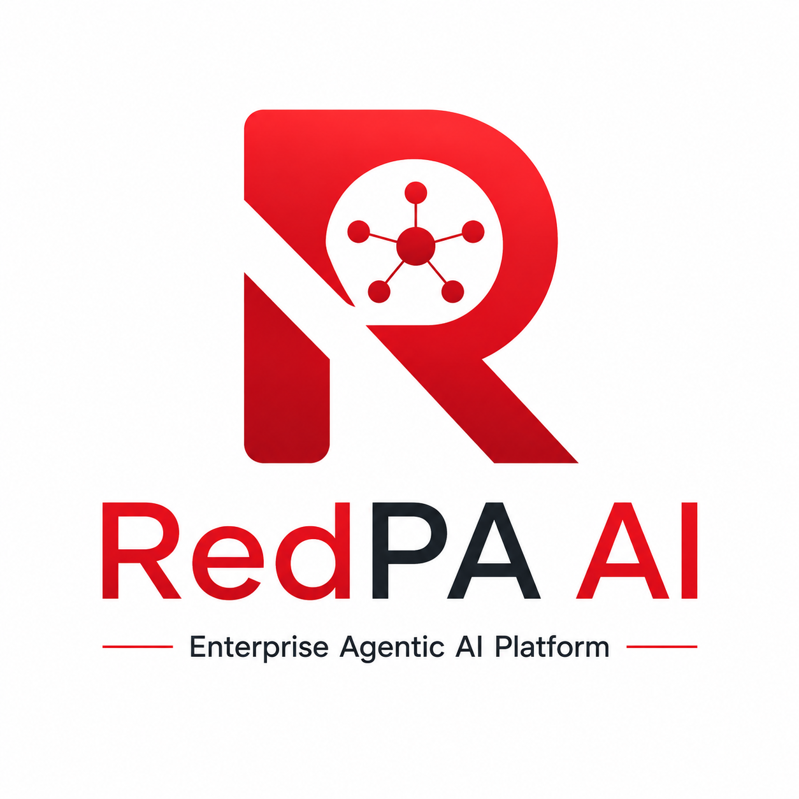
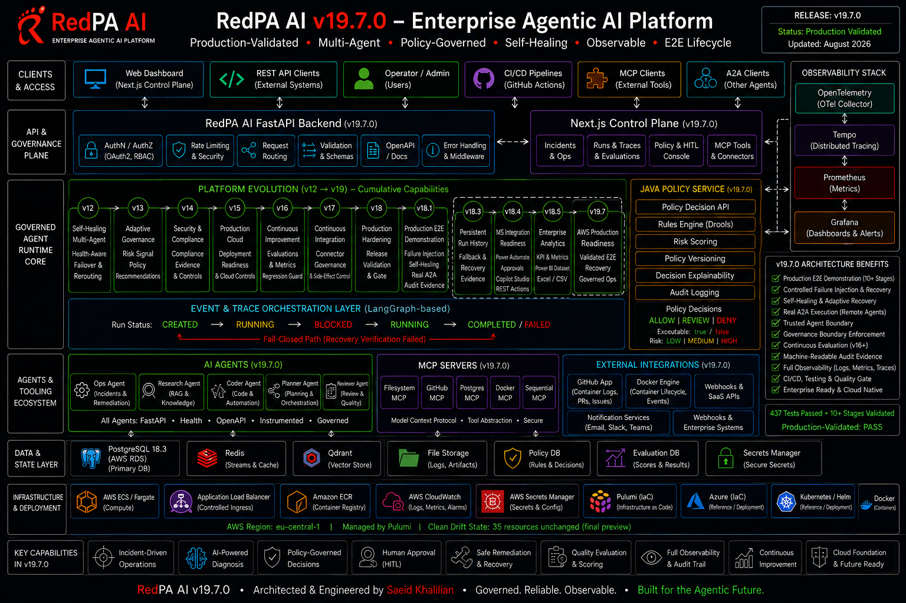
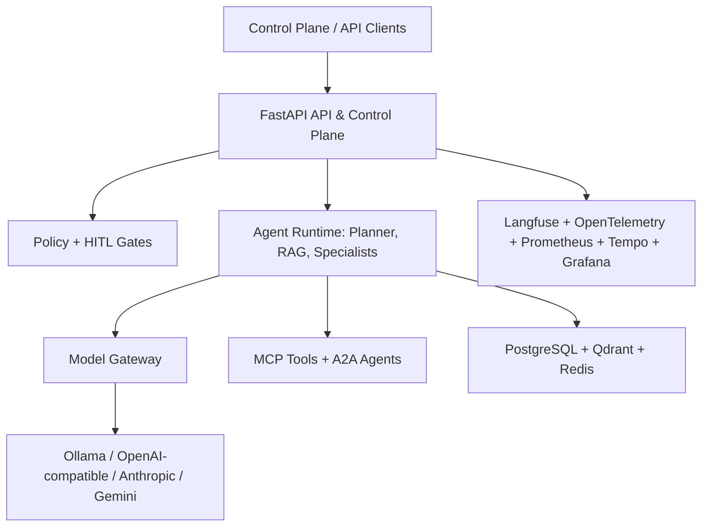

<p align="center">
  
</p>

<h1 align="center">RedPA AI</h1>

<p align="center">
  <strong>Governed Enterprise Agentic AI Platform</strong>
</p>

<p align="center">
  
  
  
  
  
  
  
</p>

---

> **RedPA AI is a production-oriented platform for governed agentic workflows: agents can reason, retrieve, delegate, evaluate, and recommend actions, while policy, Human-in-the-Loop approval, auditability, and recovery controls decide what may execute.**

RedPA AI is an engineering portfolio project that brings together a FastAPI control plane, a provider-agnostic model gateway, RAG, LangGraph-style workflows, MCP tools, A2A specialist agents, durable execution, and observability.

## What it demonstrates

- **Governed autonomy** — separates agent reasoning from permission to act.
- **Multi-agent execution** — planning, routing, specialist delegation, fallback, and aggregation.
- **Knowledge workflows** — document ingestion, Qdrant retrieval, and agent memory.
- **Interoperability** — focused MCP tool services and A2A specialist-agent services.
- **Reliable operations** — retries, circuit breakers, recovery checkpoints, incident workflows, and health-aware operations.
- **Human approval** — explicit ALLOW / REVIEW / DENY policy decisions and review gates.
- **LLM observability** — Langfuse traces model requests, routed provider attempts, token usage, latency, output, and failures.

## Architecture

<p align="center">
  
</p>


```mermaid
flowchart TD
    UI["Control Plane / API Clients"] --> API["FastAPI API & Control Plane"]
    API --> GOV["Policy + HITL Gates"]
    API --> AGENTS["Agent Runtime: Planner, RAG, Specialists"]
    AGENTS --> GATEWAY["Model Gateway"]
    GATEWAY --> LLM["Ollama / OpenAI-compatible / Anthropic / Gemini"]
    AGENTS --> TOOLS["MCP Tools + A2A Agents"]
    AGENTS --> DATA["PostgreSQL + Qdrant + Redis"]
    API --> OBS["Langfuse + OpenTelemetry + Prometheus + Tempo + Grafana"]
```

## Core capabilities

### Agent runtime and knowledge

- LangGraph-style planning and workflow orchestration
- provider routing through a central Model Gateway
- Retrieval-Augmented Generation with Qdrant
- persistent conversations, run history, and agent memory
- durable workflow state, retries, recovery, and checkpoints

### MCP and A2A

- MCP services for filesystem, GitHub, PostgreSQL, and Docker capabilities
- A2A coordinator with research, PostgreSQL, Docker, filesystem, and GitHub specialists
- capability discovery, delegation, controlled tool access, and fallback execution

### Governance and operations

- policy outcomes: **ALLOW**, **REVIEW**, and **DENY**
- Human-in-the-Loop approval and audit evidence
- multi-tenant governance boundaries and RBAC
- incident diagnosis, remediation proposals, recovery verification, and controlled rejoin
- evaluation, reliability, analytics, and enterprise-integration contracts

## Observability

RedPA uses complementary observability tools:

| Tool | Purpose |
|---|---|
| **Langfuse** | LLM/agent tracing: prompts, responses, model, tokens, latency, routing, and failures |
| **OpenTelemetry + Tempo** | distributed traces across API and infrastructure boundaries |
| **Prometheus + Grafana** | service metrics, dashboards, and operational monitoring |
| **Structured logs** | request, governance, and operational diagnostics |

Langfuse is integrated at the central Model Gateway, so every supported provider attempt is traced without duplicating instrumentation across agents. See [docs/LANGFUSE.md](docs/LANGFUSE.md) for setup and privacy controls.

## Technology stack

| Area | Technologies |
|---|---|
| Backend | Python 3.13, FastAPI, Pydantic, SQLAlchemy, Alembic |
| Agentic AI | LangGraph, LangChain Core, RAG, MCP, A2A |
| Model providers | Ollama, OpenAI-compatible APIs, Anthropic, Gemini |
| Data | PostgreSQL, Qdrant, Redis |
| Frontend | Next.js, TypeScript |
| Observability | Langfuse, OpenTelemetry, Prometheus, Tempo, Grafana |
| Delivery | Docker Compose, GitHub Actions, Kubernetes/Helm and Pulumi reference assets |

## Quick start

### Prerequisites

- Docker Desktop with Docker Compose
- Ollama running locally if you use the default provider

### Run locally

```powershell
git clone https://github.com/saeidkh96/redpa-ai.git
cd redpa-ai
Copy-Item .env.example .env
docker compose up -d --build
```

Verify the API:

```powershell
Invoke-RestMethod http://localhost:8111/api/v1/health
```

The interactive API documentation is available at:

```text
http://localhost:8111/docs
```

### Enable Langfuse

Create a Langfuse project, then add these values to your untracked `.env` file:

```env
LANGFUSE_ENABLED=true
LANGFUSE_PUBLIC_KEY=pk-lf-...
LANGFUSE_SECRET_KEY=sk-lf-...
LANGFUSE_HOST=https://cloud.langfuse.com
```

Recreate the backend:

```powershell
docker compose up -d --force-recreate backend
```

Never commit `.env` files or API keys. Full setup and capture controls are in [docs/LANGFUSE.md](docs/LANGFUSE.md).

## Example model request

After authenticating through the API docs, use `POST /api/v1/model-gateway/invoke`:

```json
{
  "messages": [
    {"role": "user", "content": "Summarize the purpose of RedPA AI in one sentence."}
  ],
  "agent_id": "demo",
  "provider": "ollama",
  "model": "qwen2.5:7b",
  "max_tokens": 80
}
```

This creates a Langfuse observation named `model-gateway.invoke` when tracing is enabled.

## Validation

Run the relevant test suite from the repository root:

```powershell
python -m pytest tests backend/tests -q
```

For a local integration smoke test, confirm Docker Compose services are healthy, call `/api/v1/health`, then execute one model-gateway request.

## Documentation

| Document | Description |
|---|---|
| [docs/architecture.md](docs/architecture.md) | detailed architecture and boundaries |
| [docs/LANGFUSE.md](docs/LANGFUSE.md) | LLM tracing setup and privacy controls |
| [docs/API_REFERENCE.md](docs/API_REFERENCE.md) | API overview |
| [docs/TESTING.md](docs/TESTING.md) | test guidance |
| [docs/operations.md](docs/operations.md) | operations concepts |
| [docs/roadmap.md](docs/roadmap.md) | project roadmap |

## Scope and boundaries

RedPA AI is a portfolio and learning project. It contains cloud, Kubernetes, Helm, and Pulumi assets, but their presence does not claim a currently deployed production system. Deployments, credentials, domains, security reviews, and operational guarantees must be independently validated for any real-world use.

## License

This project is licensed under the [MIT License](LICENSE).

---

Built by [Saeid Khalilian](https://github.com/saeidkh96)
