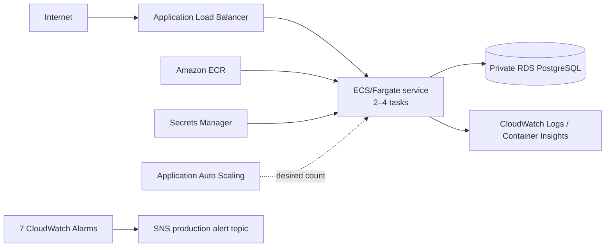

# V20 Enterprise Production Deployment

## Purpose

V20 establishes a dedicated AWS production deployment boundary for RedPA AI. It builds on the V19 AWS foundation and hardening sequence without rewriting the historical V19 evidence.

## Stack separation

Pulumi stack-aware configuration separates `dev` and `prod`. Existing development physical identities are preserved to avoid destructive replacement, while production receives explicit V20 identities and production runtime settings.

## Production architecture



## ECS capacity and scaling

Production starts with two desired/running tasks and registers a scalable target from 2 to 4 tasks. CPU and memory target-tracking policies use 60% and 70% targets respectively, with faster scale-out than scale-in cooldowns.

## Runtime startup contract

Production startup validation identified and hardened three important configuration boundaries:

1. Production requires sufficiently strong secret material; `SECRET_KEY` and `JWT_SECRET_KEY` are explicitly supplied.
2. Database passwords are URL-encoded when constructing `DATABASE_URL`.
3. Wildcard allowed hosts are not used in production; the ALB DNS name is supplied as the production host boundary.

The liveness endpoint `/api/v1/platform/live` bypasses Redis-backed rate limiting so infrastructure health checks do not fail because of a nonessential middleware dependency.

## Image promotion

The validated RC2 image was published to ECR and promoted to the final `v20.0.0` tag only after local production startup and liveness validation. The previous final image was preserved under a pre-RC2 archive tag before the final tag was repointed.

## Alerting

Seven CloudWatch alarms cover ECS CPU/memory, ALB health/5xx/latency, and RDS CPU/free storage. Production alarm actions target the V20 SNS topic. Email subscription is optional and configuration-driven.

## Database boundary

Production RDS is private, encrypted, deletion-protected, and backup-enabled. The current configuration intentionally keeps `Multi-AZ=false` and backup retention at one day. These limits are documented rather than hidden behind a broader HA claim.

## Final validated state

```text
Live status:                 healthy
Live version:                20.0.0
Environment:                 production
ECS desired/running:         2/2
ECS pending:                 0
Rollout:                     COMPLETED
Failed tasks:                0
Autoscaling range:           2–4
Pulumi production state:     39 unchanged
Regression suite:            437 passed
Secret scan:                 PASS
AWS IaC compile:             PASS
Git release tag:             v20.0.0
```

## Non-claims

V20 does not claim HTTPS/custom-domain ingress, WAF, Multi-AZ RDS, regional failover, multi-region HA, or SLA/SLO-backed availability. Kubernetes/Helm and Azure/Pulumi remain deployment/reference paths unless independently validated against live targets.
