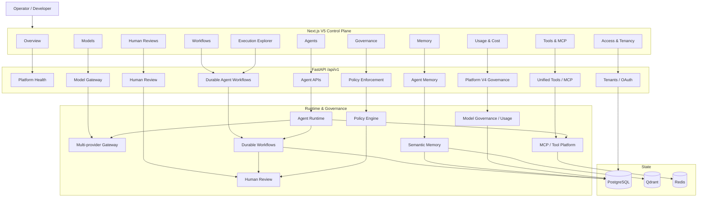

# RedPA AI V5.0 Control Plane

## Purpose

V5.0 adds an operator-facing Control Plane on top of APIs that already exist in the RedPA backend. The Control Plane does not introduce mock platform capabilities: each operational surface is backed by an implemented API or persisted subsystem in the repository.

## Logical Architecture



## Implemented V5 Surfaces

| Surface | Backing implementation |
|---|---|
| Overview | platform health, agent health, provider registry/health |
| Agents | agent registry, health and capability discovery |
| Models | provider registry, model discovery, provider health, circuit breakers |
| Tools & MCP | unified tool catalog, MCP servers, MCP health and refresh |
| Workflows | persisted distributed durable workflows, detail and resume |
| Executions | persisted distributed execution/subtask state, attempts and timings |
| Memory | memory analytics and semantic search |
| Usage & Cost | tenant model budget and persisted model-usage history |
| Human Reviews | review queue, approve/reject and workflow resume |
| Governance | policy enforcement preview and persisted policy audit |
| Access & Tenancy | tenant list/create and configured OAuth provider discovery |

## Boundaries

V5.0 intentionally does not claim functionality that is not exposed by the current backend. For example, the Access view does not invent a user-directory endpoint, and the Execution Explorer presents persisted durable-agent execution data rather than claiming a separate distributed tracing backend.

The existing Prometheus, Grafana, OpenTelemetry and Tempo stack remains the observability layer for metrics and traces outside the persisted execution data shown in the Control Plane.

## Local Entry Point

```text
http://localhost:3001/control-plane
```

The protected views use the existing access token stored by the RedPA frontend under `redpa_access_token`.
