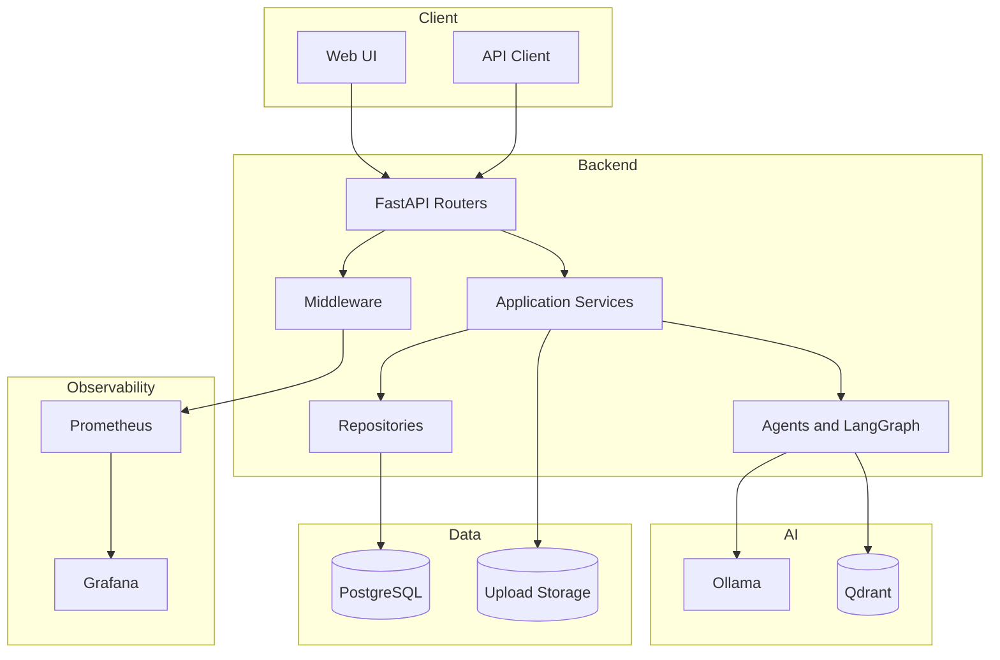
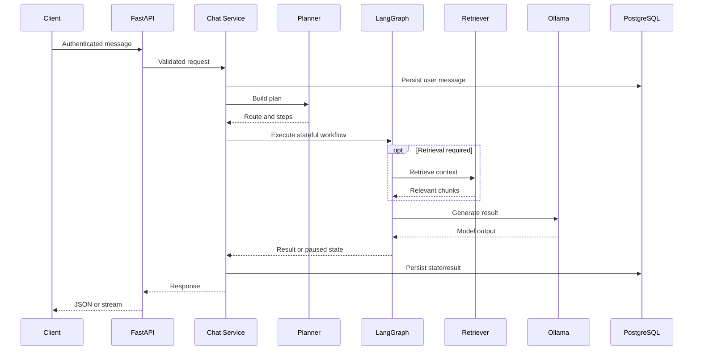

# Architecture

## Purpose

RedPA AI provides infrastructure for authenticated, persistent, observable, and human-supervised agentic AI applications.

The system is intentionally divided into transport, application, orchestration, persistence, AI, and observability layers.

## High-Level View

## Layers

### API Layer

FastAPI routers expose versioned endpoints and translate HTTP requests into application-service calls.

Responsibilities:

- input validation;
- authentication dependency injection;
- response serialization;
- HTTP status mapping;
- streaming response handling;
- OpenAPI generation.

### Application Services

Services coordinate domain operations without coupling HTTP details to persistence or AI providers.

The current structure includes services for:

- authentication and users;
- conversations and messages;
- chat;
- planner and orchestrator;
- LLM execution;
- documents and extraction;
- chunking and embeddings;
- vector storage and retrieval;
- RAG context construction;
- human review;
- workflow resumption.

### Agent and Workflow Layer

The planner determines whether the request should be answered directly or executed through a richer workflow.

LangGraph provides:

- explicit state;
- nodes and routing;
- conditional transitions;
- pausing;
- resumability;
- human-review checkpoints.

### Persistence Layer

PostgreSQL is the source of truth for transactional data such as:

- users;
- conversations;
- messages;
- document metadata;
- document content and chunks;
- human-review records;
- workflow-related state where persisted by the application.

Repositories isolate query and persistence logic from higher-level services.

### Vector Search

Qdrant stores document embeddings and supports semantic retrieval.

PostgreSQL and Qdrant have different responsibilities:

- PostgreSQL stores authoritative relational and lifecycle data.
- Qdrant stores vectors and retrieval-oriented payloads.
- Stable identifiers should connect vector points to relational records.

### LLM Runtime

Ollama provides local model execution. The default Docker configuration connects from the backend container to Ollama running on the host through `host.docker.internal`.

Provider access should remain behind the LLM service so future providers can be added without rewriting workflow logic.

### Observability

Middleware and monitoring modules expose request and application metrics. Prometheus scrapes the API, and Grafana is automatically provisioned with the Prometheus data source and dashboard configuration.

## Request Lifecycle

## Design Principles

- **Separation of concerns:** API, business logic, persistence, AI providers, and observability remain separate.
- **Explicit workflows:** Agent behavior is represented as inspectable graphs rather than hidden prompt chains.
- **Human control:** Sensitive or uncertain results can pause for review.
- **Local-first AI:** Ollama enables private local execution while keeping provider abstraction possible.
- **Observable execution:** Requests and workflows should be measurable and traceable.
- **Replaceable infrastructure:** Relational, vector, LLM, and monitoring components are accessed through clear boundaries.
