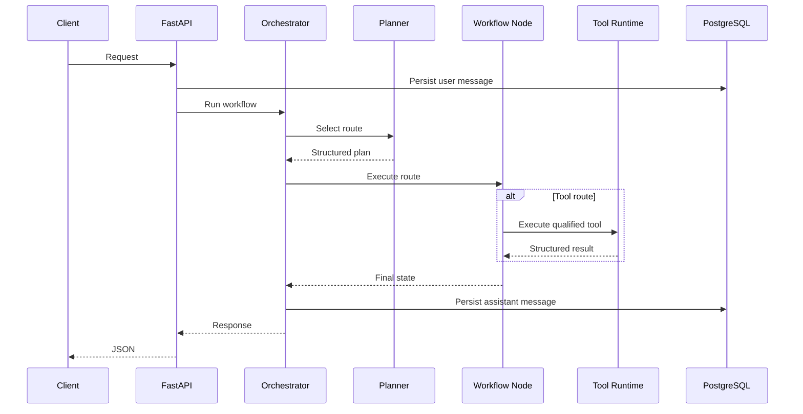

# RedPA AI Architecture

## Overview

RedPA AI is structured as a modular agent platform. FastAPI exposes the public API, LangGraph coordinates workflows, service classes implement business logic, PostgreSQL persists application state, Qdrant supports semantic retrieval, and MCP servers expose external capabilities through explicit contracts.

## Layers

### API Layer

Located under:

```text
backend/app/api/v1
```

Responsibilities:

- authentication;
- request validation;
- response schemas;
- dependency injection;
- route composition;
- status-code mapping.

### Orchestration Layer

Located under:

```text
backend/app/agents
```

Responsibilities:

- workflow state;
- planner execution;
- route transitions;
- node execution;
- interruption and resume;
- final response assembly.

### Service Layer

Located under:

```text
backend/app/services
```

Responsibilities:

- chat generation;
- planner behavior;
- research;
- RAG;
- human-review logic;
- MCP management;
- unified tool execution.

### Persistence Layer

Located under:

```text
backend/app/database
backend/app/models
backend/app/repositories
```

Responsibilities:

- async database sessions;
- ORM models;
- repository queries;
- migrations;
- persisted workflow records.

### Tool Layer

Located under:

```text
backend/app/tools
backend/app/mcp
backend/app/mcp_servers
```

Responsibilities:

- internal tools;
- MCP discovery;
- MCP execution;
- tool permissions;
- tool formatting;
- external service isolation.

## Request Lifecycle



## Design Principles

- explicit state;
- typed boundaries;
- minimal global state;
- deterministic fallback;
- read-only defaults;
- isolated external integrations;
- observable execution;
- reversible workflow decisions;
- testable services.
