# RedPA AI v19.7.0 Architecture

RedPA AI is a production-oriented, governed Agentic AI platform built around explicit execution, governance, reliability, recovery, interoperability, audit, evaluation, and infrastructure boundaries.

The central architectural rule is:

> **Reasoning != Permission**

An agent may reason, retrieve, delegate, diagnose, evaluate, and recommend an action without automatically being authorized to perform a destructive or high-risk side effect.

## Architecture Scope — v19.7.0

RedPA AI v19.7.0 combines:

- FastAPI platform APIs
- Next.js Control Plane
- LangGraph workflows
- planner/router behavior
- RAG and semantic retrieval
- Qdrant
- PostgreSQL
- Redis
- MCP tool services
- A2A agent delegation
- Human-in-the-Loop controls
- governed execution
- policy boundaries
- trusted-agent routing
- self-healing workflows
- continuous evaluation
- persistent run history
- enterprise analytics
- event/background processing
- Prometheus / Grafana
- OpenTelemetry / Tempo
- AWS ECS/Fargate
- AWS Application Load Balancer
- Amazon RDS PostgreSQL
- AWS Secrets Manager
- CloudWatch
- ECS Container Insights
- Pulumi IaC
- Docker Compose
- Kubernetes/Helm deployment assets
- Azure/Pulumi infrastructure assets

The architecture distinguishes:

- implemented runtime behavior
- validated deployment behavior
- integration readiness
- infrastructure/reference assets
- production claims that are intentionally not made

## 1. System Context

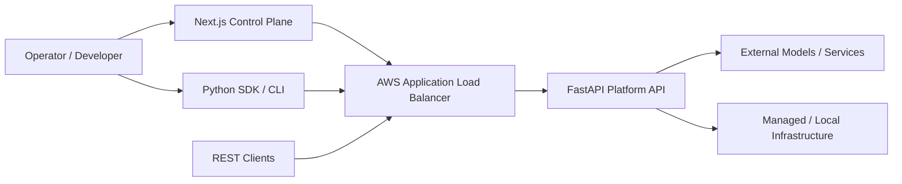

The FastAPI backend is the central application boundary. The Control Plane, SDK, CLI, background services, agent runtime, MCP services, A2A agents, policy service, data stores, and observability systems compose around this API and its governed execution model.

## 2. Architectural Planes

RedPA separates responsibilities into explicit planes.

### 2.1 Client / Access Plane

- Next.js Control Plane
- REST API clients
- Python SDK
- CLI
- external systems

### 2.2 AWS Ingress Plane

- Application Load Balancer
- public HTTP entry point
- target group
- ALB security group
- controlled ALB-to-backend security-group path

### 2.3 API Plane

- FastAPI backend
- authentication
- tenancy/RBAC foundations
- health and liveness
- API routing
- audit/evidence
- Control Plane APIs

### 2.4 Governed Agent Runtime

- planner/router
- LangGraph workflows
- durable execution
- Human-in-the-Loop
- policy decisions
- approval-aware resume
- trusted-agent routing
- evaluation
- recovery

### 2.5 Agent Communication Plane

- A2A coordinator
- specialist agents
- MCP services
- delegated execution
- structured tool execution

### 2.6 Retrieval / Memory Plane

- RAG
- Qdrant
- semantic memory
- PostgreSQL-backed state

### 2.7 Model Gateway

- provider abstraction
- model routing
- provider adapters
- model status/economics boundaries

### 2.8 Governance / HITL Plane

- policy enforcement
- ALLOW / REVIEW / DENY
- explicit approval
- rejection
- resume
- audit

### 2.9 Operations / Self-Healing Plane

- incident persistence
- diagnosis
- remediation proposals
- controlled execution
- verification
- task/agent recovery
- checkpoint persistence
- controlled rejoin

### 2.10 Data Plane

- PostgreSQL / Amazon RDS
- Redis / Streams
- Qdrant
- run history
- audit/evidence state

### 2.11 Observability Plane

- application metrics
- Prometheus
- Grafana
- OpenTelemetry
- Tempo
- CloudWatch Logs
- CloudWatch Alarms
- ECS Container Insights

### 2.12 Infrastructure / Deployment Plane

- Docker Compose
- Pulumi AWS
- Pulumi Azure
- Kubernetes / Helm

## 3. Container / Runtime View

```mermaid
flowchart TB
    Client["Control Plane / SDK / CLI"]

    subgraph Ingress["Ingress"]
        ALB["AWS ALB"]
    end

    subgraph APIPlane["API & Governance Plane"]
        API["FastAPI Backend :8000"]
        Policy["Spring Boot Policy Service :8090"]
        Ops["Ops Agent"]
        Worker["Background Worker"]
        Scheduler["Background Scheduler"]
        Outbox["Outbox Publisher"]
    end

    subgraph AgentPlane["A2A Agent Plane"]
        Coord["A2A Coordinator :8050"]
        Research["Research Agent :8061"]
        PGAgent["PostgreSQL Agent :8062"]
        DockerAgent["Docker Agent :8063"]
        FSAgent["Filesystem Agent :8064"]
        GHAgent["GitHub Agent :8065"]
    end

    subgraph ToolPlane["MCP Tool Plane"]
        FSMCP["Filesystem MCP :8010"]
        GHMCP["GitHub MCP :8020"]
        PGMCP["PostgreSQL MCP :8030"]
        DockerMCP["Docker MCP :8040"]
    end

    subgraph Data["Persistence & Coordination"]
        PG[("PostgreSQL / RDS")]
        Q[("Qdrant")]
        Redis[("Redis / Streams")]
        RunHistory["Persistent Run History"]
    end

    subgraph Observe["Observability"]
        Prom["Prometheus"]
        Grafana["Grafana"]
        OTEL["OpenTelemetry Collector"]
        Tempo["Tempo"]
        CW["CloudWatch"]
    end

    Client --> ALB --> API

    API --> Policy
    API --> Ops
    API --> Coord

    Coord --> Research
    Coord --> PGAgent
    Coord --> DockerAgent
    Coord --> FSAgent
    Coord --> GHAgent

    API --> FSMCP
    API --> GHMCP
    API --> PGMCP
    API --> DockerMCP

    API --> PG
    API --> Q
    API --> Redis
    API --> RunHistory

    Worker --> PG
    Scheduler --> PG
    Outbox --> Redis

    API --> Prom
    API --> OTEL
    OTEL --> Tempo
    Prom --> Grafana
    API --> CW
```

## 4. Core Agentic Runtime

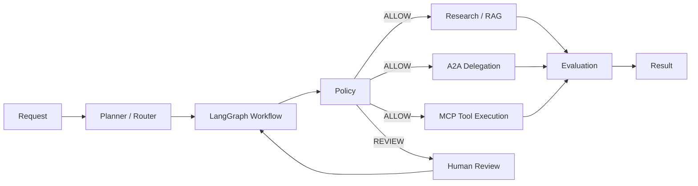

MCP and A2A remain intentionally distinct:

- **MCP** is the structured tool boundary.
- **A2A** is the specialist-agent delegation boundary.

## 5. Governed Execution Boundary

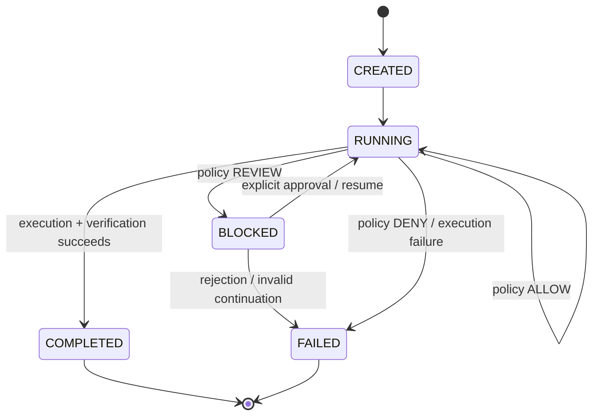

Governance is runtime state. Approval is explicit. A successful plan does not imply permission to execute a destructive action.

## 6. Production Operations and Recovery

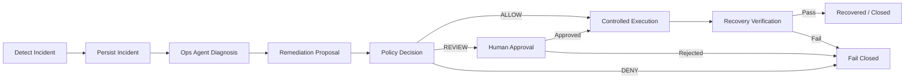

Recovery is successful only after verification.

## 7. Self-Healing Multi-Agent Runtime

```text
agent failure
-> failure record
-> capability discovery
-> health-aware replacement
-> policy / optional approval
-> context handoff
-> replacement execution
-> verification
-> persisted checkpoint
-> recovery
-> controlled rejoin
```

Key invariants:

- failed agents cannot replace themselves
- high-risk failover remains approval-aware
- replacement execution is verification-gated
- duplicate failover is idempotent
- checkpoint state persists across restart
- rejoin requires healthy state

## 8. Adaptive Governance

```mermaid
flowchart LR
    Signals["Runtime Signals"]
    History["Historical Aggregation"]
    Recommend["Recommendation"]
    Risk["Risk / Confidence"]
    Proposal["Versioned Proposal"]
    Review["Human Review"]
    Shadow["Shadow Evaluation"]
    Apply["Explicit Apply"]
    Rollback["Rollback"]

    Signals --> History --> Recommend --> Risk --> Proposal
    Proposal --> Review --> Shadow --> Apply --> Rollback
```

Adaptive governance recommends changes; it does not silently apply them.

## 9. Security and Compliance Evidence

```text
versioned control
-> evidence collection
-> completeness
-> SHA-256 integrity
-> freshness / expiry
-> risk assessment
-> approval boundary
-> persisted audit record
-> export
-> validation gate
```

## 10. Continuous Evaluation

```text
dataset
-> baseline
-> candidate
-> quality evaluation
-> safety evaluation
-> regression analysis
-> shadow evaluation
-> rollout decision
-> rollback capability
-> validation gate
```

Evaluation precedes rollout.

## 11. Enterprise Integration Governance

```text
connector registry
-> auth scope
-> secret handling
-> network boundary
-> write boundary
-> audit
-> rate limit
-> risk assessment
-> approval gate
-> validation gate
```

## 12. Trusted Agent Registry

```text
identity
-> signed manifest
-> provenance
-> declared capabilities
-> health
-> governance compatibility
-> policy profile
-> trust score/state
-> routing boundary
```

Trust is not equivalent to registration.

## 13. Persistent Run History

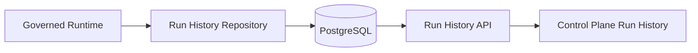

Persisted evidence includes runs, traces, primary/fallback agents, recovery evidence, latency, evaluation scores, and summary aggregation.

## 14. Microsoft Enterprise Integration Readiness

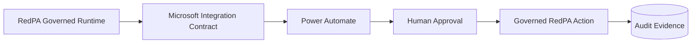

This is contract/readiness support. It does not claim a live tenant connection.

## 15. Enterprise Analytics

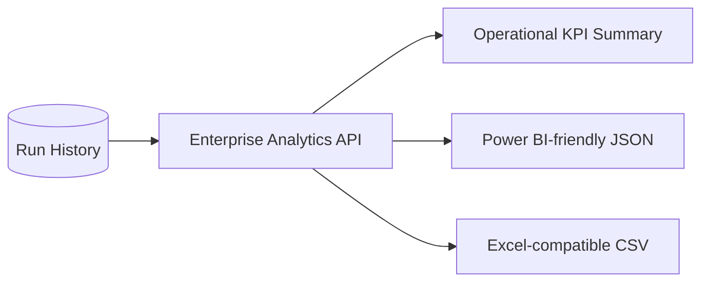

## 16. AWS Runtime Architecture — v19.7

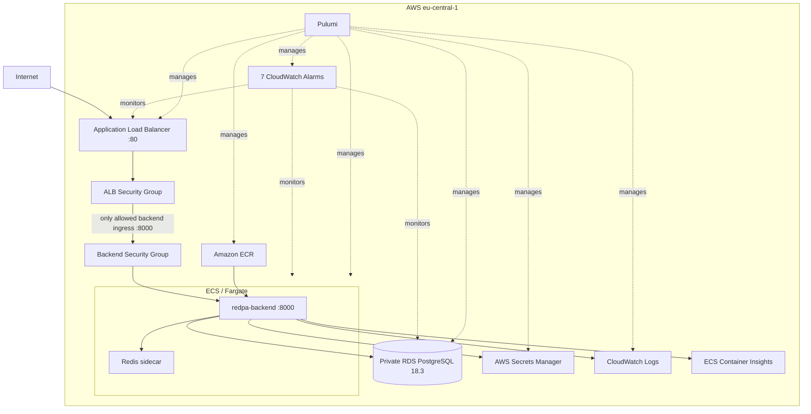

### Validated ingress properties

- ALB is the public application entry point.
- Backend port `8000` is not directly public.
- Backend ingress allows ALB security group traffic to port `8000`.
- ALB target health is validated.
- HTTP liveness through the ALB is validated.

HTTPS, ACM, Route53 production DNS, WAF, NAT Gateway architecture, and custom-domain ingress are not currently claimed.

## 17. Failure and Recovery Model

A controlled task-level failure was executed against the live V19.7 AWS development environment.

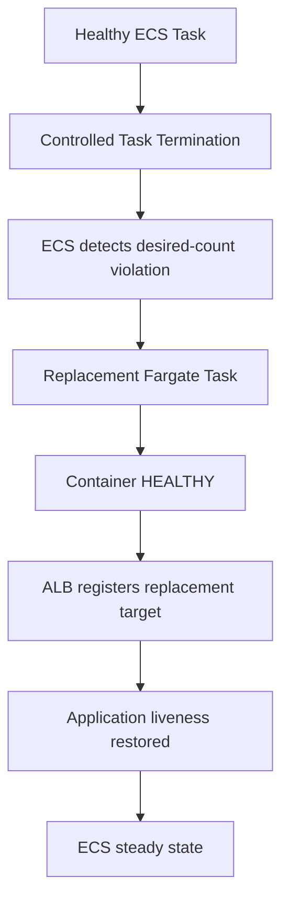

Observed behavior:

- previous task intentionally stopped
- replacement task automatically created
- replacement container became `HEALTHY`
- ALB target became healthy
- application liveness returned successfully
- service returned to `desired=1`, `running=1`, `pending=0`
- rollout returned to `COMPLETED`

This validates task-level self-recovery, not regional HA.

## 18. Database Recovery Readiness

V19.7 validates the following RDS properties:

```text
Engine:                   PostgreSQL 18.3
Status:                   available
Storage encryption:       enabled
Public access:            false
Deletion protection:      enabled
Copy tags to snapshot:    enabled
Backup retention:         1 day
Automated backup:         active
Restore window:           present
Automated snapshots:      available
Snapshot encryption:      enabled
Multi-AZ:                 false
```

Automated backup metadata exposed a valid restore window and encrypted automated snapshots were observed.

`Multi-AZ=false` remains an intentional current cost/account boundary.

## 19. AWS Observability

AWS infrastructure observability is separate from application-level observability.

### CloudWatch alarms

Seven alarms are deployed:

1. ECS CPU high
2. ECS memory high
3. ALB unhealthy host
4. ALB target 5xx
5. ALB response time
6. RDS CPU high
7. RDS low storage

### CloudWatch Logs

RedPA application logs are retained for 30 days.

### ECS Container Insights

Container Insights is enabled for ECS task/container performance visibility.

No SNS notification dependency is currently required or claimed.

## 20. Application Observability

```text
application metrics -> Prometheus -> Grafana
application traces  -> OpenTelemetry Collector -> Tempo
application logs    -> structured/correlated runtime evidence
```

Evaluation, governance, operations, request, and recovery signals contribute to platform observability.

## 21. Persistence Model

PostgreSQL is the durable relational system of record for platform/runtime/governance state.

Qdrant provides vector retrieval and semantic memory.

Redis supports coordination, caching, event streams, and runtime messaging.

A key principle is that important governance/recovery state should survive process restart.

## 22. Event and Background Processing

The platform includes:

- transactional outbox/event APIs
- Outbox Publisher
- background worker
- scheduler
- Redis-backed coordination
- Redis Streams publication

This separates synchronous request processing from asynchronous platform work.

## 23. Security and Governance Boundaries

1. Authentication and tenancy/RBAC foundations
2. Policy enforcement
3. Human Review
4. MCP execution controls
5. Connector governance
6. Trusted-agent routing
7. fail-closed recovery
8. persisted audit/evidence
9. approval-aware side effects
10. verification-gated recovery

## 24. Deployment View

### Docker Compose

The strongest integrated local runtime target.

### AWS / Pulumi

Actually deployed and validated for V19.7 in `eu-central-1`.

Validated:

- ECS/Fargate
- ECR
- ALB
- private RDS
- Secrets Manager
- CloudWatch Logs
- CloudWatch Alarms
- Container Insights
- controlled ingress
- self-recovery
- backup/restore readiness
- clean Pulumi state

### Kubernetes / Helm

Deployment/package path. Not a claim of a currently running production cluster.

### Azure / Pulumi

Infrastructure/reference path unless separately validated against a live subscription.

## 25. API Architecture

The API is versioned under `/api/v1`.

Important boundaries include:

```text
/api/v1/governance/v10
/api/v1/operations/v9
/api/v1/platform/evolution
/api/v1/adaptive-governance/v13
/api/v1/security-compliance/v14
/api/v1/cloud-readiness/v15
/api/v1/continuous-evaluation/v16
/api/v1/enterprise-integration/v17
/api/v1/trusted-agents/v18
/api/v1/production-hardening/v18.1
/api/v1/production-demo/v18.2
/api/v1/control-plane/v18.3/runs
/api/v1/analytics/v18.5/power-bi
/api/v1/analytics/v18.5/excel.csv
```

Additional routers cover authentication, users, conversations/messages, chat/LLM, documents/RAG, Human Review, MCP, tools, agents, memory, evaluations, guardrails, policy enforcement, tenants, OAuth, events, analytics, connectors, model gateway, monitoring, and health.

## 26. Release Validation Boundary

Validated V19.7 evidence:

```text
Full regression:             437 passed
Live AWS runtime:            19.7.0
ECS task:                    HEALTHY
ALB target:                  healthy
Direct backend :8000:        closed
RDS backup:                  active
RDS restore window:          validated
CloudWatch alarms:           7 / 7 OK
Pulumi final state:          35 unchanged
```

This demonstrates the tested development validation environment. It does not imply an SLA, multi-region HA, multiple steady-state tasks, or multi-AZ database HA.

## 27. V19 Evolution

```text
V19.0–V19.3
    AWS runtime and managed-data foundation
        -> ECS/Fargate
        -> ECR
        -> RDS PostgreSQL
        -> Secrets Manager

V19.4
    controlled ingress
        -> ALB
        -> target group
        -> backend direct public access closed

V19.5
    resilience hardening
        -> ECS circuit breaker
        -> automatic rollback
        -> AZ rebalancing
        -> RDS deletion protection
        -> snapshot tag propagation

V19.6
    infrastructure observability
        -> CloudWatch alarms
        -> ECS / ALB / RDS monitoring

V19.7
    production-readiness validation
        -> controlled ECS failure
        -> automatic replacement
        -> ALB recovery
        -> backup/restore evidence
        -> clean Pulumi state
```

## 28. Architectural Principles

- Autonomous reasoning and autonomous permission are separate concerns.
- High-risk side effects require explicit governance boundaries.
- Durable state is preferred for workflow, governance, and recovery checkpoints.
- Failure handling must be idempotent and restart-safe.
- Recovery requires verification.
- Adaptive policy changes are recommendation-first and explicit-apply.
- External connectors and remote agents are trust boundaries.
- Evaluation precedes rollout.
- Observability and release evidence are part of the quality model.
- Deployment readiness is demonstrated through evidence.
- Cloud deployment is not represented as HA beyond what is actually validated.

## 29. Related Documentation

- `docs/architecture/c4.md`
- `docs/architecture/arc42.md`
- `docs/architecture/ddd.md`
- `docs/architecture/adr/`
- `docs/MCP_PLATFORM.md`
- `docs/A2A_PLATFORM.md`
- `docs/TOOL_RUNTIME.md`
- `docs/HUMAN_REVIEW.md`
- `docs/V10_GOVERNED_AGENT_RUNTIME.md`
- `docs/V12_SELF_HEALING_STAGE1_10.md`
- `docs/V13_ADAPTIVE_GOVERNANCE_STAGE1_10.md`
- `docs/V14_SECURITY_COMPLIANCE_STAGE1_10.md`
- `docs/V15_PRODUCTION_CLOUD_PLATFORM_STAGE1_10.md`
- `docs/V16_AGENT_EVALUATION_AND_CONTINUOUS_IMPROVEMENT_STAGE1_10.md`
- `docs/V17_ENTERPRISE_INTEGRATION_HUB_STAGE1_10.md`
- `docs/V18_TRUSTED_AGENT_REGISTRY_STAGE1_10.md`
- `docs/V18_1_PRODUCTION_HARDENING_STAGE1_10.md`
- `docs/V18_2_PRODUCTION_E2E_DEMO_STAGE1_10.md`
- `docs/V18_3_CONTROL_PLANE_RUN_HISTORY.md`
- `docs/V18_4_MICROSOFT_ENTERPRISE_INTEGRATION.md`
- `docs/V18_5_ENTERPRISE_ANALYTICS.md`
- `docs/V19_CLOUD_DEPLOYMENT_FOUNDATION.md`
- `docs/releases/V19.7.0.md`
