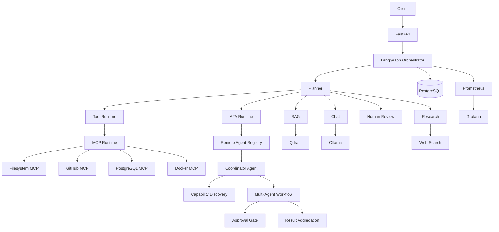

# RedPA AI Architecture

## Overview

RedPA AI is a modular Agentic AI platform built around FastAPI, LangGraph, PostgreSQL, Qdrant, MCP, and the Google Agent-to-Agent protocol.

## Main Layers

- **API:** authentication, validation, dependency injection, and OpenAPI.
- **Orchestration:** planner, LangGraph routes, interruption, resume, and response assembly.
- **A2A:** Agent Registry, Agent Cards, protocol server, Remote Agents, delegation, Multi-Agent execution, approval, and metrics.
- **Services:** Chat, RAG, Research, Human Review, MCP, tools, and A2A delegation.
- **Persistence:** PostgreSQL models, repositories, migrations, messages, and reviews.
- **Tooling:** internal tools and isolated read-only MCP servers.

## Supported Routes

```text
chat
rag
research
a2a
tool
sql
human_review
```

## High-Level Flow



## A2A Lifecycle

```text
User request
  → deterministic A2A intent
  → a2a LangGraph node
  → Remote Agent Registry
  → Agent Card ranking
  → SendMessageRequest
  → JSON-RPC remote task
  → completed task and artifact
  → persisted Chat response
```

## Multi-Agent Lifecycle

```text
Request
  → approval policy
  → subtask generation
  → bounded parallel delegation
  → per-subtask results
  → aggregation
  → metrics
```

## Security Boundaries

- JWT and current-user boundaries
- deterministic route and safety rules
- read-only MCP capabilities
- validated Remote Agent URLs and Agent Cards
- bounded timeouts
- no sensitive distributed execution before approval
- observable task metadata and Prometheus metrics

## Current Limitation

The Phase 5 Coordinator currently focuses on capability discovery and coordination. Independent specialist Remote Agent services that directly execute Research, Docker, SQL, or other tasks are planned.
