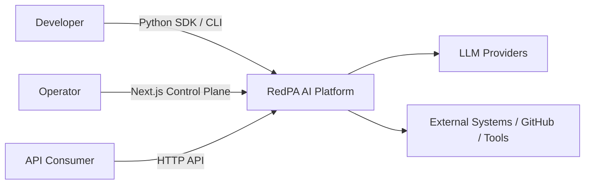
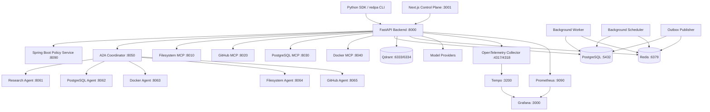
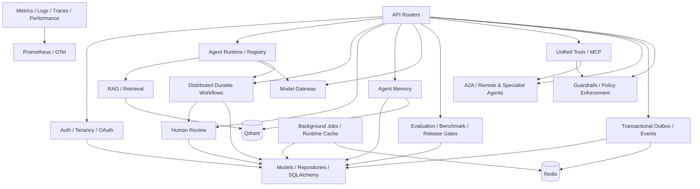
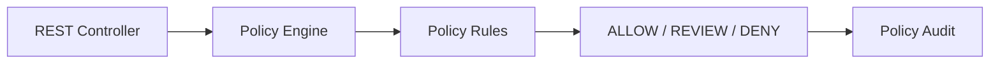

# RedPA AI V6.0 — C4 Model

This document describes the architecture represented by the V6.0 repository. It distinguishes implemented local runtime components from deployment/reference assets.

## Level 1 — System Context

RedPA AI is a developer-facing Agentic AI platform for orchestrating agents, tools, durable workflows, retrieval, model access, policy enforcement, human oversight, evaluation, memory, and operational telemetry.

## Level 2 — Runtime Containers

The policy service is supplied by `docker-compose.phase13.yml`, which augments the main Docker Compose stack and configures the backend to use it.

## Level 3 — FastAPI Platform Components

## Level 3 — Policy Service

## Developer Boundary

The V6 Python SDK and CLI are clients of implemented HTTP APIs. They do not duplicate server-side orchestration, governance, durable state, or policy logic.

## Deployment Boundary

Docker Compose is the validated local integration runtime. Kubernetes/Helm and Azure/Pulumi are deployment/reference assets in the repository; their presence is not evidence of a live hosted production deployment.
