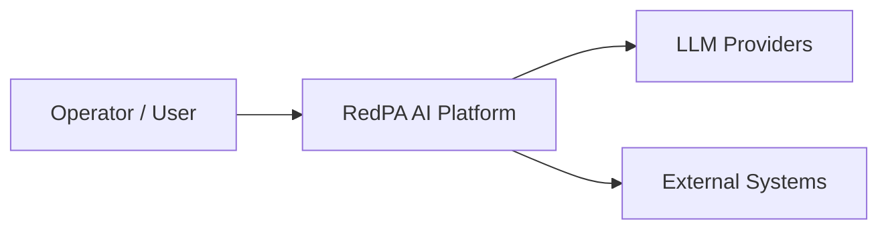
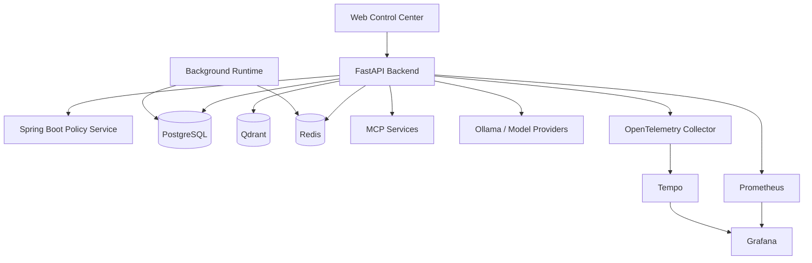
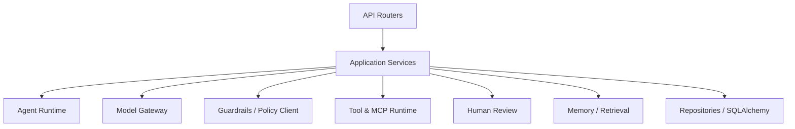
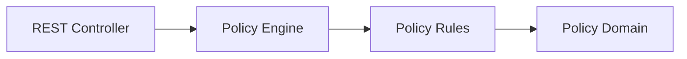

# C4 Model

## Level 1 — System Context

RedPA AI is an enterprise-oriented agentic AI platform for orchestrating
agents, tools, workflows, models, policy enforcement, retrieval, and human
oversight.

## Level 2 — Containers

## Level 3 — FastAPI Components

## Level 3 — Policy Service

