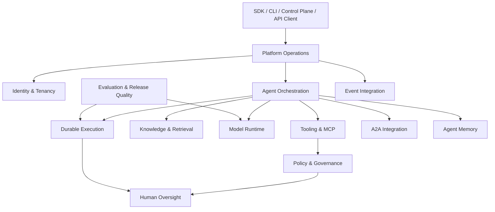

# RedPA AI V8.0 — Domain-Driven Design

RedPA uses bounded contexts to describe platform responsibilities. These boundaries are architectural guidance over an evolving codebase; they do not imply that every context is a separately deployed service.

## Agent Orchestration

Responsibilities:

- planning and routing;
- agent registry and capability discovery;
- chat, research, RAG, and tool workflows;
- A2A specialist delegation;
- distributed execution.

Core concepts: Agent, Capability, Route, Task, Execution Context, Specialist.

## Durable Execution

Responsibilities:

- persistent workflow state;
- checkpoints;
- retries and failed-task recovery;
- distributed subtask tracking;
- resume and approval-gated continuation.

Core concepts: Workflow, Checkpoint, Subtask, Attempt, Execution State, Resume.

## Knowledge & Retrieval

Responsibilities:

- document ingestion;
- chunking and embeddings;
- semantic retrieval;
- grounded context.

Core concepts: Document, Chunk, Embedding, Retrieval Query, Context.

## Human Oversight

Responsibilities:

- review creation;
- approval and rejection;
- review feedback;
- workflow continuation.

Core concepts: Review, Review Decision, Approval Gate, Reviewer.

## Tooling & Integration

Responsibilities:

- internal tools;
- MCP server registry and health;
- unified tool discovery;
- qualified tool invocation;
- policy-aware execution.

Core concepts: Tool, Tool Descriptor, Tool Invocation, Tool Result, MCP Server.

## A2A Integration

Responsibilities:

- agent capability discovery;
- specialist selection;
- remote/specialist delegation;
- parallel subtask execution;
- result aggregation.

Core concepts: Agent Card, Capability, Delegation, Specialist Result.

## Model Runtime

Responsibilities:

- provider abstraction;
- model routing;
- fallback and retry;
- circuit-breaker/reliability state;
- usage and economics.

Core concepts: Model Provider, Model Route, Inference Request, Inference Result, Reliability State, Usage Record.

## Policy & Governance

Responsibilities:

- policy evaluation;
- guardrails;
- `ALLOW` / `REVIEW` / `DENY`;
- policy audit;
- tool/MCP enforcement.

Core concepts: Policy, Rule, Risk, Decision, Enforcement Event.

## Evaluation & Release Quality

Responsibilities:

- evaluation runs and metrics;
- benchmark runs and reusable suites;
- regression comparison;
- reliability snapshots;
- release quality gates and candidate reports.

Core concepts: Evaluation Run, Metric, Benchmark Suite, Benchmark Run, Reliability Snapshot, Release Gate.

## Identity & Tenancy

Responsibilities:

- authentication;
- tenant/workspace records;
- memberships and roles;
- tenant-aware access foundations;
- OAuth provider discovery and PKCE foundations.

Core concepts: User, Tenant, Membership, Role, OAuth Provider, Identity.

## Event Integration

Responsibilities:

- persisted outbox state;
- event publication;
- Redis Streams delivery;
- publication-state visibility.

Core concepts: Domain Event, Outbox Event, Publication State, Stream.

## Agent Memory

Responsibilities:

- long-term and semantic memory;
- private/shared memory;
- search and context injection;
- summarization, deduplication, retention.

Core concepts: Memory, Scope, Semantic Match, Retention Policy.

## Platform Operations

Responsibilities:

- API health;
- rate limiting and idempotency;
- background worker/scheduler;
- runtime caching;
- metrics, logs, traces, performance.

Core concepts: Job, Runtime State, Metric, Trace, Health State.

## Context Relationships

## Tactical Guidance

Prefer explicit domain/application/infrastructure/API separation when a bounded context becomes large enough to benefit from it. Do not reorganize working implementation solely to make the folder tree mirror the conceptual model. Architecture tests and contracts should protect dependency direction during incremental refactoring.
