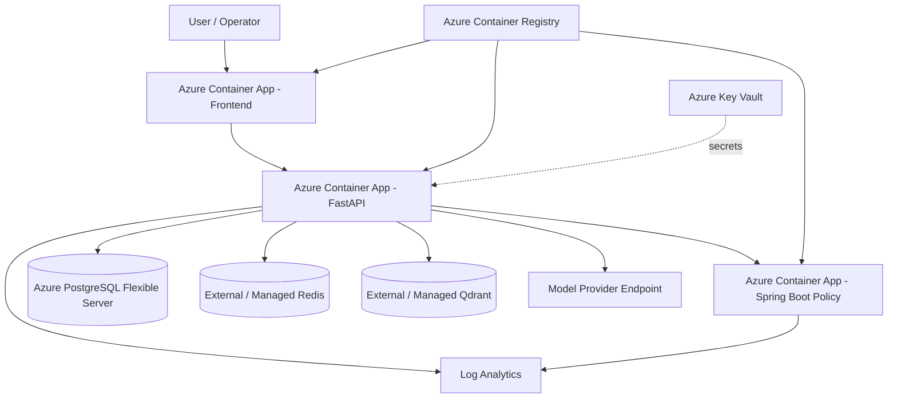

# Azure Reference Architecture

## Deployment view

## Design principles

- stateless application components run as Container Apps;
- PostgreSQL uses Azure Database for PostgreSQL Flexible Server;
- secrets are represented as Pulumi secrets and Key Vault is part of the
  target architecture;
- stateful vector/cache systems remain explicit service dependencies;
- cloud deployment is defined as code and reviewed through preview before
  deployment;
- dev and production use separate Pulumi stacks.
