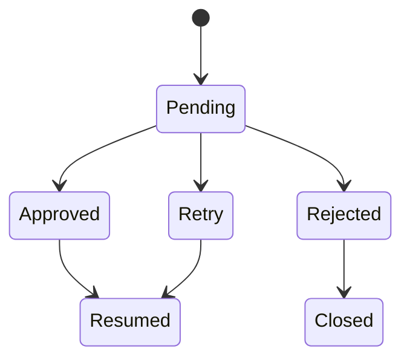

# Human-in-the-Loop Review

## Purpose

Human review provides an explicit control point when a workflow is uncertain, sensitive, or requires accountability.

## Review Lifecycle

## Reviewer Actions

A reviewer can:

- approve the proposed output;
- reject it;
- submit an edited or replacement answer;
- request a retry;
- add feedback for the resumed workflow.

## Safety Properties

The review implementation should guarantee:

- a review belongs to the authenticated user's accessible workflow;
- only pending reviews can be decided;
- a second decision returns a conflict rather than overwriting history;
- timestamps and reviewer identity are stored;
- the resumed workflow receives the exact approved decision;
- retries are bounded.

## Dashboard Contract

A future frontend dashboard can use the API to:

- list pending and completed reviews;
- filter by status and date;
- inspect workflow context;
- edit the proposed response;
- approve, reject, or retry;
- display the resumed workflow result.
