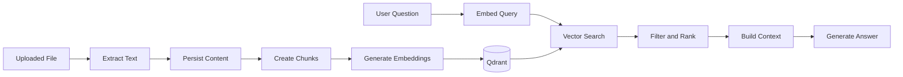

# Retrieval-Augmented Generation

## Pipeline

## Components

- **Document service:** lifecycle and metadata.
- **Document extractor:** converts supported files into text.
- **Chunking service:** creates retrieval-sized text units.
- **Embedding service:** produces vectors.
- **Vector store service:** writes, deletes, and queries vector points.
- **Retriever service:** selects relevant chunks.
- **Context builder:** formats retrieved material for the LLM.
- **RAG service:** coordinates retrieval and generation.

## Data Integrity

Each vector point should include identifiers that connect it to:

- the user or tenant;
- the source document;
- the relational chunk;
- optional page or section metadata.

Retrieval filters must prevent one user's documents from appearing in another user's context.

## Quality Controls

Useful controls include:

- chunk overlap;
- similarity threshold;
- maximum retrieved chunks;
- metadata filtering;
- source deduplication;
- context-length limits;
- empty-retrieval fallback;
- source references in generated answers.

## Deletion

Deleting a document should remove or invalidate:

- stored files;
- document metadata;
- extracted content;
- chunks;
- corresponding Qdrant points.

Partial deletion creates stale retrieval results and should be treated as an error requiring cleanup.
