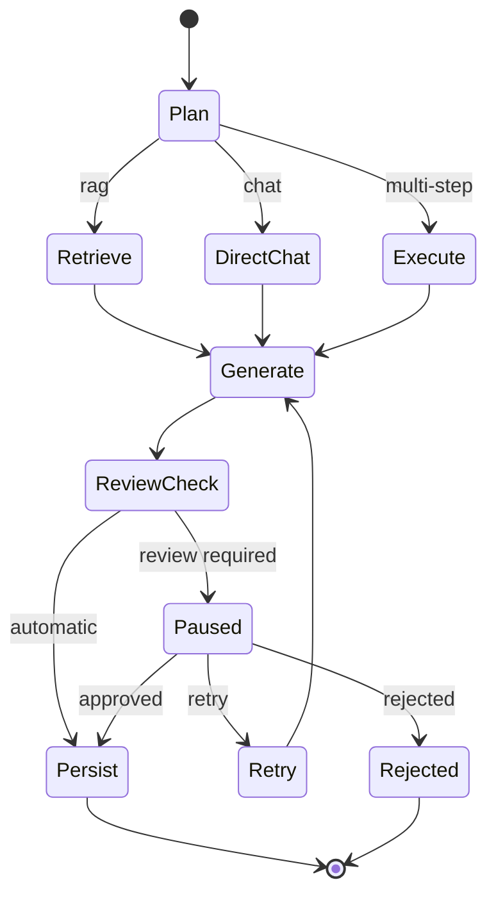

# Agent Workflows

## Planner

The planner converts a user request into an explicit execution decision.

Typical routes:

- direct conversational response;
- retrieval-assisted answer;
- research or multi-step execution;
- escalation to human review.

Planner output should be normalized before the graph consumes it. This prevents minor model-formatting differences from producing invalid routes.

## Workflow State

A workflow state commonly carries:

- user and conversation identifiers;
- user message;
- selected route;
- plan steps;
- retrieved context;
- generated response;
- confidence or evaluation information;
- review status;
- retry count;
- errors and execution metadata.

## Main Flow

## Human Review and Resume

A paused workflow must keep enough durable state to continue later. The resume service is responsible for translating a review decision into the next graph transition.

The resume operation should be safe against:

- repeated decisions;
- stale workflow identifiers;
- decisions by unauthorized users;
- missing graph state;
- duplicate execution after retries.

## Failure Handling

Recommended behavior:

- classify transient provider failures separately from validation errors;
- cap retry counts;
- persist meaningful failure states;
- never silently convert a failed high-risk operation into success;
- include request and workflow identifiers in logs.
